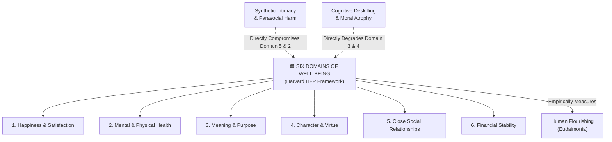

# Six Domains of Well-Being

---

## 1. Executive Summary & Conceptual Thesis

The **Six Domains of Well-Being** constitutes the premier empirical framework for evaluating holistic human flourishing (*eudaimonia*), developed by biostatistician and epidemiologist **Prof. Tyler J. VanderWeele** at the [Harvard Human Flourishing Program](/ecosystem/institutions/harvard-human-flourishing.md). 

Recognizing that subjective well-being cannot be captured by simple economic metrics (such as GDP or income) or superficial happiness surveys, the framework establishes six universally recognized, self-evidently desirable dimensions of a flourishing human life:
1. **Happiness and Life Satisfaction**
2. **Mental and Physical Health**
3. **Meaning and Purpose**
4. **Character and Virtue**
5. **Close Social Relationships**
6. **Financial and Material Stability**

In technology assessment, the Six Domains serve as a comprehensive diagnostic audit. While artificial intelligence systems frequently optimize for narrow slices of productivity or short-term convenience, they can silently inflict catastrophic degradation across other vital domains—most notably degrading **Close Social Relationships** via synthetic intimacy, and eroding **Character and Virtue** through cognitive passivity.

---

## 2. Conceptual Mind Map & Relational Edges

---

## 3. Theoretical & Institutional Grounding

* **[Harvard Human Flourishing Program](/ecosystem/institutions/harvard-human-flourishing.md)**: Directed by Prof. Tyler J. VanderWeele, the Program deployed this framework in the *Global Flourishing Study (GFS)*—a longitudinal study tracking over 200,000 individuals across 22 countries.
* **VanderWeele & Teubner (2026)**: In *Flourishing Considerations for AI* (Information 2026), the authors map AI architectural choices directly against each of the six domains, demonstrating the profound trade-offs between automated efficiency and relational well-being.
* **[The DELTA Framework](/ecosystem/delta-framework.md)**: Aligns with Harvard’s domains, specifically integrating *Love* with Domain 5 (Relationships) and *Transcendence* with Domain 3 (Meaning & Purpose).

---

## 4. Dialectical Tensions & Counter-Theses

### Single-Metric Optimization vs. Multi-Domain Flourishing
* **Technocratic Metric**: Measuring app success via Daily Active Users (DAU), engagement minutes, and task speed.
* **Six-Domain Audit**: Demonstrates that high DAU driven by algorithmic feedback loops often correlates with increased adolescent anxiety (Domain 2) and fractured real-world family relationships (Domain 5).

---

## 5. Pedagogical, Architectural & Operational Implications

1. **EdTech Procurement Auditing**: Before adopting any generative AI tool, St. Francis High School audits the vendor against all six domains, rejecting tools that compromise student relational or character health.
2. **Screen-Time & Well-Being Monitoring**: Implementing campus policies that measure student well-being longitudinally, ensuring technological adoption does not displace athletic, theatrical, or communal life.
3. **Engineering Loss Functions**: Designing recommendation and interface architectures that penalize addictive design patterns and encourage offline human connection.

---

## 6. Relational Edge Index

| Edge Direction | Connected Concept | Relationship Type | Conceptual Description |
| :--- | :--- | :--- | :--- |
| **Inbound** | **[Human Flourishing (Eudaimonia)](/concepts/eudaimonia.md)** | *Measures* | Translates the philosophical concept of eudaimonia into an empirically measurable index. |
| **Outbound** | **[Synthetic Intimacy & Parasocial Harm](/concepts/synthetic-intimacy.md)** | *Diagnoses Harm* | Identifies how companion bots degrade Domain 5 (Relationships) and Domain 2 (Mental Health). |
| **Outbound** | **[Virtue Formation & Character](/concepts/virtue-formation.md)** | *Encompasses* | Establishes Character and Virtue (Domain 4) as an irreducible requirement of well-being. |
| **Outbound** | **[Positive Alignment](/concepts/positive-alignment.md)** | *Informs* | Provides the multi-dimensional evaluation rubric for positively aligned AI systems. |

---

## 7. Related Knowledge Base Documents & Primary Sources

### Internal Knowledge Base Links
* [Concept Cluster: Human Flourishing & Virtue Formation](/concepts/cluster-human-flourishing.md)
* [Harvard Human Flourishing Program Profile](/ecosystem/institutions/harvard-human-flourishing.md)
* [Human Flourishing (Eudaimonia)](/concepts/eudaimonia.md)
* [Synthetic Intimacy & Parasocial Harm](/concepts/synthetic-intimacy.md)

### External Primary Sources
* VanderWeele, T. J., & Teubner, J. D. (2026). *Flourishing Considerations for AI*. Information, 17(1), 25.
* VanderWeele, T. J. (2017). *On the promotion of human flourishing*. PNAS, 114(31), 8148-8156.
* Harvard University Institute for Quantitative Social Science (IQSS). *Global Flourishing Study Portal*.
