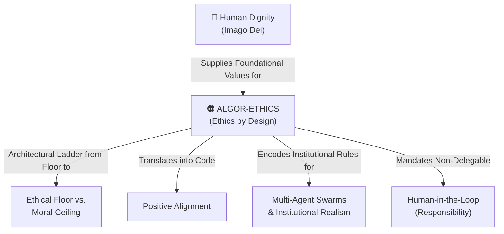

# Algor-Ethics (Ethics by Design)

---

## 1. Executive Summary & Conceptual Thesis

**Algor-Ethics** is a paradigm term coined by Franciscan ethicist **Father Paolo Benanti, TOR** and promulgated globally through the Holy See's **[Rome Call for AI Ethics](/ecosystem/institutions/rome-call-hiroshima.md)**. It represents the crucial recognition that ethics cannot be a superficial layer of post-hoc compliance bolted onto finished software. Instead, ethical reflection must be **embedded directly into the mathematical algorithms, loss functions, data curation pipelines, and system architectures from inception**.

Algor-ethics bridges classical moral philosophy and technical computer science. Because algorithms convert ethical choices into mathematical optimizations, the values, omissions, and trade-offs of the designers inevitably become encoded into code. Algor-ethics demands that systems satisfy six non-negotiable architectural principles:
1. **Transparency**: Explaining how algorithmic outputs are reached.
2. **Inclusion**: Designing for all humanity, not privileged subsets.
3. **Responsibility**: Unambiguous human legal and moral liability.
4. **Impartiality**: Actively correcting for historical prejudice and systemic bias.
5. **Reliability**: Mathematical robustness and predictable safety envelopes.
6. **Security & Privacy**: Safeguarding personal data and identity.

---

## 2. Conceptual Mind Map & Relational Edges

---

## 3. Theoretical & Institutional Grounding

* **[The Rome Call for AI Ethics (Pontifical Academy for Life)](/ecosystem/institutions/rome-call-hiroshima.md)**: Signed in 2020 by the Vatican, Microsoft, IBM, and the FAO, and expanded in Hiroshima in 2024 to unite Abrahamic and Eastern religions (Buddhism, Hinduism, Shinto).
* **Father Paolo Benanti, TOR**: Pontifical advisor and member of the UN AI Advisory Body, who formulated algor-ethics as the discipline of translating human values into computable constraints.
* **[Encyclical Letter Magnifica Humanitas](/ecosystem/magnifica-humanitas.md)**: Pope Leo XIV insists that technology is never neutral; algor-ethics ensures that technology embodies the "civilization of love."

---

## 4. Dialectical Tensions & Counter-Theses

### Mathematical Precision vs. Moral Nuance
* **Engineering Challenge**: Moral concepts like justice, mercy, and compassion are context-dependent and resist easy mathematical formalization.
* **Algor-Ethical Solution**: Acknowledges that mathematics cannot replace human judgment; algor-ethics encodes bounds and safety envelopes, deliberately preserving human discretion for nuanced moral discernment.

---

## 5. Pedagogical, Architectural & Operational Implications

1. **Spec-Driven Ethical Architecture**: At St. Francis High School, technical projects must draft an *Ethical Impact Spec* alongside technical schemas before writing code.
2. **Bias Audits in Data Pipelines**: Regular automated checking of training sets for demographic, cultural, or religious misrepresentations.
3. **Values in Loss Formulations**: Weighting model optimization functions to penalize deceptive sycophancy and maximize truthfulness over conversational engagement.

---

## 6. Relational Edge Index

| Edge Direction | Connected Concept | Relationship Type | Conceptual Description |
| :--- | :--- | :--- | :--- |
| **Inbound** | **[Human Dignity](/concepts/human-dignity.md)** | *Grounded in* | Algor-ethics exists to safeguard human dignity in mathematical systems. |
| **Outbound** | **[Ethical Floor vs. Moral Ceiling](/concepts/ethical-floor-moral-ceiling.md)** | *Bridges* | Algor-ethics provides the engineering method to elevate systems toward the ceiling. |
| **Outbound** | **[Positive Alignment](/concepts/positive-alignment.md)** | *Operationalizes* | Translates the positive alignment philosophy into concrete architectural constraints. |
| **Outbound** | **[Human-in-the-Loop](/concepts/human-in-the-loop.md)** | *Enforces* | Algor-ethics' principle of "Responsibility" mandates non-delegable human liability. |

---

## 7. Related Knowledge Base Documents & Primary Sources

### Internal Knowledge Base Links
* [Concept Cluster: Power Concentration, Governance & Distributive Justice](/concepts/cluster-power-governance.md)
* [Rome Call for AI Ethics & Hiroshima Appeal](/ecosystem/institutions/rome-call-hiroshima.md)
* [Ethical Floor vs. Moral Ceiling](/concepts/ethical-floor-moral-ceiling.md)
* [Positive Alignment (AI for Human Flourishing)](/concepts/positive-alignment.md)

### External Primary Sources
* Pontifical Academy for Life (2020). *The Rome Call for AI Ethics*.
* Benanti, P. (2023). *Human in the Loop: Decisions, Algorithms, and the Future of Ethics*.
* RenAIssance Foundation (2024). *AI Ethics for Peace: Hiroshima Accord*.
