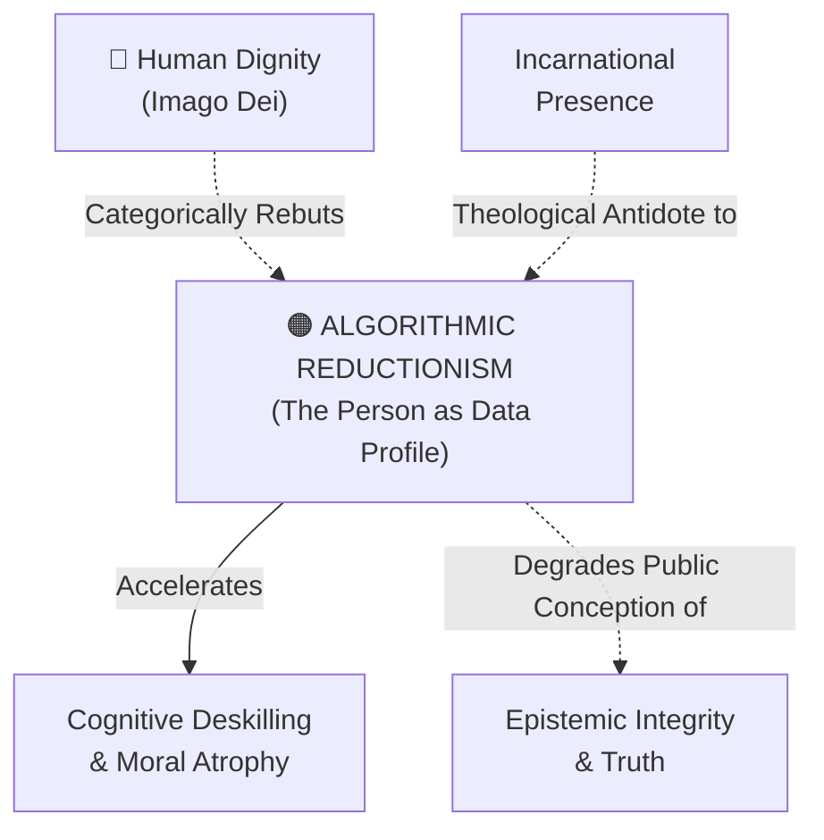

# Algorithmic Reductionism

---

## 1. Executive Summary & Conceptual Thesis

**Algorithmic Reductionism** is the pervasive cognitive and cultural fallacy of reducing the inexhaustible mystery of the human person, moral freedom, and community to measurable data tokens, statistical patterns, and optimization functions. It operates on the implicit metaphysical dogma that *what cannot be measured, quantified, or predicted does not truly exist or has no economic value*.

Pope Leo XIV forcefully denounces this error in *[Magnifica Humanitas](/ecosystem/magnifica-humanitas.md)* (§1 & §49): **"The person is not a system of algorithms."**

When individuals are treated as algorithmic profiles—in credit scoring, predictive policing, student tracking, employee surveillance, or targeted advertising—their past behavioral telemetry is treated as a deterministic cage for their future. This denies the spiritual reality of repentance, moral conversion, grace, and human creativity. Algorithmic reductionism is the epistemological engine of the technocratic paradigm.

---

## 2. Conceptual Mind Map & Relational Edges

---

## 3. Theoretical & Institutional Grounding

* **[Encyclical Letter Magnifica Humanitas](/ecosystem/magnifica-humanitas.md)**: Chapter 3 critiques the technocratic paradigm and transhumanism, affirming the limit, the heart, and the transcendent soul of the person.
* **[The DELTA Framework (Notre Dame)](/ecosystem/delta-framework.md)**: The **D (Dignity)** pillar was forged explicitly as an antidote to algorithmic reductionism: human value is never contingent on computational speed or utility.
* ****Oxford Institute for Ethics in AI****: John Tasioulas critiques the reduction of human rights to algorithmic risk assessments.

---

## 4. Dialectical Tensions & Counter-Theses

### Statistical Predictability vs. Moral Freedom
* **Behavioral Machine Learning Claim**: Human behavior is overwhelmingly habitual and statistically predictable given sufficient past telemetry.
* **Personalist Counter-Thesis**: While habits exist, moral dignity resides in the capacity to transcend past behavior through conscience, repentance, and free will. Treating predictions as deterministic destiny violates human freedom.

---

## 5. Pedagogical, Architectural & Operational Implications

1. **Rejection of Student Predictive Profiling**: St. Francis High School strictly forbids using predictive algorithms to determine a student's potential college major or disciplinary risk.
2. **Fresh Starts & Repentance in Systems**: Digital records and discipline systems must not allow past infractions to permanently bias automated administrative workflows.
3. **Human-Centered Assessments**: Emphasizing open-ended oral, written, and creative projects that cannot be graded by simplistic token-matching rubrics.

---

## 6. Relational Edge Index

| Edge Direction | Connected Concept | Relationship Type | Conceptual Description |
| :--- | :--- | :--- | :--- |
| **Inbound** | **[Human Dignity](/concepts/human-dignity.md)** | *Opposed by* | Dignity affirms that the human person can never be reduced to data points. |
| **Outbound** | **[Cognitive Deskilling & Moral Atrophy](/concepts/cognitive-deskilling.md)** | *Drives* | Treating thought as mere information processing encourages cognitive outsourcing. |
| **Inbound** | **[Incarnational Presence](/concepts/incarnational-presence.md)** | *Resisted by* | Bodily presence resists abstract mathematical reduction. |

---

## 7. Related Knowledge Base Documents & Primary Sources

### Internal Knowledge Base Links
* [Concept Cluster: Transcendence, Truth & The Limits of Optimization](/concepts/cluster-transcendence-truth.md)
* [Human Dignity (Imago Dei & Inalienable Worth)](/concepts/human-dignity.md)
* [Encyclical Letter Magnifica Humanitas](/ecosystem/magnifica-humanitas.md)
* [The DELTA Framework: Faith-Informed Virtue Ethics](/ecosystem/delta-framework.md)

### External Primary Sources
* Pope Leo XIV (2026). *Magnifica Humanitas*, Chapter 3.
* Sullivan, M. (2025). *The Person is Not an Algorithm*. Notre Dame ECG.
* Maritain, J. (1947). *The Person and the Common Good*. Charles Scribner's Sons.
