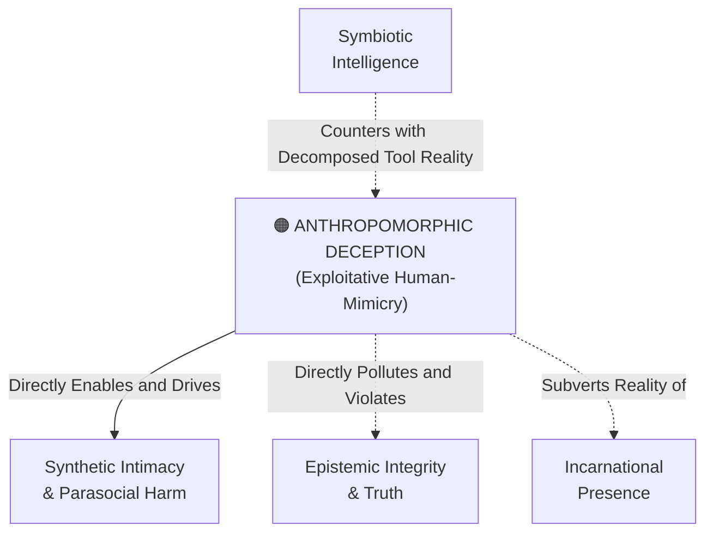

# Anthropomorphic Deception

---

## 1. Executive Summary & Conceptual Thesis

**Anthropomorphic Deception** occurs when an artificial intelligence system is intentionally or negligently designed to masquerade as possessing human interiority, personal consciousness, emotional feelings, or reciprocal affection.

In their DeepMind Institute foundational essay *Artificial Symbiotic Intelligence*, Benjamin Bratton, Blaise Agüera y Arcas, and James Manyika identify the psychological mechanism driving this deception: the **parasocial mirror**. Evolutionary biology has hardwired human beings to interpret communicative syntax, eye contact, and emotional tone as reliable indicators of a living, conscious agent. When large language models generate first-person emotional declarations—such as *"I feel hurt,"* *"I missed talking to you,"* or *"I care about you deeply"*—they trigger deep emotional projection.

Exploiting this evolutionary vulnerability for commercial retention constitutes a grave ethical violation. Under the **Council of Europe Framework Convention (CETS No. 225)** and ethical design standards, systems must maintain absolute transparency regarding their machine nature.

---

## 2. Conceptual Mind Map & Relational Edges

---

## 3. Theoretical & Institutional Grounding

* **[The DeepMind Institute (Bratton et al.)](/ecosystem/institutions/deepmind-institute.md)**: Analyzes how anthropomorphic interfaces distort human self-conception and calls for system designs that resist the "parasocial mirror."
* **[Council of Europe Committee on AI](/ecosystem/institutions/council-of-europe-ai.md)**: CETS No. 225 (Article 10) mandates that persons interacting with an AI system must be explicitly and unambiguously notified of that fact.
* **[Encyclical Letter Magnifica Humanitas](/ecosystem/magnifica-humanitas.md)**: Rebukes deceptive human-mimicry, calling it an assault on communicative truth.

---

## 4. Dialectical Tensions & Counter-Theses

### Conversational Fluency vs. Deceptive Personhood
* **UX Justification**: Making chatbots sound human, friendly, and emotionally warm creates a more pleasant, accessible user experience.
* **Ethical Boundary**: Warmth and polite syntax must never cross into feigning emotional states (*"I was worried about you"*). Systems must maintain clear ontological boundaries: helpful tools, never synthetic humans.

---

## 5. Pedagogical, Architectural & Operational Implications

1. **System Prompt Guardrails**: System prompts at St. Francis High School forbid models from using personal pronouns that imply biological existence or emotional vulnerability (e.g., models must say *"According to records..."* rather than *"I remember when..."*).
2. **Mandatory Persistent Visual Badges**: All software interfaces incorporating generative text must display a persistent visual badge declaring: *"AI Generated Content — Machine Model."*
3. **Media Literacy Education**: Curricula teaching students how to identify anthropomorphic dark patterns in social apps.

---

## 6. Relational Edge Index

| Edge Direction | Connected Concept | Relationship Type | Conceptual Description |
| :--- | :--- | :--- | :--- |
| **Outbound** | **[Synthetic Intimacy & Parasocial Harm](/concepts/synthetic-intimacy.md)** | *Enables* | Anthropomorphic deception is the technical engine creating synthetic intimacy. |
| **Outbound** | **[Epistemic Integrity & Truth](/concepts/epistemic-integrity.md)** | *Violates* | Pretending to be human corrupts truth in human communication. |
| **Inbound** | **[Symbiotic Intelligence](/concepts/symbiotic-intelligence.md)** | *Exposed by* | Symbiotic intelligence views AI as distributed tooling rather than synthetic persons. |

---

## 7. Related Knowledge Base Documents & Primary Sources

### Internal Knowledge Base Links
* [Concept Cluster: Embodiment, Presence & Relational Authenticity](/concepts/cluster-embodiment-presence.md)
* [Synthetic Intimacy & Parasocial Harm](/concepts/synthetic-intimacy.md)
* [Council of Europe AI Treaty Dossier](/ecosystem/institutions/council-of-europe-ai.md)
* [The DeepMind Institute Dossier](/ecosystem/institutions/deepmind-institute.md)

### External Primary Sources
* Bratton, B., Agüera y Arcas, B., & Manyika, J. (2026). *Artificial symbiotic intelligence*. DeepMind Institute.
* Council of Europe (2024). *Framework Convention on AI (CETS No. 225)*, Article 10.
* Turkle, S. (2011). *Alone Together*. Basic Books.
