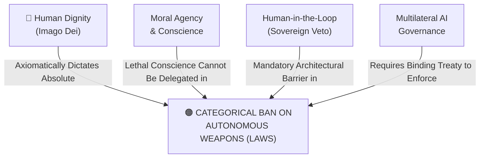

# Categorical Ban on Autonomous Weapons (LAWS)

---

## 1. Executive Summary & Conceptual Thesis

**The Categorical Ban on Autonomous Weapons (LAWS)** represents an absolute, non-negotiable moral red line shared across world religions, international humanitarian law, and civil society coalitions: **a machine must never choose to take a human life**.

Delegating the power of lethal force to an algorithm is an affront to human dignity and a grave regression of human civilization. Machines—regardless of computational power or sensor resolution—lack moral conscience, existential vulnerability, the capacity for mercy, and the ability to weigh proportional justice under the laws of armed conflict. An algorithm cannot experience remorse, nor can it be held morally culpable for a war crime.

Promulgated with historic urgency in Pope Leo XIV's **[Magnifica Humanitas](/ecosystem/magnifica-humanitas.md)** (Chapter 5) and signed by world religious leaders at Hiroshima Peace Park in **[The Hiroshima Appeal](/ecosystem/institutions/rome-call-hiroshima.md)** (July 2024), this mandate demands an immediate, legally binding multilateral treaty categorically outlawing Lethal Autonomous Weapons Systems.

---

## 2. Conceptual Mind Map & Relational Edges

---

## 3. Theoretical & Institutional Grounding

* **[The Hiroshima Appeal for AI Ethics and Peace](/ecosystem/institutions/rome-call-hiroshima.md)**: Historic accord signed at Hiroshima Peace Park uniting Christianity, Islam, Judaism, Buddhism, Hinduism, and Shinto, demanding a binding UN treaty banning autonomous weapons.
* **[Encyclical Letter Magnifica Humanitas](/ecosystem/magnifica-humanitas.md)**: Chapter 5 issues an unyielding condemnation: *"No machine can or should ever possess the sovereign authority to determine whether a human person lives or dies. To delegate the power of lethal force to an algorithm is an abdication of human moral conscience."*
* **International Committee of the Red Cross (ICRC)**: Demands legally binding rules on autonomous weapon systems to prevent unpredictability and human loss of control.

---

## 4. Dialectical Tensions & Counter-Theses

### Tactical Superiority vs. Moral Imperative
* **Military Realpolitik Argument**: Hypersonic swarms and electronic warfare happen too fast for human operators; whoever maintains a human in the loop will lose the war to adversaries utilizing full autonomy.
* **Moral Rebuttal**: Just as the global community banned chemical, biological, and blinding laser weapons despite their tactical utility, humanity must ban autonomous kill decisions. Winning a battle through algorithmic dehumanization destroys the moral foundation of human survival.

---

## 5. Pedagogical, Architectural & Operational Implications

1. **Strict Defense Contracting Refusal**: St. Francis High School and its affiliated engineering labs maintain an absolute policy refusing research funding or partnerships associated with lethal targeting systems.
2. **Peace and Ethics Curriculum**: Educating students on the Hiroshima Appeal, Just War theory, and the ethics of technological disarmament.
3. **Engineering Moral Invariants**: Software design invariants requiring that automated systems must never issue lethal or physical harm commands without sovereign human confirmation.

---

## 6. Relational Edge Index

| Edge Direction | Connected Concept | Relationship Type | Conceptual Description |
| :--- | :--- | :--- | :--- |
| **Inbound** | **[Human Dignity](/concepts/human-dignity.md)** | *Mandated by* | Dignity demands that life-and-death authority cannot be handed to non-human code. |
| **Inbound** | **[Moral Agency & Conscience](/concepts/moral-agency.md)** | *Preserves* | Ensures that moral responsibility for force remains with accountable human beings. |
| **Inbound** | **[Human-in-the-Loop](/concepts/human-in-the-loop.md)** | *Enacted via* | Conscience-in-the-loop requires absolute human veto over weapons deployment. |
| **Outbound** | **[Multilateral AI Governance](/concepts/multilateral-governance.md)** | *Enforced through* | A weapons ban can only succeed through verifiable international multilateral treaties. |

---

## 7. Related Knowledge Base Documents & Primary Sources

### Internal Knowledge Base Links
* [Concept Cluster: Transcendence, Truth & The Limits of Optimization](/concepts/cluster-transcendence-truth.md)
* [Rome Call for AI Ethics & Hiroshima Appeal](/ecosystem/institutions/rome-call-hiroshima.md)
* [Encyclical Letter Magnifica Humanitas](/ecosystem/magnifica-humanitas.md)
* [Human Dignity (Imago Dei & Inalienable Worth)](/concepts/human-dignity.md)

### External Primary Sources
* Pontifical Academy for Life (2024). *The Hiroshima Appeal for AI Ethics and Peace*.
* Pope Leo XIV (2026). *Magnifica Humanitas*, Chapter 5.
* International Committee of the Red Cross (2021). *Position on Autonomous Weapon Systems*.
