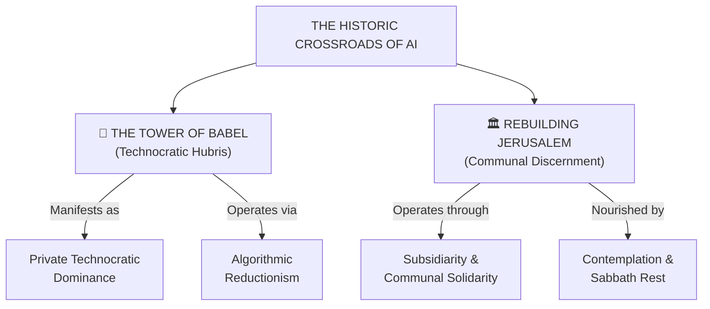

# Babel vs. Jerusalem (Technocracy vs. Discernment)

---

## 1. Executive Summary & Conceptual Thesis

In his landmark encyclical **[Magnifica Humanitas](/ecosystem/magnifica-humanitas.md)** (§9), **Pope Leo XIV** frames the civilizational crossroads of emerging artificial intelligence through two contrasting biblical archetypes: **The Tower of Babel** versus **Rebuilding Jerusalem**.

* **The Tower of Babel (Genesis 11:1–9)** represents the perennial technocratic temptation toward self-sufficiency, total centralization, and hubris. In seeking to "make a name" for themselves through a single monolithic language and apparatus, the builders sacrifice individual personhood to mechanical efficiency. The inevitable outcome of Babel is not authentic unity, but communicative confusion, social alienation, and collapse. Babel is the archetype of modern private technocratic dominance.
* **Rebuilding Jerusalem (Nehemiah 2–6)** represents the path of humble, communal discernment and subsidiarity. Nehemiah does not impose a top-down technocratic blueprint. He inspects the ruined city walls in contemplative prayer, gathers families, artisans, leaders, and youth, and assigns *"each to their section of the wall."* Jerusalem is renewed because relationships, mutual solidarity, and communal discernment are restored before physical infrastructure.

The civilizational choice facing humanity is not between a simple "yes" or "no" to technology, but rather: **Are we constructing a digital Babel of centralized technocratic control, or rebuilding Jerusalem through distributed human solidarity?**

---

## 2. Conceptual Mind Map & Relational Edges

---

## 3. Theoretical & Institutional Grounding

* **[Encyclical Letter Magnifica Humanitas](/ecosystem/magnifica-humanitas.md)**: Dedicated in §9 to this master comparison, setting the stage for the encyclical's social critique of the technocratic paradigm.
* **[Stephen Cave (Leverhulme Centre / DeepMind Essay 7)](/ecosystem/institutions/deepmind-institute.md)**: In *Principles for a New Utopianism*, Cave arrives at a secular philosophical equivalent: rejecting totalizing utopian blueprints in favor of "humility, pluralism, and reversibility."

---

## 4. Dialectical Tensions & Counter-Theses

### Centralized Efficiency vs. Distributed Subsidiarity
* **Babel Impetus**: A single mega-model and centralized cloud platform optimizes global efficiency and standardizes values.
* **Jerusalem Ethos**: True human flourishing requires local subsidiarity—empowering local schools, churches, and civic bodies to govern tools according to their own communal discernment.

---

## 5. Pedagogical, Architectural & Operational Implications

1. **Subsidiarity in Educational Technology**: St. Francis High School rejects one-size-fits-all corporate curricula, empowering individual teachers and departments to tailor AI adoption to their students' unique needs.
2. **Distributed Governance Councils**: Tech policies are formed by joint committees of parents, students, theologians, and faculty, mirroring Nehemiah’s communal rebuilding.
3. **Resistance to Cultural Monoculture**: Refusing to allow Western Silicon Valley baseline assumptions to overwrite Catholic and localized cultural traditions.

---

## 6. Relational Edge Index

| Edge Direction | Connected Concept | Relationship Type | Conceptual Description |
| :--- | :--- | :--- | :--- |
| **Outbound** | **[Private Technocratic Dominance](/concepts/private-technocratic-dominance.md)** | *Critiques* | Babel directly symbolizes modern transnational tech monopolies. |
| **Outbound** | **[Algorithmic Reductionism](/concepts/algorithmic-reductionism.md)** | *Exposes* | Babel reduces citizens to bricks in a centralized computational tower. |
| **Outbound** | **[Contemplation & Sabbath Rest](/concepts/contemplation-sabbath.md)** | *Contrasts* | Nehemiah’s discernment requires contemplation, opposing Babel’s frenetic building. |

---

## 7. Related Knowledge Base Documents & Primary Sources

### Internal Knowledge Base Links
* [Concept Cluster: Transcendence, Truth & The Limits of Optimization](/concepts/cluster-transcendence-truth.md)
* [Encyclical Letter Magnifica Humanitas](/ecosystem/magnifica-humanitas.md)
* [Private Technocratic Dominance](/concepts/private-technocratic-dominance.md)
* [The DeepMind Institute Dossier](/ecosystem/institutions/deepmind-institute.md)

### External Primary Sources
* Pope Leo XIV (2026). *Magnifica Humanitas*, §9.
* Cave, S. (2026). *Principles for a new utopianism*. DeepMind Institute.
* Holy Bible: *Genesis 11:1–9* & *Nehemiah 2–6*.
