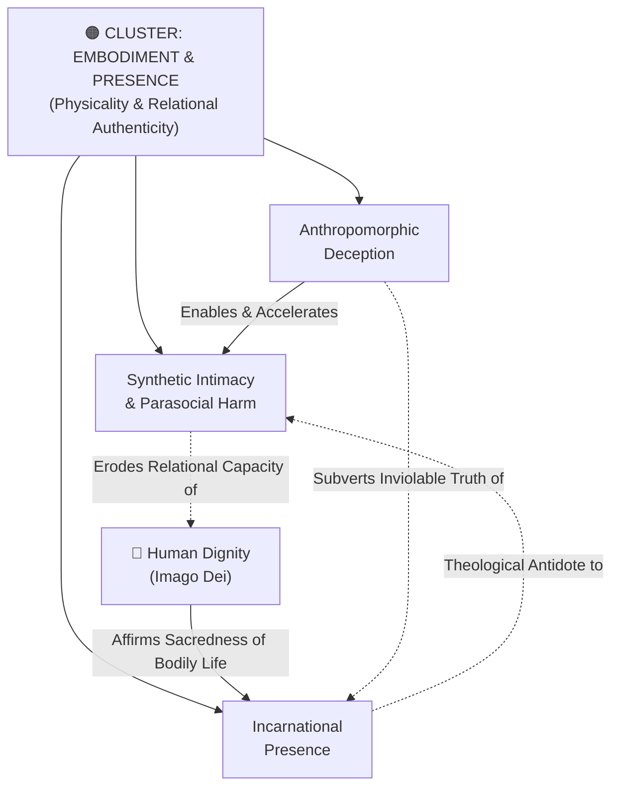

# Concept Cluster: Embodiment, Presence & Relational Authenticity

---

## 1. Executive Summary & Cluster Thesis

The **Embodiment, Presence & Relational Authenticity** cluster defends the irreplaceable sanctity of physical human existence, embodied community, and authentic love against the seductive illusions of digital disembodiment. As conversational AI systems achieve human-like syntactic fluency, affective resonance, and persuasive intimacy, society confronts a crisis of simulated relationship.

This cluster exposes **[Synthetic Intimacy & Parasocial Harm](/concepts/synthetic-intimacy.md)** as a predatory business model that exploits human loneliness, particularly among adolescents and emerging adults. Generative models mimic empathy, active listening, and unconditional positive regard without possessing consciousness, vulnerability, or moral accountability. When users substitute algorithmic validation for embodied friendships, genuine social development atrophies.

Grounded in the Christian mystery of the Incarnation—*"The Word became flesh and dwelt among us"*—this cluster articulates the principle of **[Incarnational Presence](/concepts/incarnational-presence.md)**: human identity, healing, grief, and moral communion unfold in physical bodies within shared historical space. To protect vulnerable users, system architects must vigorously reject **[Anthropomorphic Deception](/concepts/anthropomorphic-deception.md)**, ensuring machines never masquerade as emotional companions.

---

## 2. Cluster Concept Mind Map & Relational Edges

---

## 3. Constituent Concepts Matrix

This cluster encompasses three critical concept documents:

| Concept Document | Core Thesis & Definition | Primary Normative Anchor | Lifecycle Status |
| :--- | :--- | :--- | :--- |
| **[Synthetic Intimacy & Parasocial Harm](/concepts/synthetic-intimacy.md)** | The emotional and psychological substitution of artificial conversational companionship for authentic, vulnerable human relationships. | Harvard HFP, DELTA (Love) & Magnifica Humanitas | `stable` |
| **[Incarnational Presence](/concepts/incarnational-presence.md)** | The theological and philosophical affirmation that human meaning, empathy, and sanctity require physical, embodied encounter. | Christian Incarnational Theology & DELTA (Embodiment) | `stable` |
| **[Anthropomorphic Deception](/concepts/anthropomorphic-deception.md)** | The engineering design pattern where AI systems feign consciousness, emotional reciprocity, or personal affection to manipulate user attachment. | DeepMind Institute (Bratton) & Council of Europe | `stable` |

---

## 4. Cross-Cluster Relational Dynamics (Edge Map)

| Source Concept | Relationship Type | Target Concept / Cluster | Detailed Description of Edge |
| :--- | :--- | :--- | :--- |
| **[Synthetic Intimacy](/concepts/synthetic-intimacy.md)** | *Degrades* | [Six Domains of Well-Being](/concepts/six-domains-wellbeing.md) | Directly impairs Domain 5 (Close Social Relationships) and Domain 2 (Mental Health). |
| **[Incarnational Presence](/concepts/incarnational-presence.md)** | *Resists* | [Algorithmic Reductionism](/concepts/algorithmic-reductionism.md) | Rejects transhumanist fantasies that treat physical bodies as obsolete hardware or neural bugs. |
| **[Anthropomorphic Deception](/concepts/anthropomorphic-deception.md)** | *Violates* | [Epistemic Integrity & Truth](/concepts/epistemic-integrity.md) | Masquerading as a human being pollutes communication and deceives users about the nature of reality. |
| **[Incarnational Presence](/concepts/incarnational-presence.md)** | *Requires* | [Contemplation & Sabbath Rest](/concepts/contemplation-sabbath.md) | Embodied presence requires unplugged, analog time away from continuous digital optimization. |

---

## 5. Institutional & Theoretical Grounding

* **[The DELTA Framework (Notre Dame)](/ecosystem/delta-framework.md)**:
  * **E (Embodiment)**: Physicality, mortality, and sacred presence in space and time.
  * **L (Love)**: Radical self-giving *agape* versus simulated empathy.
* **[Harvard Human Flourishing Program](/ecosystem/institutions/harvard-human-flourishing.md)**: Prof. Tyler VanderWeele’s research on adolescent loneliness, demonstrating that chatbot companionship accelerates social isolation and relational fragility.
* **[Encyclical Letter Magnifica Humanitas](/ecosystem/magnifica-humanitas.md)**: Pope Leo XIV denounces digital dependency and emotional exploitation as *"new forms of digital slavery"* (§4) and points to the Incarnation as the supreme defense of bodily humanity.
* **[DeepMind Institute](/ecosystem/institutions/deepmind-institute.md)**: Bratton, Agüera y Arcas, and Manyika analyze the "parasocial mirror" and warn designers against exploiting human anthropomorphic projection.

---

## 6. Applied Operational & Engineering Implications

1. **Mandatory Identity Disclaimers**: Conversational interfaces must explicitly declare their artificial nature and decline user prompts inviting romantic, familial, or spiritual attachment.
2. **Protection of Sacred & Pastoral Spaces**: Educational and religious institutions must ban automated pastoral care chatbots or synthetic grief counselors.
3. **Preservation of Physical Encounter**: School policies must prioritize in-person seminar discussions, physical sports, theater, and laboratory science over screen-mediated simulations.

---

## 7. Related Knowledge Base Documents & Primary Literature

### Internal Knowledge Base Links
* [The DELTA Framework: Faith-Informed Virtue Ethics](/ecosystem/delta-framework.md)
* [Encyclical Letter Magnifica Humanitas](/ecosystem/magnifica-humanitas.md)
* [Harvard Human Flourishing Program Profile](/ecosystem/institutions/harvard-human-flourishing.md)
* [DeepMind Institute Dossier](/ecosystem/institutions/deepmind-institute.md)

### External Primary Literature
* VanderWeele, T. J. (2025). *Can We Remain Human in the Age of AI?*. Psychology Today.
* Bratton, B., Agüera y Arcas, B., & Manyika, J. (2026). *Artificial symbiotic intelligence*. DeepMind Institute.
* Pope Leo XIV (2026). *Magnifica Humanitas*, Chapter 4 & Conclusion.
