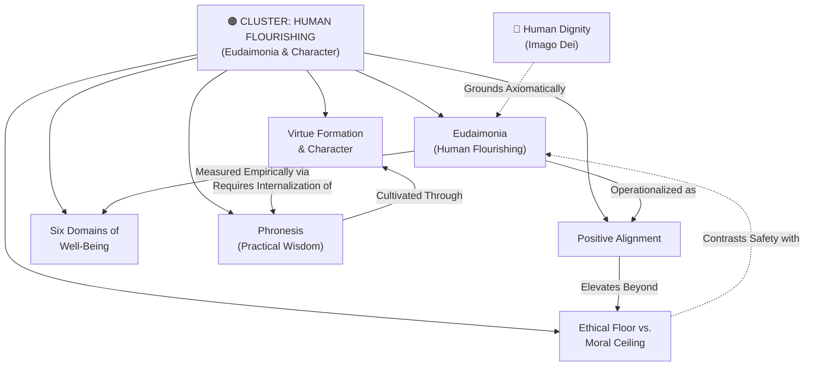

# Concept Cluster: Human Flourishing (Eudaimonia) & Virtue Formation

---

## 1. Executive Summary & Cluster Thesis

The **Human Flourishing & Virtue Formation** cluster centers on the teleological question: *What is the ultimate purpose of artificial intelligence in relation to human life?* While early AI governance and safety frameworks operated almost exclusively within a defensive paradigm—focused on harm prevention, non-discrimination, data privacy, and mitigating catastrophic existential threats—this cluster advances the affirmative paradigm of **[Positive Alignment](/concepts/positive-alignment.md)**. 

Rooted in classical Aristotelian-Thomistic philosophy and modern empirical psychology, this cluster argues that technical systems must be evaluated not merely by what they avoid (an **[Ethical Floor vs. Moral Ceiling](/concepts/ethical-floor-moral-ceiling.md)** distinction), but by their capacity to actively scaffold holistic well-being (**[Eudaimonia](/concepts/eudaimonia.md)**). True flourishing cannot be reduced to subjective momentary pleasure, computational efficiency, or economic throughput; it encompasses character virtues, deep human relationships, existential meaning, and practical wisdom (**[Phronesis](/concepts/phronesis.md)**).

In educational environments such as St. Francis High School, this cluster challenges the presumption that friction-free cognitive convenience is inherently beneficial. Instead, it positions character acquisition as a labor of intentional struggle, demanding that pedagogical software protect student agency, intellectual perseverance, and moral growth (**[Virtue Formation & Character](/concepts/virtue-formation.md)**).

---

## 2. Cluster Concept Mind Map & Relational Edges

---

## 3. Constituent Concepts Matrix

This cluster encompasses six interrelated concept documents:

| Concept Document | Core Thesis & Definition | Primary Normative Anchor | Lifecycle Status |
| :--- | :--- | :--- | :--- |
| **[Human Flourishing (Eudaimonia)](/concepts/eudaimonia.md)** | The realization of complete human potential across emotional, relational, moral, and spiritual dimensions. | Aristotelian Teleology & Christian Personalism | `stable` |
| **[Positive Alignment](/concepts/positive-alignment.md)** | Technical and institutional alignment oriented toward elevating human capabilities and flourishing rather than solely avoiding harm. | Oxford Institute for Ethics in AI & DeepMind | `stable` |
| **[Virtue Formation & Character](/concepts/virtue-formation.md)** | Habitual cultivation of moral excellences (prudence, justice, courage, temperance) through lived action and mentorship. | Aristotelian Virtue Ethics & DELTA Framework | `stable` |
| **[Six Domains of Well-Being](/concepts/six-domains-wellbeing.md)** | VanderWeele's multi-dimensional empirical framework assessing happiness, mental/physical health, meaning, character, relationships, and stability. | Harvard Human Flourishing Program | `stable` |
| **[Phronesis (Practical Wisdom)](/concepts/phronesis.md)** | The contextual moral judgment required to choose the right action in particular, complex circumstances; unprogrammable by statistical heuristics. | Classical Greek Philosophy & Oxford HAI Lab | `stable` |
| **[Ethical Floor vs. Moral Ceiling](/concepts/ethical-floor-moral-ceiling.md)** | The structural demarcation between baseline legal/safety compliance (the floor) and proactive civilizational flourishing (the ceiling). | DELTA Framework & Magnifica Humanitas | `stable` |

---

## 4. Cross-Cluster Relational Dynamics (Edge Map)

This cluster connects dynamically to neighboring conceptual domains:

| Source Concept | Relationship Type | Target Concept / Cluster | Detailed Description of Edge |
| :--- | :--- | :--- | :--- |
| **[Eudaimonia](/concepts/eudaimonia.md)** | *Requires* | [Human Dignity](/concepts/human-dignity.md) | Human flourishing cannot be pursued if inalienable human worth is compromised or commodified. |
| **[Virtue Formation](/concepts/virtue-formation.md)** | *Threatened by* | [Cognitive Deskilling & Moral Atrophy](/concepts/cognitive-deskilling.md) | Offloading moral and intellectual effort to AI atrophies the capacities necessary for virtue. |
| **[Phronesis](/concepts/phronesis.md)** | *Cultivated via* | [Cognitive Friction & Productive Struggle](/concepts/cognitive-friction.md) | Practical wisdom cannot emerge from instant synthetic answers; it requires interpretive struggle. |
| **[Positive Alignment](/concepts/positive-alignment.md)** | *Contrasts with* | [Algorithmic Reductionism](/concepts/algorithmic-reductionism.md) | Rejects optimizing for narrow metrics (retention, click-through) in favor of polycentric human goods. |
| **[Six Domains of Well-Being](/concepts/six-domains-wellbeing.md)** | *Vulnerable to* | [Synthetic Intimacy & Parasocial Harm](/concepts/synthetic-intimacy.md) | Artificial companionship displaces genuine relational health (Domain 5) and moral character (Domain 4). |

---

## 5. Institutional & Theoretical Grounding

* **[Oxford Institute for Ethics in AI](/ecosystem/institutions/oxford-ethics-ai.md)**: Led by Prof. John Tasioulas and Dr. Ruben Laukkonen, Oxford formulated the seminal *Positive Alignment* manifesto, uniting computer scientists and philosophers to shift AI engineering toward *eudaimonia*.
* **[Harvard Human Flourishing Program](/ecosystem/institutions/harvard-human-flourishing.md)**: Prof. Tyler J. VanderWeele established empirical measurement instruments tracking how emerging technologies influence character, mental health, and family cohesion.
* **[The DELTA Framework (Univ. of Notre Dame)](/ecosystem/delta-framework.md)**: Supplies the foundational normative grammar—specifically the *Agency*, *Transcendence*, and *Love* pillars—demanding that learning environments prioritize moral formation over automation.
* **[Encyclical Letter Magnifica Humanitas](/ecosystem/magnifica-humanitas.md)**: Pope Leo XIV insists that human flourishing requires an "integral ecology" where machines remain servants to the spiritual vocation of the person.

---

## 6. Applied Operational & Engineering Implications

1. **Socratic Software Architectures**: Systems deployed in schools must prioritize dialogue and question-posing over turnkey answer generation.
2. **Multi-Domain Optimization Criteria**: Frontier models and recommendation engines must not optimize for single-variable loss functions (e.g. dwell time, tokens generated), but evaluate outcomes across flourishing indicators.
3. **Intentional Educational Friction**: Curriculum design must demarcate unassisted human thinking zones to safeguard the neural and moral architecture of emerging adults.

---

## 7. Related Knowledge Base Documents & Primary Literature

### Internal Knowledge Base Links
* [The DELTA Framework: Faith-Informed Virtue Ethics](/ecosystem/delta-framework.md)
* [Oxford Institute for Ethics in AI Profile](/ecosystem/institutions/oxford-ethics-ai.md)
* [Harvard Human Flourishing Program Profile](/ecosystem/institutions/harvard-human-flourishing.md)
* [Encyclical Letter Magnifica Humanitas](/ecosystem/magnifica-humanitas.md)
* [Knowledge-Driven Engineering Playbook](/playbooks/knowledge-driven-engineering.md)

### External Primary Literature
* Laukkonen, R. et al. (2026). *Positive Alignment: Artificial Intelligence for Human Flourishing*. arXiv:2605.10310.
* VanderWeele, T. J., & Teubner, J. D. (2026). *Flourishing Considerations for AI*. Information, 17(1), 25.
* Aristotle. *Nicomachean Ethics*. Books II & VI (Virtue and Phronesis).
