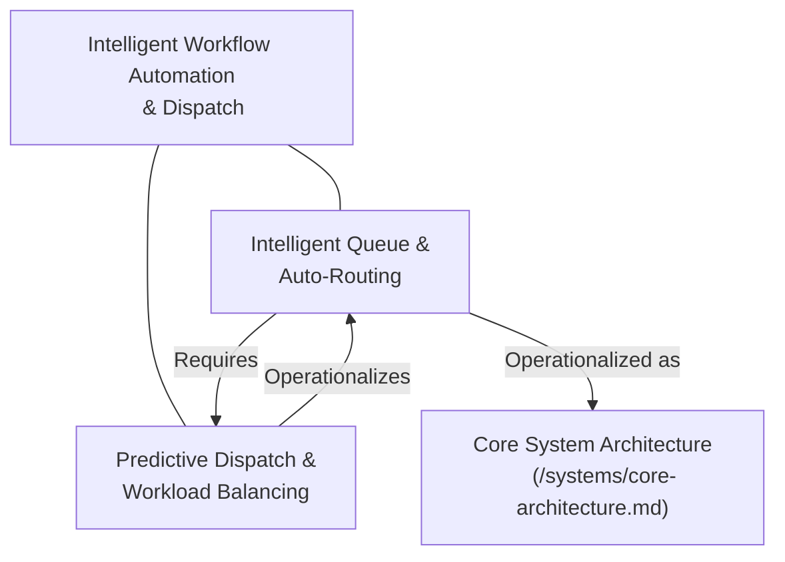

# Concept Cluster: Intelligent Workflow Automation & Dispatch

---

## 1. Executive Summary & Cluster Thesis

This thematic cluster unites research, architectural RFCs, and operational proposals addressing the challenges of high-volume request routing, predictive resource allocation, and autonomous task triage.

* **Organizing Tension**: Automated high-velocity throughput vs. human operator agency and verification guarantees.
* **Scope of Inquiry**: Event-driven ingress pipelines, machine-assisted workload scoring, and real-time SLA prediction.
* **Strategic Relevancy**: Eliminates operational bottlenecks while preserving human-in-the-loop auditability.

---

## 2. Conceptual Constellation Mind Map

---

## 3. Constituent Concepts Matrix

| Concept Document | Core Thesis & Definition | Primary Normative / Technical Anchor | Lifecycle Status |
| :--- | :--- | :--- | :--- |
| **[Next-Generation Intelligent Queue](/concepts/future-initiative.md)** | Automated event-driven dispatcher calculating priority scores and estimated wait times. | *Event-Driven Architecture, Reactive Streams* | `draft` |
| **[Predictive Dispatch & Workload Balancing](/concepts/predictive-dispatch.md)** | Dynamic machine-assisted task distribution balancing operator cognitive load with SLA targets. | *Queueing Theory, Cognitive Ergonomics* | `draft` |

---

## 4. Cross-Cluster & Transversal Relational Edges

| Source Node in Cluster | Relationship Type | Target Concept / Cluster | Detailed Description of Edge |
| :--- | :--- | :--- | :--- |
| **[Intelligent Queue](/concepts/future-initiative.md)** | *Operationalized as* | [System Architecture](/systems/core-architecture.md) | How the routing algorithm is hosted within active production microservices. |
| **[Predictive Dispatch](/concepts/predictive-dispatch.md)** | *Operationalized as* | [Production Workflow](/playbooks/knowledge-driven-engineering.md) | How dispatch telemetry integrates with operational team sprints. |

---

## 5. Applied Operational & Engineering Implications

1. **System Guardrails**: Non-delegable manual override for urgent priority requests; graceful fallback to FIFO queueing during broker outages.
2. **Telemetry Invariants**: Real-time tracing of priority assignment decisions with immutable audit logs.
3. **Capacity Boundaries**: Enforced operator cognitive concurrency limits to prevent burnout.

---

## 6. Related Knowledge Base Documents & Primary Literature

### Internal Knowledge Base Links
* [System Architecture Specification](/systems/core-architecture.md)
* [Knowledge-Driven Engineering Playbook](/playbooks/knowledge-driven-engineering.md)
* [Customer Discovery & User Feedback](/research/user-interview-example.md)

### External Primary Sources
* [Fowler, M. (2017), *What do you mean by Event-Driven?*](https://martinfowler.com/articles/201701-event-driven.html)
