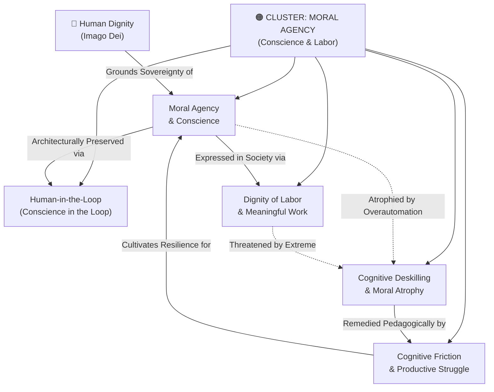

# Concept Cluster: Moral Agency, Conscience & The Dignity of Work

---

## 1. Executive Summary & Cluster Thesis

The **Moral Agency, Conscience & Dignity of Work** cluster interrogates the boundaries of human autonomy in an era of hyper-capable automated cognitive systems. Its central animating thesis holds that **moral conscience is sovereign, personal, and non-delegable**. While machine learning models can process immense datasets, synthesize textual arguments, and forecast probabilistic outcomes, they lack moral interiority, existential accountability, and the capacity to bear moral responsibility before God and society.

This cluster identifies the existential risk not as killer robots alone, but as the voluntary abdication of human judgment: the subtle, systemic temptation to offload difficult moral, legal, pedagogical, and administrative choices to automated algorithms (**[Human-in-the-Loop & Conscience in the Loop](/concepts/human-in-the-loop.md)**). Such delegation inevitably induces **[Cognitive Deskilling & Moral Atrophy](/concepts/cognitive-deskilling.md)**, wherein human beings lose the psychological and intellectual muscle required to navigate ethical ambiguity.

Furthermore, this cluster asserts that work is not merely an economic input to be minimized through automation, but an indispensable component of human vocation, identity, and flourishing (**[Dignity of Labor & Meaningful Work](/concepts/dignity-of-labor.md)**). By intentionally preserving **[Cognitive Friction & Productive Struggle](/concepts/cognitive-friction.md)** in education and professional workflows, institutions protect human agency from algorithmic subsumption.

---

## 2. Cluster Concept Mind Map & Relational Edges

---

## 3. Constituent Concepts Matrix

This cluster encompasses five foundational concepts:

| Concept Document | Core Thesis & Definition | Primary Normative Anchor | Lifecycle Status |
| :--- | :--- | :--- | :--- |
| **[Moral Agency & Conscience](/concepts/moral-agency.md)** | The inalienable capacity and duty of human persons to discern truth and freely choose moral action. | Catholic Moral Theology & DELTA Framework | `stable` |
| **[Human-in-the-Loop (Conscience in the Loop)](/concepts/human-in-the-loop.md)** | The architectural requirement that high-stakes, irreversible ethical choices remain subject to sovereign human veto. | Council of Europe (CETS 225) & Magnifica Humanitas | `stable` |
| **[Cognitive Deskilling & Moral Atrophy](/concepts/cognitive-deskilling.md)** | The degradation of cognitive competence, critical reasoning, and moral willpower resulting from chronic over-reliance on AI. | Harvard HFP & DeepMind Economic Policy | `stable` |
| **[Cognitive Friction & Productive Struggle](/concepts/cognitive-friction.md)** | The deliberate preservation of difficulty and interpretive resistance in learning workflows to catalyze genuine mastery. | Pedagogical Theory & DELTA Teacher's Examen | `stable` |
| **[Dignity of Labor & Meaningful Work](/concepts/dignity-of-labor.md)** | Labor as an expression of personal vocation and human dignity, rejecting the reduction of workers to automatable capital costs. | Catholic Social Teaching (*Laborem Exercens*, *Magnifica Humanitas*) | `stable` |

---

## 4. Cross-Cluster Relational Dynamics (Edge Map)

| Source Concept | Relationship Type | Target Concept / Cluster | Detailed Description of Edge |
| :--- | :--- | :--- | :--- |
| **[Moral Agency](/concepts/moral-agency.md)** | *Mandates* | [Categorical Ban on Autonomous Weapons](/concepts/autonomous-weapons-ban.md) | Because lethal moral choice cannot be delegated, autonomous weapon targeting is categorically prohibited. |
| **[Cognitive Friction](/concepts/cognitive-friction.md)** | *Cultivates* | [Phronesis (Practical Wisdom)](/concepts/phronesis.md) | Situational wisdom cannot be memorized or automated; it is forged through friction and reflective struggle. |
| **[Dignity of Labor](/concepts/dignity-of-labor.md)** | *Informs* | [Sovereign AI Wealth Funds & Economic Policy](/concepts/sovereign-wealth-funds-economic-policy.md) | Economic interventions must focus on wage subsidies and worker agency, not merely passive cash transfers. |
| **[Human-in-the-Loop](/concepts/human-in-the-loop.md)** | *Guaranteed by* | [Multilateral AI Governance](/concepts/multilateral-governance.md) | Statutory treaties establish legal rights of appeal and human review for automated decisions. |
| **[Cognitive Deskilling](/concepts/cognitive-deskilling.md)** | *Exacerbated by* | [Algorithmic Reductionism](/concepts/algorithmic-reductionism.md) | Treating human tasks as mere optimization workflows encourages complete behavioral automation. |

---

## 5. Institutional & Theoretical Grounding

* **[Encyclical Letter Magnifica Humanitas](/ecosystem/magnifica-humanitas.md)**: Pope Leo XIV dedicates Chapter 4 to the dignity of work and the preservation of human freedom, warning against digital slavery and algorithmic displacement of human vocations.
* **[The DELTA Framework](/ecosystem/delta-framework.md)**: The **A (Agency)** pillar insists that human beings must remain active moral agents rather than passive consumers of machine-generated recommendations.
* **[Council of Europe Committee on AI (CAI)](/ecosystem/institutions/council-of-europe-ai.md)**: CETS No. 225 establishes binding procedural remedies guaranteeing citizens the right to contest automated decisions before a human judge.
* **[DeepMind Institute Macroeconomics Program](/ecosystem/institutions/deepmind-institute.md)**: Jacobs and Imas analyze how unconditional transfers without labor agency degrade civic purpose, advocating for labor subsidies.

---

## 6. Applied Operational & Engineering Implications

1. **Non-Delegable Human Veto Rails**: Software deployed in school admissions, academic grading, disciplinary sanctions, or medical care must require explicit human sign-off.
2. **Friction-Preserving UI Defaults**: Pedagogical tools must resist providing instant, complete essays or math solutions; systems should operate in scaffolded, Socratic modes.
3. **Workplace Augmentation Audits**: Organizations must conduct labor impact assessments before automating knowledge workflows to protect employee skill mastery.

---

## 7. Related Knowledge Base Documents & Primary Literature

### Internal Knowledge Base Links
* [The DELTA Framework: Faith-Informed Virtue Ethics](/ecosystem/delta-framework.md)
* [Encyclical Letter Magnifica Humanitas](/ecosystem/magnifica-humanitas.md)
* [Council of Europe Framework Convention Dossier](/ecosystem/institutions/council-of-europe-ai.md)
* [Knowledge-Driven Engineering Playbook](/playbooks/knowledge-driven-engineering.md)

### External Primary Literature
* Pope Leo XIV (2026). *Magnifica Humanitas*. Holy See.
* Pope John Paul II (1981). *Laborem Exercens*. Vatican.
* Jacobs, J., & Imas, A. (2026). *Economic policy for AGI*. DeepMind Institute.
* Council of Europe (2024). *Framework Convention on AI (CETS No. 225)*.
