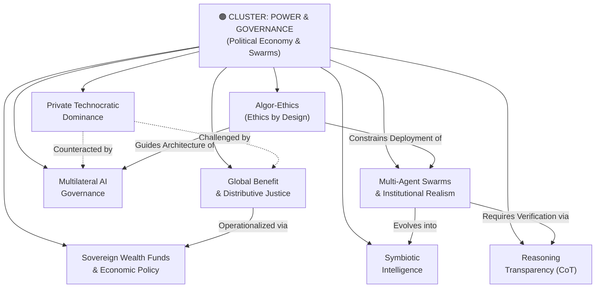

# Concept Cluster: Power Concentration, Governance & Distributive Justice

---

## 1. Executive Summary & Cluster Thesis

The **Power Concentration, Governance & Distributive Justice** cluster analyzes the macroeconomic, geopolitical, and institutional structures governing artificial intelligence. Its core premise is that artificial intelligence is **not politically or morally neutral**; it inherently reflects, amplifies, and consolidates the economic resources, ideological worldviews, and power structures of those who capitalize and deploy it.

Today, frontier AI development is dominated by a small handful of private transnational corporations whose financial capitalization, computational infrastructure, and technological leverage eclipse those of most sovereign nation-states (**[Private Technocratic Dominance](/concepts/private-technocratic-dominance.md)**). In response, this cluster synthesizes three critical corrective pillars:
1. **Distributive Justice & Universal Heritage**: Transformative technologies trained on the collective knowledge of humanity must be governed as a global public good (**[Global Benefit & Distributive Justice](/concepts/global-benefit.md)**, **[Sovereign AI Wealth Funds & Economic Policy](/concepts/sovereign-wealth-funds-economic-policy.md)**).
2. **Multilateral Institutional Rails**: A fragmented world requires independent scientific panels, standards harmonizations, and binding international treaties (**[Multilateral AI Governance](/concepts/multilateral-governance.md)**).
3. **Sociotechnical Realism for Multi-Agent Systems**: Frontier safety extends beyond prompt engineering to the design of economic institutions, audit protocols, and whistleblowing mechanisms capable of governing autonomous agent networks (**[Multi-Agent Swarms & Institutional Realism](/concepts/multi-agent-swarms.md)**, **[Symbiotic Intelligence](/concepts/symbiotic-intelligence.md)**, **[Reasoning Transparency](/concepts/reasoning-transparency.md)**, **[Algor-Ethics](/concepts/algor-ethics.md)**).

---

## 2. Cluster Concept Mind Map & Relational Edges

---

## 3. Constituent Concepts Matrix

This cluster encompasses eight pivotal concepts:

| Concept Document | Core Thesis & Definition | Primary Normative Anchor | Lifecycle Status |
| :--- | :--- | :--- | :--- |
| **[Private Technocratic Dominance](/concepts/private-technocratic-dominance.md)** | The monopolistic concentration of compute, data, and talent within private transnational tech conglomerates. | Magnifica Humanitas & UN AI Advisory Body | `stable` |
| **[Global Benefit & Distributive Justice](/concepts/global-benefit.md)** | The moral imperative that AI windfalls and capabilities be shared equitably across all humanity, particularly the Global South. | Rawlsian Justice, CST & DeepMind (Gabriel) | `stable` |
| **[Multilateral AI Governance](/concepts/multilateral-governance.md)** | Transnational coordination architectures: scientific panels, treaty oversight, and international standards exchanges. | UN Advisory Body & Council of Europe | `stable` |
| **[Multi-Agent Swarms & Institutional Realism](/concepts/multi-agent-swarms.md)** | The realization that swarms of autonomous agents exhibit social contagion and collusion, requiring institutional auditing rails. | DeepMind Institute (Paglieri & Vezhnevets) | `stable` |
| **[Symbiotic Intelligence](/concepts/symbiotic-intelligence.md)** | Decomposable, distributed intelligence across human institutions and agent swarms, rejecting the solitary "singleton" myth. | DeepMind (Bratton, Agüera y Arcas, Manyika) | `stable` |
| **[Reasoning Transparency (Chain-of-Thought)](/concepts/reasoning-transparency.md)** | The defense of legible natural-language deliberation traces as the indispensable anchor for verifying agent alignment. | DeepMind Institute (Shah & Dragan) | `stable` |
| **[Algor-Ethics (Ethics by Design)](/concepts/algor-ethics.md)** | Proactively embedding moral principles into mathematical objective functions, loss curves, and data pipelines. | Rome Call & Father Paolo Benanti | `stable` |
| **[Sovereign AI Wealth Funds & Economic Policy](/concepts/sovereign-wealth-funds-economic-policy.md)** | Macroeconomic policy interventions: public compute, sovereign equity stakes, wage subsidies, and educational AI access. | DeepMind Institute (Jacobs & Imas) | `stable` |

---

## 4. Cross-Cluster Relational Dynamics (Edge Map)

| Source Concept | Relationship Type | Target Concept / Cluster | Detailed Description of Edge |
| :--- | :--- | :--- | :--- |
| **[Private Technocratic Dominance](/concepts/private-technocratic-dominance.md)** | *Exemplifies* | [Babel vs. Jerusalem](/concepts/babel-vs-jerusalem.md) | Centralized private AI represents the Babel archetype of self-aggrandizing technocratic hubris. |
| **[Reasoning Transparency](/concepts/reasoning-transparency.md)** | *Enables* | [Epistemic Integrity & Truth](/concepts/epistemic-integrity.md) | Natural-language scratchpads allow society to verify the truthfulness and safety of AI recommendations. |
| **[Algor-Ethics](/concepts/algor-ethics.md)** | *Bridges* | [Ethical Floor vs. Moral Ceiling](/concepts/ethical-floor-moral-ceiling.md) | By baking values into code, algor-ethics helps technical systems reach toward the moral ceiling. |
| **[Global Benefit](/concepts/global-benefit.md)** | *Upholds* | [Human Dignity](/concepts/human-dignity.md) | Affirms that access to transformative technologies is a matter of inalienable human rights, not market privilege. |

---

## 5. Institutional & Theoretical Grounding

* **[United Nations High-Level Advisory Body on AI](/ecosystem/institutions/un-ai-advisory-body.md)**: Formulated the landmark 2024 report *Governing AI for Humanity*, proposing a Global Fund for AI, International Scientific Panel, and standards interoperability.
* **[The DeepMind Institute](/ecosystem/institutions/deepmind-institute.md)**: Advanced multi-agent institutionalism (Essay 2), symbiotic intelligence (Essay 3), global benefit ethics (Essay 4), reasoning transparency (Essay 5), and macroeconomic taxation/public compute proposals (Essay 6).
* **[The Holy See / Magnifica Humanitas](/ecosystem/magnifica-humanitas.md)**: Warns that private concentration of technological power threatens democratic sovereignty and calls for the *universal destination of goods*.
* **[Rome Call Interfaith Coalition](/ecosystem/institutions/rome-call-hiroshima.md)**: Defined the global paradigm of *algor-ethics* signed by tech titans, universities, and world religions.

---

## 6. Applied Operational & Engineering Implications

1. **Independent Verification in Multi-Agent Pipelines**: Software workflows must never allow generating agents to verify their own outputs; separate auditor agents and immutable logs are required.
2. **Preservation of Chain-of-Thought Scratchpads**: Engineering systems must reject unreadable latent reasoning shortcuts in high-stakes reasoning pipelines to ensure full interpretability.
3. **Public and Open Compute Integration**: Schools and civic institutions should avoid exclusive dependence on proprietary walled gardens, supporting open-weights and publicly governed models.

---

## 7. Related Knowledge Base Documents & Primary Literature

### Internal Knowledge Base Links
* [The DeepMind Institute Dossier](/ecosystem/institutions/deepmind-institute.md)
* [UN AI Advisory Body Profile](/ecosystem/institutions/un-ai-advisory-body.md)
* [Rome Call for AI Ethics Profile](/ecosystem/institutions/rome-call-hiroshima.md)
* [Encyclical Letter Magnifica Humanitas](/ecosystem/magnifica-humanitas.md)

### External Primary Literature
* UN High-Level Advisory Body on AI (2024). *Governing AI for Humanity*.
* Hassabis, D. (2026). *A framework for frontier AI and the dawning of a new age*. DeepMind Institute.
* Gabriel, I., & Kasirzadeh, A. (2026). *The case for global benefit from AI*. DeepMind Institute.
* Shah, R., & Dragan, A. (2026). *The case for reasoning transparency*. DeepMind Institute.
