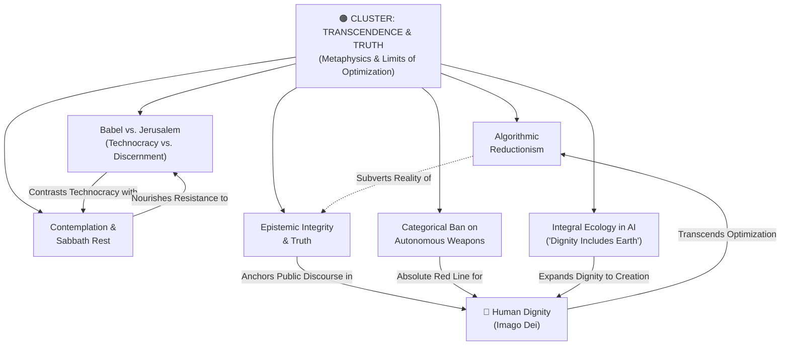

# Concept Cluster: Transcendence, Truth & The Limits of Optimization

---

## 1. Executive Summary & Cluster Thesis

The **Transcendence, Truth & Limits of Optimization** cluster marks the metaphysical boundary of artificial intelligence: **not everything of genuine human value can be quantified, automated, monetized, or optimized by a loss function**. 

In an era captivated by synthetic generative fluency, contemporary society risks committing the fatal error of **[Algorithmic Reductionism](/concepts/algorithmic-reductionism.md)**—mistaking statistical token prediction for wisdom, information for truth, and computational efficiency for the good life. Pope Leo XIV frames this crisis through the master archetypes of **[Babel vs. Jerusalem](/concepts/babel-vs-jerusalem.md)**: Babel represents the hubristic technocratic project to build a monoculture of self-sufficiency, whereas Jerusalem represents humble communal discernment, subsidiarity, and relational reconciliation.

Furthermore, generative AI poses severe threats to the public epistemological commons through deepfakes, synthetic hall of mirrors, and automated outrage. Preserving **[Epistemic Integrity & Truth](/concepts/epistemic-integrity.md)** requires an "ecology of communication" grounded in human trust. To resist total digital colonization, humanity must intentionally protect non-optimizable spaces of silence, prayer, and rest (**[Contemplation & Sabbath Rest](/concepts/contemplation-sabbath.md)**), while upholding a strict moral boundary against delegating life-and-death choices to machines (**[Categorical Ban on Autonomous Weapons](/concepts/autonomous-weapons-ban.md)**).

---

## 2. Cluster Concept Mind Map & Relational Edges

---

## 3. Constituent Concepts Matrix

This cluster encompasses five vital concepts:

| Concept Document | Core Thesis & Definition | Primary Normative Anchor | Lifecycle Status |
| :--- | :--- | :--- | :--- |
| **[Babel vs. Jerusalem](/concepts/babel-vs-jerusalem.md)** | The theological contrast between technocratic hubris and centralization (Babel) versus humble communal discernment and subsidiarity (Jerusalem). | Magnifica Humanitas (§9) | `stable` |
| **[Algorithmic Reductionism](/concepts/algorithmic-reductionism.md)** | The intellectual fallacy of reducing human persons, dignity, and flourishing to measurable data points and algorithmic inputs. | Magnifica Humanitas & DELTA (Dignity) | `stable` |
| **[Contemplation & Sabbath Rest](/concepts/contemplation-sabbath.md)** | The intentional preservation of non-digital, non-productive time dedicated to silence, wonder, prayer, and transcendent communion. | DELTA (Transcendence) & Catholic Social Teaching | `stable` |
| **[Epistemic Integrity & Truth](/concepts/epistemic-integrity.md)** | Defending the public epistemological commons against synthetic disinformation, algorithmic distortion, and communicative pollution. | Magnifica Humanitas (Ch. 4) & Council of Europe | `stable` |
| **[Categorical Ban on Autonomous Weapons (LAWS)](/concepts/autonomous-weapons-ban.md)** | The absolute moral and legal prohibition against delegating the sovereign authority of lethal force to automated software. | Hiroshima Appeal, Vatican & Rome Call | `stable` |
| **[Integral Ecology in AI (Dignity Includes the Earth)](/concepts/integral-ecology-ai.md)** | Expanding DELTA's Dignity pillar to planetary stewardship and connecting AI compute energy and water to moral responsibility. | Laudato Si' & DELTA (Dignity) | `stable` |

---

## 4. Cross-Cluster Relational Dynamics (Edge Map)

| Source Concept | Relationship Type | Target Concept / Cluster | Detailed Description of Edge |
| :--- | :--- | :--- | :--- |
| **[Babel vs. Jerusalem](/concepts/babel-vs-jerusalem.md)** | *Critiques* | [Private Technocratic Dominance](/concepts/private-technocratic-dominance.md) | Directly exposes modern tech monopolies as contemporary manifestations of the Babel impulse. |
| **[Algorithmic Reductionism](/concepts/algorithmic-reductionism.md)** | *Rebutted by* | [Human Dignity](/concepts/human-dignity.md) | *"The person is not a system of algorithms."* Dignity is inalienable and beyond computation. |
| **[Contemplation & Sabbath Rest](/concepts/contemplation-sabbath.md)** | *Protects* | [Moral Agency & Conscience](/concepts/moral-agency.md) | Silence and unhurried contemplation are necessary preconditions for the formation of conscience. |
| **[Epistemic Integrity](/concepts/epistemic-integrity.md)** | *Requires* | [Reasoning Transparency (Chain-of-Thought)](/concepts/reasoning-transparency.md) | Truth in AI outputs requires auditable reasoning traces rather than black-box pronouncements. |
| **[Ban on Autonomous Weapons](/concepts/autonomous-weapons-ban.md)** | *Enforced through* | [Multilateral AI Governance](/concepts/multilateral-governance.md) | Requires binding international treaties under the UN and Geneva Conventions. |
| **[Integral Ecology in AI](/concepts/integral-ecology-ai.md)** | *Extends* | [Human Dignity](/concepts/human-dignity.md) | Expands human dignity beyond anthropocentrism to include reverence for the physical earth. |

---

## 5. Institutional & Theoretical Grounding

* **[Encyclical Letter Magnifica Humanitas](/ecosystem/magnifica-humanitas.md)**: Formulates the central archetypes of Babel and Jerusalem, denounces transhumanism, and issues an uncompromising prohibition on lethal autonomous weapons.
* **[The DELTA Framework (Notre Dame)](/ecosystem/delta-framework.md)**: The **T (Transcendence)** pillar commands institutions to cultivate wonder, contemplation, and truth beyond loss functions.
* **[The Hiroshima Appeal (Pontifical Academy for Life & World Religions)](/ecosystem/institutions/rome-call-hiroshima.md)**: Historic interfaith accord signed at Hiroshima Peace Park demanding an immediate international treaty outlawing autonomous kill decisions.
* **[Stephen Cave (Leverhulme Centre / DeepMind Essay 7)](/ecosystem/institutions/deepmind-institute.md)**: Advocates for "humility and pluralism" in future visions, warning against monolithic technological dogmas.

---

## 6. Applied Operational & Engineering Implications

1. **Digital Sabbath & Tech-Free Zones**: Educational institutions must institute scheduled periods of screen-free contemplation, retreat, and analog discussion.
2. **Absolute Refusal of Lethal Software Development**: Strict organizational prohibition against accepting defense contracts involving autonomous target selection or weaponized software.
3. **Cryptographic Provenance & Watermarking**: System architectures must support C2PA-compliant content credentials and synthetic media disclosures to preserve public epistemic integrity.

---

## 7. Related Knowledge Base Documents & Primary Literature

### Internal Knowledge Base Links
* [Encyclical Letter Magnifica Humanitas](/ecosystem/magnifica-humanitas.md)
* [The DELTA Framework: Faith-Informed Virtue Ethics](/ecosystem/delta-framework.md)
* [Rome Call for AI Ethics & Hiroshima Appeal](/ecosystem/institutions/rome-call-hiroshima.md)
* [DeepMind Institute Dossier](/ecosystem/institutions/deepmind-institute.md)

### External Primary Literature
* Pope Leo XIV (2026). *Magnifica Humanitas*, Chapters 3, 4, and 5.
* Pontifical Academy for Life (2024). *The Hiroshima Appeal for AI Ethics and Peace*.
* Cave, S. (2026). *Principles for a new utopianism*. DeepMind Institute.