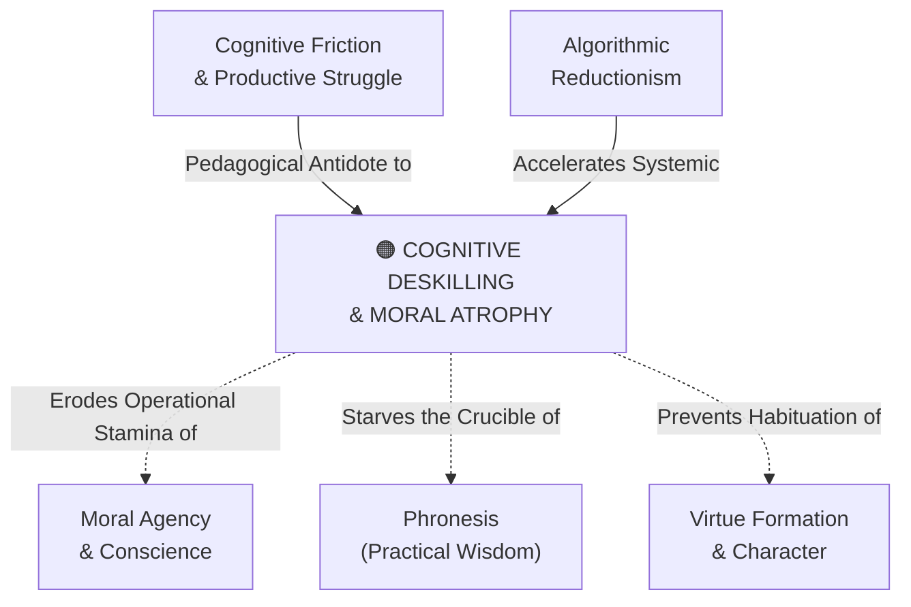

# Cognitive Deskilling & Moral Atrophy

---

## 1. Executive Summary & Conceptual Thesis

**Cognitive Deskilling & Moral Atrophy** describes the insidious psychological and developmental erosion that occurs when human beings systematically outsource their intellectual struggle, critical deliberation, and moral choices to automated computational agents. Just as physical muscles undergo biological atrophy when spared all physical resistance, human cognitive and moral capacities wither when spared the friction of authentic effort.

In secondary and higher education, generative AI threatens to induce catastrophic cognitive deskilling:
* If students rely on conversational agents to draft outlines, synthesize literature, write code, and rephrase arguments, they fail to develop the neural pathways for sustained concentration, linear argumentation, and intellectual fortitude.
* More perilous still is **moral atrophy**: when individuals routinely defer ethical judgments—such as interpersonal reconciliation, pastoral care, or professional responsibility—to automated scripts, they lose the capacity for situational discernment (**[Phronesis](/concepts/phronesis.md)**).

Preventing deskilling requires pedagogical and technological systems that deliberately preserve **[Cognitive Friction & Productive Struggle](/concepts/cognitive-friction.md)**.

---

## 2. Conceptual Mind Map & Relational Edges

---

## 3. Theoretical & Institutional Grounding

* ****Harvard Human Flourishing Program****: VanderWeele & Teubner (2026) document how chronic reliance on cognitive shortcuts impairs executive function, memory consolidation, and moral character in young adults.
* **[The DELTA Framework (Notre Dame)](/ecosystem/delta-framework.md)**: Warns that outsourcing intellectual and moral discernment produces "cognitive passivity and ethical alienation."
* **[DeepMind Institute Macroeconomics Program](/ecosystem/institutions/deepmind-institute.md)**: Jacobs & Imas demonstrate that widespread cognitive deskilling among displaced workers leads to deep crises of purpose and mental health decline, even when financial income is replaced via basic income.

---

## 4. Dialectical Tensions & Counter-Theses

### Cognitive Augmentation vs. Cognitive Substitution
* **Techno-Optimist Claim**: AI frees humans from tedious low-level cognition so they can operate at "higher strategic and creative levels."
* **Cognitive Reality**: Higher-order creativity and strategic reasoning are inextricably built upon lower-level foundational skills. You cannot write brilliant philosophy if you never struggled with grammar, syntax, and basic logic.

---

## 5. Pedagogical, Architectural & Operational Implications

1. **AI Assignment Decision Tree**: Teachers at St. Francis High School categorize coursework into *Unassisted Formation Zones* (where AI use is strictly prohibited to build core cognitive muscle) and *Supervised Augmentation Zones*.
2. **Analog Thesis Defenses**: Secondary students must present and defend their arguments orally before a faculty panel, demonstrating unassisted grasp of thesis architecture.
3. **No-Shortcut IDE and Writing Tools**: Educational software should disable full-sentence auto-complete and turnkey code generation for introductory programming and composition courses.

---

## 6. Relational Edge Index

| Edge Direction | Connected Concept | Relationship Type | Conceptual Description |
| :--- | :--- | :--- | :--- |
| **Outbound** | **[Moral Agency & Conscience](/concepts/moral-agency.md)** | *Threatens* | Deskilled humans become passive consumers who can no longer exercise robust agency. |
| **Outbound** | **[Phronesis (Practical Wisdom)](/concepts/phronesis.md)** | *Degrades* | Practical moral judgment requires practice; without it, judgment atrophies into complacency. |
| **Inbound** | **[Cognitive Friction & Productive Struggle](/concepts/cognitive-friction.md)** | *Remedied by* | Preserving intentional cognitive friction is the primary pedagogical defense against deskilling. |
| **Inbound** | **[Algorithmic Reductionism](/concepts/algorithmic-reductionism.md)** | *Accelerated by* | Viewing learning as merely generating answers encourages complete task offloading. |

---

## 7. Related Knowledge Base Documents & Primary Sources

### Internal Knowledge Base Links
* [Concept Cluster: Moral Agency, Conscience & The Dignity of Work](/concepts/cluster-moral-agency.md)
* [Cognitive Friction & Productive Struggle](/concepts/cognitive-friction.md)
* [Virtue Formation & Character](/concepts/virtue-formation.md)
* [The DELTA Framework: Faith-Informed Virtue Ethics](/ecosystem/delta-framework.md)

### External Primary Sources
* VanderWeele, T. J., & Teubner, J. D. (2026). *Flourishing Considerations for AI*. Information, 17(1), 25.
* Jacobs, J., & Imas, A. (2026). *Economic policy for AGI*. DeepMind Institute.
* University of Notre Dame (2026). *The Teacher's Examen: Preserving Student Voice*. DELTA Network.
