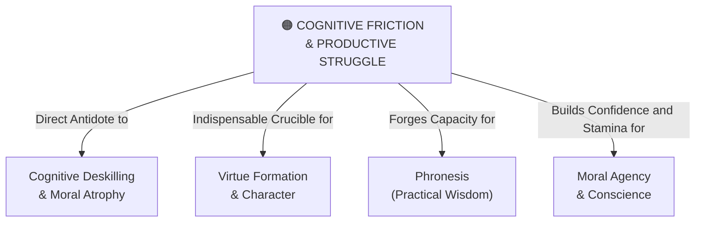

# Cognitive Friction & Productive Struggle

---

## 1. Executive Summary & Conceptual Thesis

**Cognitive Friction & Productive Struggle** is a foundational pedagogical principle affirming that **genuine learning, intellectual independence, and character formation require effortful resistance, confusion, failure, and reflective recovery**. Cognitive science has long demonstrated that desirable difficulties enhance long-term memory encoding, conceptual synthesis, and adaptive problem-solving skills.

The consumer tech paradigm views all friction as a defect to be engineered away: interfaces must be frictionless, answers instant, and cognitive loads minimized. However, when software removes all friction from reading, drafting, mathematical reasoning, and ethical discernment, it removes the very catalyst of human growth.

In contrast to frictionless automation, the [DELTA Framework](/ecosystem/delta-framework.md) advocates for the **intentional preservation of cognitive friction**. Educational software and curricula must be designed not to replace the student's intellectual struggle, but to scaffold and accompany them through productive struggle toward authentic mastery.

---

## 2. Conceptual Mind Map & Relational Edges

---

## 3. Theoretical & Institutional Grounding

* **[The DELTA Framework (Notre Dame)](/ecosystem/delta-framework.md)**: Julia Stull and the DELTA Education Community developed *Scaffolded Writing Workshops* and the *AI Assignment Decision Tree*, demonstrating how teachers can deliberately engineer productive friction into assignments to safeguard student voice.
* ****Oxford Institute for Ethics in AI (The Lyceum Project)****: Highlights that Aristotelian virtue is acquired through habituation (*ethos*), which intrinsically requires overcoming internal and external resistance.
* **Classical Learning Theory (Bjork & Bjork)**: "Desirable difficulties" in learning create deeper cognitive schemata than passive or frictionless retrieval.

---

## 4. Dialectical Tensions & Counter-Theses

### Frictionless Speed vs. Formative Struggle
* **Silicon Valley Narrative**: *"Why spend 5 hours struggling through a primary Latin text or complex calculus proof when an AI model can explain it in 5 seconds?"*
* **Pedagogical Rebuttal**: Because the objective of education is not obtaining the translated text; the objective is the transformation of the student's mind into one capable of rigorous, unassisted translation and analysis.

---

## 5. Pedagogical, Architectural & Operational Implications

1. **The Scaffolded Writing Workshop**: Students draft initial ideas in analog notebooks with fountain pens or pencils, articulating thesis ideas through group debate before consulting any digital search engine.
2. **Socratic AI Interaction Modes**: AI tutors must withhold direct answers, prompting the student with hints, counter-examples, and clarifying questions.
3. **Intentional Slowdown in Exam Settings**: Timed, offline analytical exams that evaluate the student's spontaneous cognitive reasoning without access to internet assistance.

---

## 6. Relational Edge Index

| Edge Direction | Connected Concept | Relationship Type | Conceptual Description |
| :--- | :--- | :--- | :--- |
| **Outbound** | **[Cognitive Deskilling & Moral Atrophy](/concepts/cognitive-deskilling.md)** | *Prevents* | Preserving cognitive resistance stops the intellectual atrophy of over-reliance. |
| **Outbound** | **[Virtue Formation & Character](/concepts/virtue-formation.md)** | *Catalyzes* | Character virtues like fortitude and patience require overcoming friction. |
| **Outbound** | **[Phronesis (Practical Wisdom)](/concepts/phronesis.md)** | *Forges* | Practical wisdom is forged through real struggle with complex dilemmas. |
| **Outbound** | **[Moral Agency & Conscience](/concepts/moral-agency.md)** | *Strengthens* | Wrestling with difficult choices builds genuine autonomy and personal agency. |

---

## 7. Related Knowledge Base Documents & Primary Sources

### Internal Knowledge Base Links
* [Concept Cluster: Moral Agency, Conscience & The Dignity of Work](/concepts/cluster-moral-agency.md)
* [Cognitive Deskilling & Moral Atrophy](/concepts/cognitive-deskilling.md)
* [Virtue Formation & Character](/concepts/virtue-formation.md)
* [The DELTA Framework: Faith-Informed Virtue Ethics](/ecosystem/delta-framework.md)

### External Primary Sources
* Bjork, E. L., & Bjork, R. A. (2011). *Making things hard on yourself, but in a good way: Creating desirable difficulties to enhance learning*.
* University of Notre Dame (2026). *DELTA Assignment Decision Tree*. Institute for Ethics and the Common Good.
* Tasioulas, J. & Koralus, P. (2025). *The Lyceum Project: Cognitive Resistance in Human-AI Collaboration*. Oxford.
