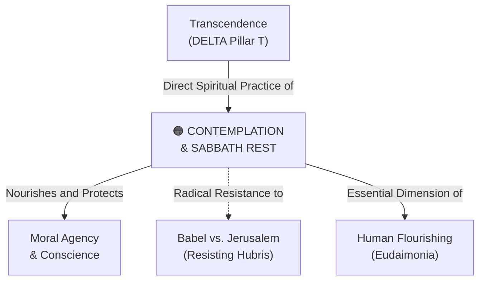

# Contemplation & Sabbath Rest

---

## 1. Executive Summary & Conceptual Thesis

**Contemplation & Sabbath Rest** represents the intentional spiritual and psychological discipline of preserving non-digital, non-productive, and non-optimizable time and space. In an attention economy designed to capture every waking second for data extraction and behavioral advertising, silence, prayer, and rest become radical acts of moral resistance.

The [DELTA Framework](/ecosystem/delta-framework.md) enshrines this principle in its **Transcendence (T)** pillar: *"Not everything of genuine value can be quantified, automated, monetized, or optimized by a loss function. Wonder, contemplative silence, moral beauty, truth, worship, and gratitude draw humanity beyond empirical mechanics toward the divine."*

Without regular Sabbath rest and contemplation, human interiority collapses into digital agitation, making moral discernment (**[Phronesis](/concepts/phronesis.md)**) and character formation impossible.

---

## 2. Conceptual Mind Map & Relational Edges

---

## 3. Theoretical & Institutional Grounding

* **[The DELTA Framework (Notre Dame)](/ecosystem/delta-framework.md)**: The **T (Transcendence)** pillar commands educational institutions to preserve analog, contemplative spaces that deliberately resist algorithmic speed.
* **[Encyclical Letter Magnifica Humanitas](/ecosystem/magnifica-humanitas.md)**: Pope Leo XIV warns against attention monetization as a form of spiritual bondage, calling for the recovery of contemplative silence.
* **Josef Pieper's *Leisure: The Basis of Culture***: Demonstrates that leisure and contemplation are not mere breaks from work to recharge productivity, but the foundational activities through which human culture and worship emerge.

---

## 4. Dialectical Tensions & Counter-Theses

### Continuous Optimization vs. Sacred Rest
* **Silicon Valley Optimization Stance**: Every minute must be utilized for self-optimization, learning, or productivity tracking.
* **Sabbath Counter-Thesis**: Rest has intrinsic value because human worth is not tied to productivity. Sabbath declares that the world is sustained by divine grace, not frantic human activity.

---

## 5. Pedagogical, Architectural & Operational Implications

1. **Digital Sabbath Protocols**: St. Francis High School implements screen-free weekends and retreats where students and faculty disconnect completely from electronic communications.
2. **Campus Architecture of Silence**: Intentional quiet gardens, chapels, and reading libraries where electronic devices are strictly prohibited.
3. **No-AI Creative Periods**: Art, poetry, and reflective writing classes where students create without algorithmic assistance.

---

## 6. Relational Edge Index

| Edge Direction | Connected Concept | Relationship Type | Conceptual Description |
| :--- | :--- | :--- | :--- |
| **Inbound** | **[Moral Agency & Conscience](/concepts/moral-agency.md)** | *Nourishes* | Conscience requires contemplative silence to hear the voice of moral truth. |
| **Outbound** | **[Babel vs. Jerusalem](/concepts/babel-vs-jerusalem.md)** | *Resists* | Sabbath rest directly defies the relentless construction of the Babel monoculture. |
| **Inbound** | **[Incarnational Presence](/concepts/incarnational-presence.md)** | *Requires* | Contemplation is an embodied practice unfolding in physical space and time. |

---

## 7. Related Knowledge Base Documents & Primary Sources

### Internal Knowledge Base Links
* [Concept Cluster: Transcendence, Truth & The Limits of Optimization](/concepts/cluster-transcendence-truth.md)
* [The DELTA Framework: Faith-Informed Virtue Ethics](/ecosystem/delta-framework.md)
* [Encyclical Letter Magnifica Humanitas](/ecosystem/magnifica-humanitas.md)
* [Babel vs. Jerusalem](/concepts/babel-vs-jerusalem.md)

### External Primary Sources
* Pieper, J. (1952). *Leisure: The Basis of Culture*. Pantheon Books.
* University of Notre Dame (2026). *DELTA Framework: Transcendence Pillar*.
* Heschel, A. J. (1951). *The Sabbath: Its Meaning for Modern Man*. Farrar, Straus and Giroux.
