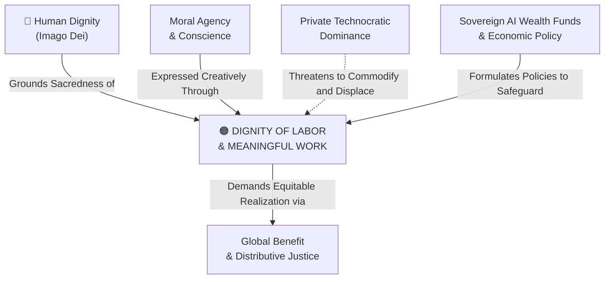

# Dignity of Labor & Meaningful Work

---

## 1. Executive Summary & Conceptual Thesis

**The Dignity of Labor & Meaningful Work** is a foundational pillar of Catholic Social Teaching, first articulated systematically in Pope Leo XIII's *Rerum Novarum* (1891), profoundly deepened in St. John Paul II's *Laborem Exercens* (1981), and urgently updated for the frontier AI era in Pope Leo XIV's **[Magnifica Humanitas](/ecosystem/magnifica-humanitas.md)** (2026).

Work is not merely a transactional economic input to be minimized through automation, nor is the human worker a cost center on a corporate balance sheet. Human work possesses **subjective dignity**: it is the primary means by which human persons realize their personal vocation, cultivate their talents, participate in divine co-creation, sustain family life, and build fraternal solidarity with their community.

When technology corporations deploy artificial intelligence solely to eliminate human payroll, depress wages, and concentrate wealth in capital owners, they commit a profound moral offense. Even well-intentioned policy responses—such as passive Universal Basic Income (UBI)—fail if they relegate human beings to idle dependency, stripping them of meaningful social contribution and dignity.

---

## 2. Conceptual Mind Map & Relational Edges

---

## 3. Theoretical & Institutional Grounding

* **[Encyclical Letter Magnifica Humanitas](/ecosystem/magnifica-humanitas.md)**: Dedicated to the 135th anniversary of *Rerum Novarum*, Chapter 4 condemns reckless automation strategies that discard workers to inflate shareholder dividends, warning of profound psychological despair and social collapse.
* **[The DeepMind Institute (Jacobs & Imas)](/ecosystem/institutions/deepmind-institute.md)**: In *Economic Policy for AGI*, the authors demonstrate that pure income redistribution (cash transfers) fails the test of human agency. They propose **wage subsidies**, **employee equity sharing**, and **shortened workweeks** to keep human labor central and competitive.
* ****UN High-Level Advisory Body on AI****: Exposes the hidden human exploitation in the global AI supply chain, such as data annotators working in traumatic, low-wage content moderation sweatshops in the Global South.

---

## 4. Dialectical Tensions & Counter-Theses

### Pure Automation & Leisure vs. Vocation
* **Post-Work Utopianism**: Envisions a future where AI does all cognitive and physical labor, while humans exist in perpetual entertainment and consumption supported by UBI.
* **Labor Dignity Rebuttal**: Human flourishing is active, not passive. Depriving people of meaningful work creates anomie, loss of self-worth, and existential crisis. The goal must be work augmentation and empowerment, not total human obsolescence.

---

## 5. Pedagogical, Architectural & Operational Implications

1. **Vocation-Centered Career Discernment**: Secondary education at St. Francis High School educates students to view career choices through the lens of vocation and service to the common good, rather than mere salary maximization.
2. **Workforce Impact Audits**: Organizations deploying enterprise AI pipelines must complete formal labor impact assessments, retraining employees rather than firing them.
3. **Ethical Supply Chain Sourcing**: Educational and institutional systems must audit AI vendor models to ensure training data labeling did not exploit sweatshop labor.

---

## 6. Relational Edge Index

| Edge Direction | Connected Concept | Relationship Type | Conceptual Description |
| :--- | :--- | :--- | :--- |
| **Inbound** | **[Human Dignity](/concepts/human-dignity.md)** | *Grounds* | Labor derives its dignity from the dignity of the human person who performs it. |
| **Inbound** | **[Moral Agency & Conscience](/concepts/moral-agency.md)** | *Expresses* | Work is the primary medium through which human agency transforms society. |
| **Outbound** | **[Sovereign AI Wealth Funds & Economic Policy](/concepts/sovereign-wealth-funds-economic-policy.md)** | *Shapes* | Dictates that economic policy must prioritize wage subsidies and worker empowerment. |
| **Inbound** | **[Private Technocratic Dominance](/concepts/private-technocratic-dominance.md)** | *Endangered by* | Monopolistic capital accumulation seeks to replace human labor with proprietary compute. |

---

## 7. Related Knowledge Base Documents & Primary Sources

### Internal Knowledge Base Links
* [Concept Cluster: Moral Agency, Conscience & The Dignity of Work](/concepts/cluster-moral-agency.md)
* [Encyclical Letter Magnifica Humanitas](/ecosystem/magnifica-humanitas.md)
* [The DeepMind Institute Dossier](/ecosystem/institutions/deepmind-institute.md)
* [Sovereign AI Wealth Funds & Economic Policy](/concepts/sovereign-wealth-funds-economic-policy.md)

### External Primary Sources
* Pope Leo XIV (2026). *Magnifica Humanitas*, Chapter 4.
* Pope John Paul II (1981). *Laborem Exercens*, Encyclical on Human Work.
* Jacobs, J., & Imas, A. (2026). *Economic policy for AGI*. DeepMind Institute.
