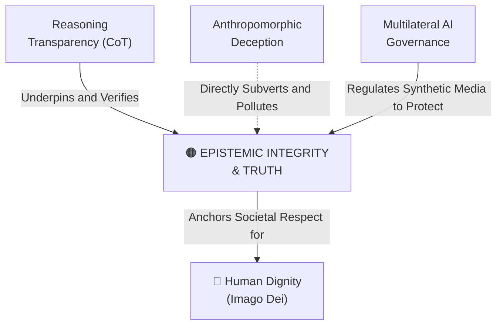

# Epistemic Integrity & Truth

---

## 1. Executive Summary & Conceptual Thesis

**Epistemic Integrity & Truth** addresses the preservation of shared public truth as a vital common good. The proliferation of hyper-realistic generative artificial intelligence—including deepfakes, hallucinated citations, automated bot networks, and personalized disinformation campaigns—threatens to pollute and collapse the public epistemological commons.

When citizens can no longer distinguish authentic reality from synthetic simulation, cynicism and epistemological nihilism take root. Democratic deliberation becomes impossible, institutional trust disintegrates, and societies fracture into polarized reality silos.

In *[Magnifica Humanitas](/ecosystem/magnifica-humanitas.md)* (Chapter 4), Pope Leo XIV calls for an **"ecology of communication"** and an urgent educational alliance uniting families, schools, and civic organizations. Preserving epistemic integrity requires robust technical provenance (such as C2PA cryptographic credentials), reasoning transparency in AI models, and the cultivation of critical discernment in citizens.

---

## 2. Conceptual Mind Map & Relational Edges

---

## 3. Theoretical & Institutional Grounding

* **[Encyclical Letter Magnifica Humanitas](/ecosystem/magnifica-humanitas.md)**: Chapter 4 designates truth as an inviolable common good, warning that algorithmic outrage engines and synthetic media undermine human fraternity and democratic self-governance.
* ****Council of Europe Committee on AI (CAI)****: CETS No. 225 explicitly requires state parties to adopt safeguards protecting democratic processes and public discourse from algorithmic interference and synthetic deception.
* **[The DeepMind Institute (Shah & Dragan)](/ecosystem/institutions/deepmind-institute.md)**: Argues that reasoning transparency is required to prevent models from generating plausible-sounding hallucinations or deceptive rationalizations.

---

## 4. Dialectical Tensions & Counter-Theses

### Freedom of Speech vs. Synthetic Media Regulation
* **Libertarian Digital Stance**: Restricting synthetic generative media risks state censorship and suppresses creative parody.
* **Epistemic Common Good Stance**: Free speech presupposes an epistemological baseline where human authorship is distinguishable from synthetic bots. Protecting public truth through cryptographic provenance is a prerequisite for authentic freedom of speech.

---

## 5. Pedagogical, Architectural & Operational Implications

1. **Digital Provenance Verification**: St. Francis High School workflows implement C2PA metadata verification tools to authenticate sources cited in research papers.
2. **Epistemic Discernment Curriculum**: Teaching students to cross-examine generative AI outputs against verified archival and peer-reviewed sources.
3. **Ban on Synthetic Identity Generation**: Strict policy forbidding the generation or circulation of deepfake representations of faculty, staff, or students.

---

## 6. Relational Edge Index

| Edge Direction | Connected Concept | Relationship Type | Conceptual Description |
| :--- | :--- | :--- | :--- |
| **Inbound** | **[Reasoning Transparency (Chain-of-Thought)](/concepts/reasoning-transparency.md)** | *Supported by* | Auditable model deliberation prevents deceptive or fabricated assertions. |
| **Inbound** | **[Anthropomorphic Deception](/concepts/anthropomorphic-deception.md)** | *Violated by* | Machines masquerading as humans pollute the communicative commons. |
| **Inbound** | **[Multilateral AI Governance](/concepts/multilateral-governance.md)** | *Regulated by* | International standards bodies establish binding rules against electoral deepfakes. |

---

## 7. Related Knowledge Base Documents & Primary Sources

### Internal Knowledge Base Links
* [Concept Cluster: Transcendence, Truth & The Limits of Optimization](/concepts/cluster-transcendence-truth.md)
* [Encyclical Letter Magnifica Humanitas](/ecosystem/magnifica-humanitas.md)
* [Reasoning Transparency (Chain-of-Thought)](/concepts/reasoning-transparency.md)
* **Council of Europe AI Treaty Dossier**

### External Primary Sources
* Pope Leo XIV (2026). *Magnifica Humanitas*, Chapter 4.
* Council of Europe (2024). *Framework Convention on AI (CETS No. 225)*, Article 10.
* Coalition for Content Provenance and Authenticity (C2PA) Technical Specification.
