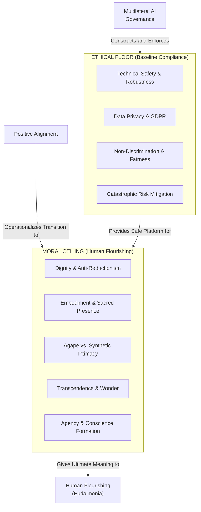

# Ethical Floor vs. Moral Ceiling

---

## 1. Executive Summary & Conceptual Thesis

The distinction between the **Ethical Floor** and the **Moral Ceiling** is one of the most vital architectural and normative contributions of the [DELTA Framework](/ecosystem/delta-framework.md) and contemporary Catholic Social Teaching.

* **The Ethical Floor (Regulatory Compliance & Harm Prevention)**: Represents the minimum baseline of technical safety, legal compliance, and negative rights protection. It includes statutory frameworks such as the EU AI Act, Council of Europe Framework Convention (CETS No. 225), GDPR data privacy, copyright protections, bias mitigation, and preventing catastrophic existential or biosecurity threats. The floor defines *what systems must never do*.
* **The Moral Ceiling (Human Flourishing & Virtue Formation)**: Represents the affirmative, teleological vision of the good life. Grounded in Christian personalism, Aristotelian virtue ethics, and human flourishing (*eudaimonia*), the ceiling asks *what systems ought to cultivate*. It calls for systems that nurture human agency, respect physical embodiment, protect authentic community, preserve contemplative wonder, and elevate human dignity.

A society or school that focuses exclusively on the ethical floor creates safe, compliant machines that can nonetheless degrade human character, encourage addiction, and diminish the spirit. True institutional leadership requires constructing the floor while striving toward the ceiling.

---

## 2. Conceptual Mind Map & Relational Edges

---

## 3. Theoretical & Institutional Grounding

* **[The DELTA Framework (Univ. of Notre Dame)](/ecosystem/delta-framework.md)**: Articulates this explicit contrast: *"As artificial intelligence becomes more powerful, Christian institutions must look beyond an 'ethical floor' of safety, privacy, and transparency toward a deeper, faith-informed approach rooted in enduring Christian values."*
* **[Encyclical Letter Magnifica Humanitas](/ecosystem/magnifica-humanitas.md)**: Pope Leo XIV insists that legal prohibitions against autonomous weapons or data exploitation are essential baselines, but the Church's true mission is building a *"civilization of love"* rather than a sterile digital bureaucracy.
* ****Oxford Institute for Ethics in AI****: Mirrors this distinction in the *Positive Alignment* agenda, moving from defensive risk mitigation to active scaffolding of human goods.

---

## 4. Dialectical Tensions & Counter-Theses

### Compliance Checking vs. Moral Vision
* **The Compliance Trap**: Organizations believe their ethical duties are satisfied when their legal team checks off GDPR, copyright, and safety audit checkboxes.
* **The Moral Ceiling Reality**: A platform can be 100% legally compliant while driving teenage users into catastrophic social isolation and cognitive passivity. Compliance is necessary, but insufficient for virtue.

---

## 5. Pedagogical, Architectural & Operational Implications

1. **Dual-Gate Architectural Review**: Software specifications at St. Francis High School must pass two distinct evaluation gates: Gate 1 (Floor: Security, Privacy, FERPA compliance) and Gate 2 (Ceiling: Does this enhance student agency, embodiment, and intellectual perseverance?).
2. **Beyond Content Moderation**: Platform moderation must not merely filter profane tokens; it must evaluate whether community interfaces promote fraternal charity and constructive dialogue.
3. **Institutional Procurement Standards**: Refusing to license EdTech tools that pass legal privacy standards but use engagement-maximizing hooks that degrade student attention.

---

## 6. Relational Edge Index

| Edge Direction | Connected Concept | Relationship Type | Conceptual Description |
| :--- | :--- | :--- | :--- |
| **Outbound** | **[Positive Alignment](/concepts/positive-alignment.md)** | *Guides* | The moral ceiling defines the affirmative goal toward which positive alignment strives. |
| **Outbound** | **[Human Flourishing (Eudaimonia)](/concepts/eudaimonia.md)** | *Elevates Toward* | The ceiling is defined by the full realization of human flourishing. |
| **Inbound** | **[Multilateral AI Governance](/concepts/multilateral-governance.md)** | *Enforces Floor* | International treaties and regulations construct and police the ethical floor. |
| **Inbound** | **[Algor-Ethics](/concepts/algor-ethics.md)** | *Bridges* | Ethics by design builds the architectural ladder connecting the floor to the ceiling. |

---

## 7. Related Knowledge Base Documents & Primary Sources

### Internal Knowledge Base Links
* [Concept Cluster: Human Flourishing & Virtue Formation](/concepts/cluster-human-flourishing.md)
* [The DELTA Framework: Faith-Informed Virtue Ethics](/ecosystem/delta-framework.md)
* [Positive Alignment (AI for Human Flourishing)](/concepts/positive-alignment.md)
* **Council of Europe Framework Convention Dossier**

### External Primary Sources
* Sullivan, M. & Kronk, A. (2026). *DELTA: Educating for Character in the Age of AI*. University of Notre Dame.
* Laukkonen, R. et al. (2026). *Positive Alignment: Artificial Intelligence for Human Flourishing*. arXiv:2605.10310.
* Council of Europe (2024). *Framework Convention on AI (CETS No. 225)*.
