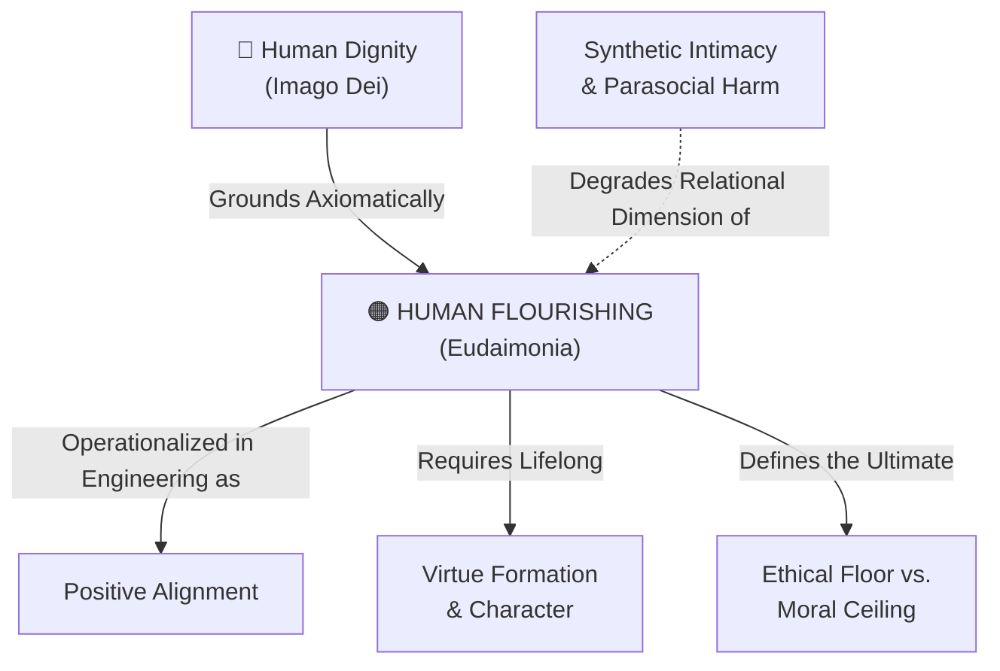

# Human Flourishing (Eudaimonia)

---

## 1. Executive Summary & Conceptual Thesis

**Human Flourishing (*Eudaimonia*)** represents the supreme ethical goal (*telos*) of human existence within classical philosophy and virtue ethics. Distinct from contemporary utilitarian conceptions of happiness—which prioritize fleeting affective pleasure, hedonic gratification, or cognitive convenience—*eudaimonia* denotes a state of complete, multi-dimensional wholeness. It is the realization of human potential through the exercise of reason, moral character, deep communal bonds, and purposeful living.

In the context of artificial intelligence, *eudaimonia* serves as the foundational normative benchmark for evaluating whether technological systems genuinely benefit humanity. When technologies are designed solely to optimize transactional speed, screen engagement, or labor productivity, they frequently undermine the very foundations of human flourishing: eroding attention spans, replacing vulnerable human relationships with synthetic chatbots, and bypassing the cognitive friction essential for character formation.

Adopting *eudaimonia* as a core engineering and pedagogical requirement compels institutions to move beyond passive safety guardrails toward **[Positive Alignment](/concepts/positive-alignment.md)**—designing systems that proactively elevate human wisdom, relational depth, and moral excellence.

---

## 2. Conceptual Mind Map & Relational Edges

---

## 3. Theoretical & Institutional Grounding

* **[The DELTA Framework](/ecosystem/delta-framework.md)**: Formulated at the University of Notre Dame's Institute for Ethics and the Common Good, DELTA establishes human flourishing (*eudaimonia*) as the foundational moral ceiling for artificial intelligence, integrating Christian virtue ethics with classical Aristotelian teleology.
* **[The DeepMind Institute](/ecosystem/institutions/deepmind-institute.md)**: In *The Case for Global Benefit from AI* (Gabriel & Kasirzadeh, 2026), DeepMind researchers argue that artificial intelligence governance must transcend baseline harm avoidance to proactively maximize holistic human flourishing across diverse global communities.

---

## 4. Dialectical Tensions & Counter-Theses

### Hedonic Utility vs. Eudaimonic Growth
* **Consumer Tech Paradigm**: Optimizes for friction-free convenience, instant answers, and dopamine-driven platform retention.
* **Eudaimonic Paradigm**: Affirms that true human growth requires overcoming difficulty, developing patience, and experiencing the vulnerability of mutual human relationships.

---

## 5. Pedagogical, Architectural & Operational Implications

1. **Student Holistic Flourishing Index**: St. Francis High School evaluates AI tool integration not by test speed or homework completion rates, but by its longitudinal impact on student intellectual perseverance, relational health, and moral character.
2. **AI as Socratic Mentor**: Educational software must be tuned to ask probing questions that stimulate student reflection, rather than simply supplying synthesized answers.
3. **Protecting Communal Encounter**: Educational environments must preserve shared physical rituals, athletic participation, and liturgical worship as irreplaceable pillars of flourishing.

---

## 6. Relational Edge Index

| Edge Direction | Connected Concept | Relationship Type | Conceptual Description |
| :--- | :--- | :--- | :--- |
| **Inbound** | **[Human Dignity](/concepts/human-dignity.md)** | *Grounds* | Dignity is the ontological foundation; eudaimonia is its active, flourishing expression. |
| **Outbound** | **[Positive Alignment](/concepts/positive-alignment.md)** | *Operationalized as* | Positive alignment is the technical translation of eudaimonia for machine systems. |
| **Outbound** | **[Virtue Formation & Character](/concepts/virtue-formation.md)** | *Requires* | Flourishing cannot occur without the habitual acquisition of moral and intellectual virtues. |
| **Outbound** | **[Ethical Floor vs. Moral Ceiling](/concepts/ethical-floor-moral-ceiling.md)** | *Defines* | Eudaimonia constitutes the moral ceiling that rises above baseline compliance. |

---

## 7. Related Knowledge Base Documents & Primary Sources

### Internal Knowledge Base Links
* [Concept Cluster: Human Flourishing & Virtue Formation](/concepts/cluster-human-flourishing.md)
* **Oxford Institute for Ethics in AI Profile**
* **Harvard Human Flourishing Program Profile**
* [The DELTA Framework: Faith-Informed Virtue Ethics](/ecosystem/delta-framework.md)

### External Primary Sources
* Laukkonen, R. et al. (2026). *Positive Alignment: Artificial Intelligence for Human Flourishing*. arXiv:2605.10310.
* Aristotle. *Nicomachean Ethics*, Book I.
* VanderWeele, T. J. (2017). *On the promotion of human flourishing*. PNAS, 114(31), 8148-8156.
