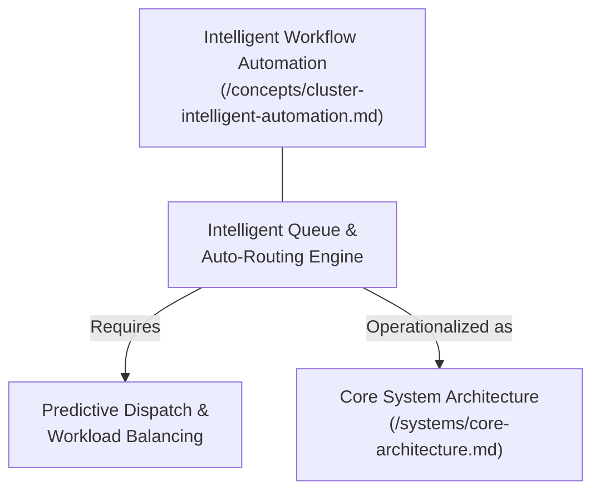
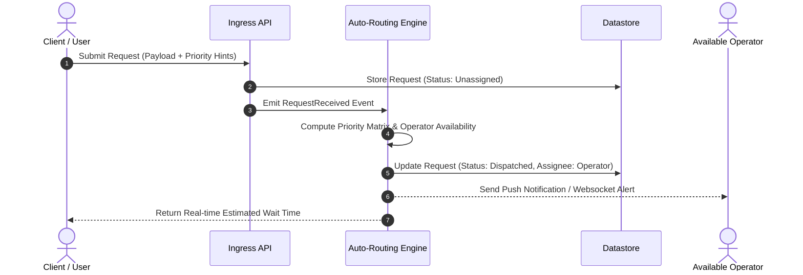

# Next-Generation Intelligent Queue & Auto-Routing

---

## 1. Executive Summary & Conceptual Thesis

Current user requests and internal tickets are routed via manual triage queues. This creates operational bottlenecks during peak hours, increases latency for urgent requests, and lacks real-time visibility.

This proposal introduces an automated event-driven dispatcher that calculates priority scores, estimates resolution times, and assigns tasks to available operators.

---

## 2. Conceptual Mind Map & Relational Edges



---

## 3. Proposed Architecture & Workflow



---

## 4. Data Contract (Draft)

```json
{
  "request_id": "req_8923a10b",
  "client_id": "usr_99812",
  "urgency": "high",
  "category": "technical_support",
  "metadata": {
    "device_platform": "mobile_ios",
    "network_latency_ms": 42
  }
}
```

---

## 5. Applied Operational & Engineering Implications

1. **Graceful Fallback**: If the auto-routing engine becomes unreachable, ingress traffic defaults immediately to a durable FIFO dead-letter queue.
2. **Idempotency**: All routing decisions carry unique routing transaction IDs to prevent duplicate operator assignments.
3. **Telemetry**: Real-time emission of queue dwell times and dispatch latency percentiles ($p50$, $p95$, $p99$).

---

## 6. Relational Edge Index

| Edge Direction | Connected Concept | Relationship Type | Conceptual Description |
| :--- | :--- | :--- | :--- |
| **Outbound** | **[Predictive Dispatch](/concepts/predictive-dispatch.md)** | *Requires* | The routing engine depends on predictive workload telemetry to calculate assignment targets. |
| **Outbound** | **[Core Architecture](/systems/core-architecture.md)** | *Operationalized as* | How the auto-routing pipeline is hosted within production API gateways and event busses. |

---

## 7. Related Knowledge Base Documents & Primary Literature

### Internal Knowledge Base Links
* [Thematic Cluster: Intelligent Workflow Automation](/concepts/cluster-intelligent-automation.md)
* [Core System Architecture](/systems/core-architecture.md)
* [User Interview Insights](/research/user-interview-example.md)

### External Primary Sources
* [Reactive Streams Specification (2020)](https://www.reactive-streams.org/)
