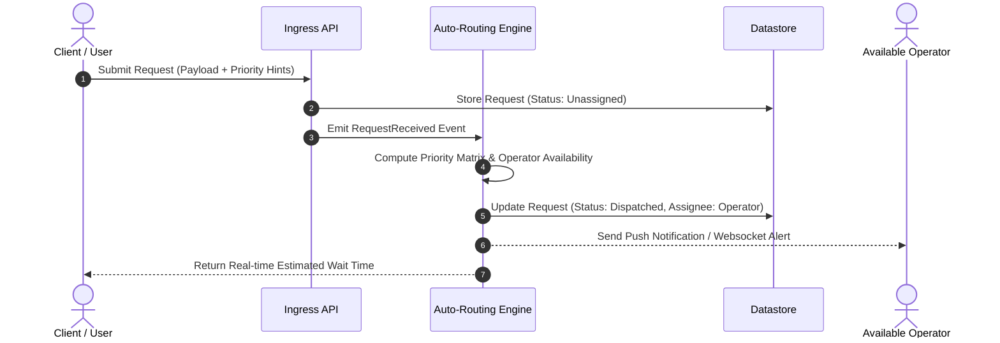

# Next-Generation Intelligent Queue & Auto-Routing

## 1. Executive Summary & Problem
Current user requests and internal tickets are routed via manual triage queues. This creates operational bottlenecks during peak hours, increases latency for urgent requests, and lacks real-time visibility.

This proposal introduces an automated event-driven dispatcher that calculates priority scores, estimates resolution times, and assigns tasks to available operators.

---

## 2. Proposed Architecture & Workflow



---

## 3. Data Contract (Draft)

```json
{
  "request_id": "req_8923a10b",
  "client_id": "usr_99812",
  "urgency": "high",
  "category": "technical_support",
  "metadata": {
    "device_platform": "mobile_ios",
    "network_latency_ms": 42
  }
}
```

---

## 4. Evaluation & Next Steps
* [ ] Human architecture review of latency impact on primary datastore.
* [ ] Shadow testing with synthetic traffic in staging environment.
* [ ] Pilot deployment with selected operators.

---

## 5. Related Knowledge Base Documents
* [Core System Architecture](/systems/core-architecture.md) - Active services that will host this engine.
* [User Interview Insights](/research/user-interview-example.md) - Qualitative feedback highlighting the need for this feature.
