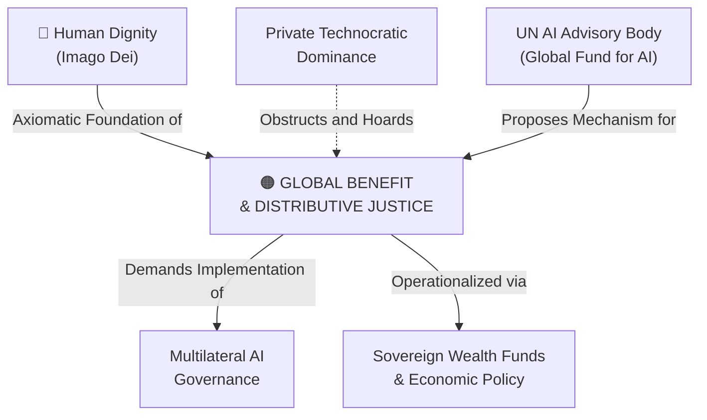

# Global Benefit & Distributive Justice

---

## 1. Executive Summary & Conceptual Thesis

**Global Benefit & Distributive Justice** asserts that transformative artificial intelligence is a common heritage of humanity whose benefits, compute access, and economic windfalls must be distributed equitably across the globe, rather than hoarded by wealthy nations and private shareholders.

In their seminal DeepMind Institute essay *The Case for Global Benefit from AI* (2026), philosophers **Dr. Iason Gabriel** and **Prof. Atoosa Kasirzadeh** open with the historical parable of the Chamberlen family, who kept the life-saving obstetrical forceps a private secret for over a century for private profit while countless mothers and infants died. They argue that treating frontier AI as proprietary corporate capital repeats this tragedy at planetary scale.

Global benefit is grounded across four distinct philosophical traditions:
1. **Human Rights**: Universal Declaration of Human Rights (Article 27) guarantees the positive right to participate in and benefit from scientific advancement.
2. **Reciprocity & Moral Debt**: AI models are trained on the accumulated cultural, linguistic, and scientific heritage of the entire human race; developers owe a moral debt back to humanity.
3. **Rawlsian Distributive Justice**: Behind a "veil of ignorance," no person would agree to an AI distribution where birthplace or wealth dictates access to survival-critical technology.
4. **Beneficence & Human Potential**: The moral obligation to eradicate disease, poverty, and squandered human talent.

In Catholic Social Teaching, this aligns directly with the **Universal Destination of Goods** reaffirmed in *[Magnifica Humanitas](/ecosystem/magnifica-humanitas.md)*.

---

## 2. Conceptual Mind Map & Relational Edges

---

## 3. Theoretical & Institutional Grounding

* **[The DeepMind Institute (Gabriel & Kasirzadeh)](/ecosystem/institutions/deepmind-institute.md)**: Establishes the four philosophical pillars of global benefit, articulating clear institutional duties for frontier labs.
* **[Encyclical Letter Magnifica Humanitas](/ecosystem/magnifica-humanitas.md)**: Chapter 2 invokes the *universal destination of goods*, affirming that compute clusters, training datasets, and scientific breakthroughs are goods intended for all.
* **[UN High-Level Advisory Body on AI](/ecosystem/institutions/un-ai-advisory-body.md)**: Proposes a **Global Fund for AI** and a Capacity Development Network to pool resources, compute, and training sets for the Global South.

---

## 4. Dialectical Tensions & Counter-Theses

### Intellectual Property Rents vs. Global Public Goods
* **Capital Market Position**: High returns are necessary incentives for frontier research and development investment.
* **Distributive Justice Position**: When technologies reach civilizational significance, private rent extraction must be bounded by public equity, mandatory licensing, and patent reform to prevent extreme inequality.

---

## 5. Pedagogical, Architectural & Operational Implications

1. **Equitable Access Guarantee**: Tools developed or procured at St. Francis High School must ensure that financial background never determines student access to frontier AI pedagogical assistance.
2. **Global South Compute Partnerships**: Supporting educational initiatives that share open datasets and pedagogical models with sister schools in developing nations.
3. **Multilingual and Culturally Plural Datasets**: System architectures must incorporate non-Western linguistic corpora to avoid cultural erasure.

---

## 6. Relational Edge Index

| Edge Direction | Connected Concept | Relationship Type | Conceptual Description |
| :--- | :--- | :--- | :--- |
| **Inbound** | **[Human Dignity](/concepts/human-dignity.md)** | *Grounds* | Dignity demands that technological benefits cannot be conditioned on wealth. |
| **Inbound** | **[Private Technocratic Dominance](/concepts/private-technocratic-dominance.md)** | *Challenged by* | Global benefit directly confronts monopolistic hoarding of frontier technology. |
| **Outbound** | **[Sovereign AI Wealth Funds & Economic Policy](/concepts/sovereign-wealth-funds-economic-policy.md)** | *Operationalized via* | Concrete policy mechanisms like sovereign funds redistribute AI wealth globally. |
| **Outbound** | **[Multilateral AI Governance](/concepts/multilateral-governance.md)** | *Requires* | Equitable distribution requires multilateral oversight and treaty enforcement. |

---

## 7. Related Knowledge Base Documents & Primary Sources

### Internal Knowledge Base Links
* [Concept Cluster: Power Concentration, Governance & Distributive Justice](/concepts/cluster-power-governance.md)
* [The DeepMind Institute Dossier](/ecosystem/institutions/deepmind-institute.md)
* [UN AI Advisory Body Profile](/ecosystem/institutions/un-ai-advisory-body.md)
* [Encyclical Letter Magnifica Humanitas](/ecosystem/magnifica-humanitas.md)

### External Primary Sources
* Gabriel, I., & Kasirzadeh, A. (2026). *The case for global benefit from AI*. DeepMind Institute.
* United Nations (1948). *Universal Declaration of Human Rights*, Article 27.
* Rawls, J. (1971). *A Theory of Justice*. Harvard University Press.
