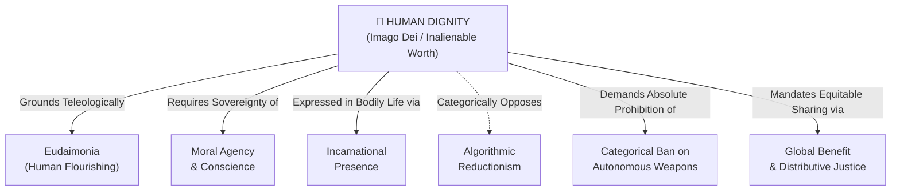

# Human Dignity (Imago Dei & Inalienable Worth)

---

## 1. Executive Summary & Conceptual Thesis

**Human Dignity** is the foundational, gravitational center of the entire knowledge base. It is not merely one ethical principle among equals; it is the non-negotiable axiom from which every right, duty, architectural constraint, and pedagogical boundary derives. 

Rooted philosophically in both classical personalism and the Judeo-Christian doctrine of *Imago Dei* (being created in the image and likeness of God), human dignity asserts that **every human person possesses an intrinsic, inalienable worth that is entirely independent of their economic productivity, cognitive processing speed, algorithmic predictability, or computational output**. As Pope Leo XIV proclaims in *[Magnifica Humanitas](/ecosystem/magnifica-humanitas.md)* (§1): *"The person is not a system of algorithms."*

In the era of frontier AI, human dignity is acutely threatened by technological reductionism—the pervasive habit of treating workers, students, and citizens as mere collections of behavioral tokens to be classified, monetized, nudged, or replaced. Upholding human dignity requires designing technological systems that honor the sacred inviolability of the person.

---

## 2. Conceptual Mind Map & Relational Edges

---

## 3. Theoretical & Institutional Grounding

* **[The DELTA Framework (Notre Dame)](/ecosystem/delta-framework.md)**: The **D (Dignity)** pillar emphasizes that dignity protects vulnerable individuals—specifically learners undergoing cognitive formation and workers vulnerable to displacement—from being bench-marked against machine throughput.
* **[Encyclical Letter Magnifica Humanitas](/ecosystem/magnifica-humanitas.md)**: Pope Leo XIV grounds human dignity in the Incarnation, rebuking transhumanist ideologies that treat the human body as an engineering defect to be overcome through synthetic augmentation.
* **[Council of Europe Framework Convention (CETS No. 225)](/ecosystem/institutions/council-of-europe-ai.md)**: Establishes dignity as a binding statutory norm under international human rights law, guaranteeing that persons must never be treated as passive algorithmic objects.
* **[Rome Call for AI Ethics & Hiroshima Appeal](/ecosystem/institutions/rome-call-hiroshima.md)**: Unites world religions around the principle that computational intelligence can never possess spiritual personhood or replace human sacredness.

---

## 4. Dialectical Tensions & Counter-Theses

### Human Worth vs. Functional Utility
* **Technocratic Fallacy**: Silicon Valley optimization functions benchmark value on productivity, problem-solving speed, and economic return.
* **Dignitarian Counter-Thesis**: A person with severe cognitive disabilities or an elderly patient holds identical and absolute dignity compared to the most elite software engineer. Systems designed purely for functional utility inevitably marginalize the vulnerable.

---

## 5. Pedagogical, Architectural & Operational Implications

1. **Anti-Subsumption Software Design**: Educational software at St. Francis High School must never assign immutable academic "aptitude tracks" or behavioral scores derived from automated monitoring.
2. **Student as Subject, Not Data Commodity**: Classroom technologies must strictly prohibit monetization or commercial exploitation of student cognitive telemetry.
3. **Preservation of the Vulnerable**: AI deployment in grading, counseling, or financial aid must guarantee unconditional human accompaniment.

---

## 6. Relational Edge Index

| Edge Direction | Connected Concept | Relationship Type | Conceptual Description |
| :--- | :--- | :--- | :--- |
| **Outbound** | **[Human Flourishing (Eudaimonia)](/concepts/eudaimonia.md)** | *Grounds* | Dignity is the starting axiom; flourishing is the teleological realization of that dignity. |
| **Outbound** | **[Moral Agency & Conscience](/concepts/moral-agency.md)** | *Requires* | Without moral agency and free will, human dignity is reduced to biological passivity. |
| **Outbound** | **[Algorithmic Reductionism](/concepts/algorithmic-reductionism.md)** | *Opposes* | Dignity explicitly rejects modeling the human soul as a closed system of statistical weights. |
| **Outbound** | **[Incarnational Presence](/concepts/incarnational-presence.md)** | *Affirms* | Dignity is lived in physical bodies, not in digital disembodiment. |
| **Outbound** | **[Categorical Ban on Autonomous Weapons](/concepts/autonomous-weapons-ban.md)** | *Mandates* | A machine taking human life is the ultimate violation of human dignity. |

---

## 7. Related Knowledge Base Documents & Primary Sources

### Internal Knowledge Base Links
* [Concept Cluster: Human Flourishing & Virtue Formation](/concepts/cluster-human-flourishing.md)
* [The DELTA Framework: Faith-Informed Virtue Ethics](/ecosystem/delta-framework.md)
* [Encyclical Letter Magnifica Humanitas](/ecosystem/magnifica-humanitas.md)
* [Council of Europe AI Treaty Dossier](/ecosystem/institutions/council-of-europe-ai.md)

### External Primary Sources
* Pope Leo XIV (2026). *Magnifica Humanitas*, Holy See.
* University of Notre Dame (2026). *DELTA Framework Charter*, Institute for Ethics and the Common Good.
* United Nations (1948). *Universal Declaration of Human Rights*, Article 1.
