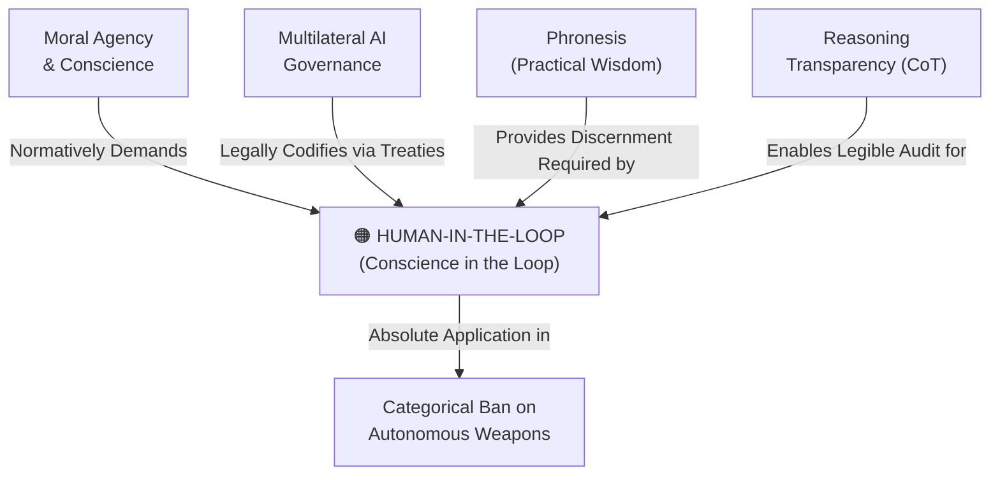

# Human-in-the-Loop (Conscience in the Loop)

---

## 1. Executive Summary & Conceptual Thesis

**Human-in-the-Loop (HITL)**, elevated within the [DELTA Framework](/ecosystem/delta-framework.md) and [Magnifica Humanitas](/ecosystem/magnifica-humanitas.md) to **Conscience in the Loop**, is an indispensable engineering and legal design invariant. It dictates that automated machine intelligence must never be granted autonomous authority over decisions that impact human life, bodily integrity, civil liberties, legal rights, or moral evaluation.

While conventional engineering often treats "human in the loop" as a temporary latency bottleneck to be eliminated through full automation, dignitarian ethics views human involvement as a permanent moral necessity. Algorithms can calculate probabilities, detect patterns, and aggregate signals, but they cannot possess empathy, weigh proportional equity, or bear moral culpability before a community.

Under binding international law—such as the **Council of Europe Framework Convention (CETS No. 225)**—and moral theology, individuals subjected to automated analysis have a non-negotiable right to meaningful human review, procedural contestability, and a confirmed human signature prior to execution.

---

## 2. Conceptual Mind Map & Relational Edges

---

## 3. Theoretical & Institutional Grounding

* ****Council of Europe Committee on AI (CAI)****: CETS No. 225 (Articles 14 & 15) establishes procedural safeguards guaranteeing that automated decisions affecting human rights must be contestable before a human reviewer.
* **[Encyclical Letter Magnifica Humanitas](/ecosystem/magnifica-humanitas.md)**: Pope Leo XIV emphasizes that human moral conscience can never be automated; in judicial sentencing, medical diagnosis, pastoral care, and warfare, software must strictly remain advisory.
* **[The Rome Call for AI Ethics](/ecosystem/institutions/rome-call-hiroshima.md)**: Identifies "Responsibility" as one of its six core algor-ethics pillars, insisting that human operators always retain legal and ethical liability.

---

## 4. Dialectical Tensions & Counter-Theses

### Autonomous Efficiency vs. Human Deliberation
* **Technocratic Automation Stance**: Having a human review every output creates expensive operational friction and slows down throughput.
* **Conscience-in-the-Loop Counter-Thesis**: Friction is not an engineering defect; in high-stakes human matters, friction is the very space in which moral responsibility, compassion, and justice operate.

---

## 5. Pedagogical, Architectural & Operational Implications

1. **Mandatory Human Signature in EdTech**: St. Francis High School workflows mandate that no disciplinary warning, grading penalty, or course placement recommendation generated by software can be executed without a faculty signature.
2. **Contestability Workflows**: Any student or parent receiving an AI-assisted evaluation must have a prominent, accessible "Request Human Review" button.
3. **Audit Transcripts**: Systems must log model inputs, intermediate chain-of-thought, and the identity of the human operator who reviewed and confirmed the final action.

---

## 6. Relational Edge Index

| Edge Direction | Connected Concept | Relationship Type | Conceptual Description |
| :--- | :--- | :--- | :--- |
| **Inbound** | **[Moral Agency & Conscience](/concepts/moral-agency.md)** | *Mandates* | The sovereignty of human conscience requires that humans retain ultimate decision authority. |
| **Outbound** | **[Categorical Ban on Autonomous Weapons](/concepts/autonomous-weapons-ban.md)** | *Enforces* | The prohibition of autonomous weapons is the absolute realization of conscience-in-the-loop. |
| **Inbound** | **[Reasoning Transparency (Chain-of-Thought)](/concepts/reasoning-transparency.md)** | *Enabled by* | Transparent reasoning traces allow the human in the loop to audit internal model rationale. |
| **Inbound** | **[Phronesis (Practical Wisdom)](/concepts/phronesis.md)** | *Requires* | The human in the loop must exercise practical wisdom, not simply rubber-stamp algorithmic outputs. |

---

## 7. Related Knowledge Base Documents & Primary Sources

### Internal Knowledge Base Links
* [Concept Cluster: Moral Agency, Conscience & The Dignity of Work](/concepts/cluster-moral-agency.md)
* **Council of Europe AI Treaty Dossier**
* [Moral Agency & Conscience](/concepts/moral-agency.md)
* [Reasoning Transparency (Chain-of-Thought)](/concepts/reasoning-transparency.md)

### External Primary Sources
* Council of Europe (2024). *Framework Convention on AI (CETS No. 225)*, Articles 14-16.
* Pope Leo XIV (2026). *Magnifica Humanitas*, Chapter 5.
* High-Level Expert Group on AI (2019). *Ethics Guidelines for Trustworthy AI*. European Commission.
