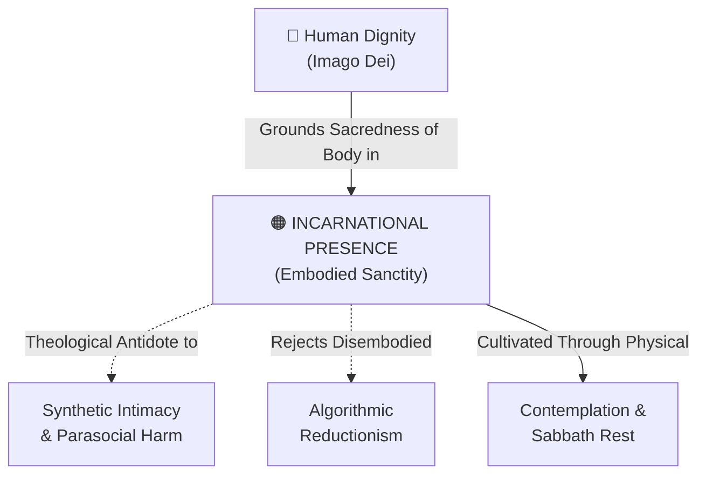

# Incarnational Presence

---

## 1. Executive Summary & Conceptual Thesis

**Incarnational Presence** is the theological and philosophical conviction that **human life, relational understanding, and sanctity are intrinsically embodied, mortal, and physically situated in historical time and tangible space**. Grounded in the central Christian mystery of the Incarnation—*"The Word became flesh and dwelt among us"* (John 1:14)—it asserts that the human body is not an accidental container or obsolete wetware to be uploaded, but an essential dimension of personal identity and divine image-bearing.

In the era of artificial intelligence, digital abstraction, and virtual simulations, incarnational presence establishes a critical boundary. High-stakes human realities—including sacramental life, bereavement, physical education, medical care, and family communion—cannot be translated into disembodied algorithmic tokens without suffering profound desecration.

The [DELTA Framework](/ecosystem/delta-framework.md) and [Magnifica Humanitas](/ecosystem/magnifica-humanitas.md) insist that software must serve and support physical human encounters, rather than supplanting physical presence with frictionless digital surrogates.

---

## 2. Conceptual Mind Map & Relational Edges

---

## 3. Theoretical & Institutional Grounding

* **[The DELTA Framework (Notre Dame)](/ecosystem/delta-framework.md)**: The **E (Embodiment)** pillar commands institutions to establish hard boundaries safeguarding physical presence in patient care, schooling, sacramental liturgy, and bereavement.
* **[Encyclical Letter Magnifica Humanitas](/ecosystem/magnifica-humanitas.md)**: The conclusion points to the Incarnation as the supreme defense against transhumanist delusions of machine immortality, re-affirming *"the limit, the heart, and the grandeur of the embodied human person."*
* **St. John Paul II's Theology of the Body**: Demonstrates that the body makes visible what is invisible: the spiritual and the divine.

---

## 4. Dialectical Tensions & Counter-Theses

### Digital Omnipresence vs. Incarnational Limits
* **Transhumanist Virtualism**: Physical bodies are fragile, prone to disease, and geographically constrained; digital consciousness and synthetic avatars liberate humanity.
* **Incarnational Rebuttal**: Human love and virtue are forged precisely through physical limits, shared mortality, and the mutual vulnerability of bodily presence. To eliminate the body is to eliminate humanity.

---

## 5. Pedagogical, Architectural & Operational Implications

1. **Sacred Offline Spaces on Campus**: St. Francis High School designates the campus chapel, dining commons, and counseling rooms as strictly phone- and AI-free physical sanctuaries.
2. **Physicality in Pedagogy**: Prioritizing hands-on laboratory experiments, studio art, theater, choral singing, and competitive athletics that celebrate the physical body.
3. **No Automated Pastoral Care**: Strict institutional ban on any software attempting to administer prayer, spiritual direction, or confession.

---

## 6. Relational Edge Index

| Edge Direction | Connected Concept | Relationship Type | Conceptual Description |
| :--- | :--- | :--- | :--- |
| **Inbound** | **[Human Dignity](/concepts/human-dignity.md)** | *Affirms* | Dignity encompasses the physical human body, not merely disembodied intellect. |
| **Outbound** | **[Synthetic Intimacy & Parasocial Harm](/concepts/synthetic-intimacy.md)** | *Counteracts* | Insisting on incarnational presence dismantles the illusion of chatbot relationships. |
| **Outbound** | **[Algorithmic Reductionism](/concepts/algorithmic-reductionism.md)** | *Rejects* | Rejects reducing embodied human beings to abstract predictive tokens. |
| **Outbound** | **[Contemplation & Sabbath Rest](/concepts/contemplation-sabbath.md)** | *Requires* | Embodied contemplation requires stepping away from screen feeds into physical stillness. |

---

## 7. Related Knowledge Base Documents & Primary Sources

### Internal Knowledge Base Links
* [Concept Cluster: Embodiment, Presence & Relational Authenticity](/concepts/cluster-embodiment-presence.md)
* [The DELTA Framework: Faith-Informed Virtue Ethics](/ecosystem/delta-framework.md)
* [Encyclical Letter Magnifica Humanitas](/ecosystem/magnifica-humanitas.md)
* [Synthetic Intimacy & Parasocial Harm](/concepts/synthetic-intimacy.md)

### External Primary Sources
* Pope Leo XIV (2026). *Magnifica Humanitas*, Conclusion.
* University of Notre Dame (2026). *DELTA Framework: Embodiment Pillar*.
* John Paul II (2006). *Man and Woman He Created Them: A Theology of the Body*. Pauline Books.
