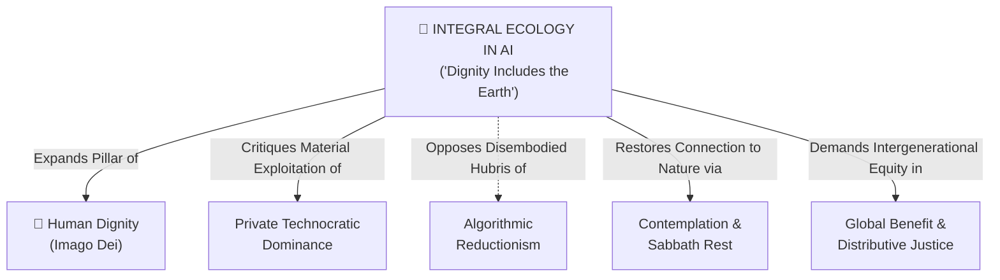

# Integral Ecology in AI (Dignity Includes the Earth)

---

## 1. Executive Summary & Conceptual Thesis

In classical Catholic Social Teaching and virtue-ethics frameworks such as Notre Dame’s **[DELTA Framework](/ecosystem/delta-framework.md)**, **Dignity** has traditionally been formulated through an anthropocentric lens: the inalienable worth of the human person created in the image of God (*Imago Dei*). 

However, as artificial intelligence evolves into massive frontier foundation models requiring gigawatt data centers, continental transmission grids, millions of gallons of evaporative cooling water, and extractive mineral supply chains (lithium, cobalt, copper), a purely disembodied or anthropocentric ethics becomes inadequate.

Drawing upon Pope Francis's landmark encyclical **[*Laudato Si’*](/ecosystem/laudato-si.md)**, this concept expands the DELTA Dignity pillar to affirm that **"Dignity includes the earth."** Under the principle of **Integral Ecology**, human flourishing and environmental health are inseparable: *"the cry of the earth and the cry of the poor are one"* (*Laudato Si’* §49). 

In an educational and engineering context, **Integral Ecology in AI** demands that technological choices—from school device procurement to student prompt generation and datacenter hosting—must account for the physical, energetic, and ecological costs of computation.

---

## 2. Conceptual Mind Map & Relational Edges



---

## 3. Theoretical & Institutional Grounding

* **[Encyclical Letter Laudato Si' (Pope Francis)](/ecosystem/laudato-si.md)**: Establishes the theological foundation of integral ecology and delivers a profound critique of the *Technocratic Paradigm*—the illusion that technological power can proceed without moral, physical, or planetary limits.
* **[The DELTA Framework (University of Notre Dame)](/ecosystem/delta-framework.md)**: Expanded from its baseline five virtues (Dignity, Embodiment, Love, Transcendence, Agency) to recognize that human embodiment is grounded in a physical biosphere. To protect human dignity, institutions must protect the material world that sustains human life.
* **[MIT RAISE Day of AI Curriculum](/ecosystem/institutions/mit-day-of-ai.md)**: Provides the empirical pedagogical link, educating secondary school students on the tangible carbon, energy, and water footprint required to train and run modern foundation models.

---

## 4. The Material Reality of Artificial Intelligence

The popular imagination frequently conceptualizes generative AI as "immaterial cloud software." Integral ecology unmasks the severe physical realities of computation:

```
┌──────────────────────────────────────────────────────────────────────────────────────────┐
│                            THE PHYSICAL FOOTPRINT OF AI                                  │
├──────────────────────────┬───────────────────────────────┬───────────────────────────────┤
│ Ecological Vector        │ Physical Reality & Mechanism  │ Pedagogical / Ethical Stance  │
├──────────────────────────┼───────────────────────────────┼───────────────────────────────┤
│ 1. Energy Grids &        │ Frontier clusters require     │ Encouraging "green compute"   │
│    Carbon Footprint      │ hundreds of megawatts, often  │ architectures and questioning │
│                          │ straining local fossil grids  │ frivolous computational waste │
├──────────────────────────┼───────────────────────────────┼───────────────────────────────┤
│ 2. Datacenter Water      │ Evaporative cooling towers    │ Raising consciousness of      │
│    Consumption           │ consume millions of gallons of│ community water rights near   │
│                          │ potable water per facility    │ hyperscale datacenter sites   │
├──────────────────────────┼───────────────────────────────┼───────────────────────────────┤
│ 3. Mineral Extraction &  │ Semiconductor chips require   │ Supply chain transparency and │
│    Hardware Obsolescence │ rare earths, lithium, cobalt; │ resisting rapid, unnecessary  │
│                          │ short GPU lifecycles drive    │ hardware refresh cycles       │
│                          │ toxic global e-waste          │                               │
└──────────────────────────┴───────────────────────────────┴───────────────────────────────┘
```

---

## 5. Pedagogical & Operational Implications for St. Francis High School

For secondary education initiatives, integrating Integral Ecology transforms how students and staff perceive digital tools:

1. **Computational Conscience in the Classroom**: Students are taught that AI inference is not free. Trivial or lazy queries (e.g. asking an LLM to rephrase a three-word sentence ten times) carry an energetic cost. Cultivating *computational thrift* becomes part of character formation.
2. **Institutional Procurement Auditing**: School IT decisions (selecting cloud vendors, LMS platforms, and educational AI tools) should evaluate vendor commitments to renewable energy, water recycling, and extended hardware lifecycles.
3. **Curricular Integration in Science & Theology**: Environmental science classes measure datacenter energy and water use; theology classes reflect on *Laudato Si’* and stewardship, unifying secular STEM data with faith-informed ethics.

---

## 6. Relational Edge Index

| Edge Direction | Connected Concept | Relationship Type | Conceptual Description |
| :--- | :--- | :--- | :--- |
| **Outbound** | **[Human Dignity (Imago Dei & Inalienable Worth)](/concepts/human-dignity.md)** | *Extends* | Expands dignity from individual human worth to encompass stewardship over the creation that sustains all life. |
| **Outbound** | **[Private Technocratic Dominance](/concepts/private-technocratic-dominance.md)** | *Critiques* | Exposes how private compute monopolies externalize ecological costs (power grids, water, e-waste) onto public communities. |
| **Outbound** | **[Algorithmic Reductionism](/concepts/algorithmic-reductionism.md)** | *Opposes* | Rejects the premise that digital efficiency excuses physical environmental degradation. |
| **Outbound** | **[Contemplation & Sabbath Rest](/concepts/contemplation-sabbath.md)** | *Reinforces* | Reclaiming non-digital, un-optimized physical space for communion with nature and the Creator. |
| **Outbound** | **[Global Benefit & Distributive Justice](/concepts/global-benefit.md)** | *Mandates* | Ensures vulnerable global populations who suffer first from climate change are not exploited by AI infrastructure. |

---

## 7. Related Knowledge Base Documents & Primary Sources

### Internal Knowledge Base Links
* [Concept Cluster: Transcendence, Truth & The Limits of Optimization](/concepts/cluster-transcendence-truth.md)
* [Saint Francis High School Sustainability Framework](/references/st-francis-sustainability.md)
* [Catholic Companion Framework for Technology and Innovation](/ecosystem/catholic-companion-framework.md)
* [Encyclical Letter Laudato Si'](/ecosystem/laudato-si.md)
* [The DELTA Framework: Faith-Informed Virtue Ethics for AI](/ecosystem/delta-framework.md)
* [MIT RAISE: Day of AI Curriculum & K-12 AI Literacy](/ecosystem/institutions/mit-day-of-ai.md)
* [Encyclical Letter Magnifica Humanitas](/ecosystem/magnifica-humanitas.md)

### External Primary Sources
* Pope Francis (2015). *Encyclical Letter Laudato Si' on Care for Our Common Home*, Holy See.
* University of Notre Dame (2026). *The DELTA Framework*, Institute for Ethics and the Common Good.
* MIT RAISE (2024). *Day of AI: AI and Climate Change Curriculum Module*, Massachusetts Institute of Technology.
