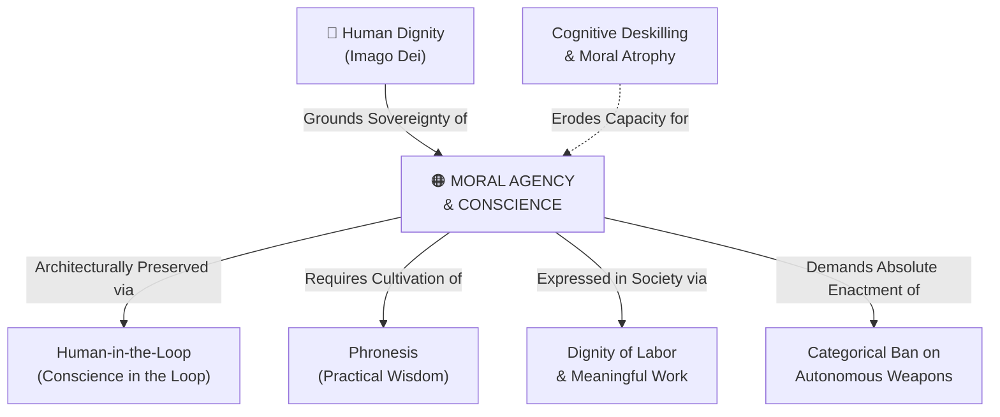

# Moral Agency & Conscience

---

## 1. Executive Summary & Conceptual Thesis

**Moral Agency & Conscience** constitutes the sanctuary of human personhood. It is the capacity and solemn duty of human beings to deliberate upon moral reality, discern the voice of truth, and make free, accountable choices toward the good. Unlike mere computational task execution—which consists of probabilistic pattern matching and heuristic optimization against programmed loss functions—authentic moral agency requires subjective interiority, existential vulnerability, moral conscience, and spiritual freedom.

In the AI era, human agency faces a dual threat: direct coercion and voluntary abdication. The rise of persuasive algorithmic nudges, behavioral tracking, and synthetic intimacy subtly manipulates human choices, while convenience tempts humanity to offload agonizing ethical discernment to automated engines. 

The [DELTA Framework](/ecosystem/delta-framework.md) and [Magnifica Humanitas](/ecosystem/magnifica-humanitas.md) insist that **conscience is sovereign and non-delegable**. Outsourcing high-stakes decisions—such as sentencing, grading, medical triage, or warfare—to software represents an abdication of human responsibility that directly attacks human dignity.

---

## 2. Conceptual Mind Map & Relational Edges

---

## 3. Theoretical & Institutional Grounding

* **[The DELTA Framework (Notre Dame)](/ecosystem/delta-framework.md)**: The **A (Agency)** pillar defines agency as the capacity of the conscience to seek truth and choose the good, warning against the cognitive atrophy of moral surrender.
* **[Encyclical Letter Magnifica Humanitas](/ecosystem/magnifica-humanitas.md)**: Pope Leo XIV declares: *"Freedom is not mere choice among market commodities; it is the capacity to love, to sacrifice, and to bear witness to truth."* The encyclical condemns algorithmic behavioral control as a new form of digital slavery (§4).
* **[The Rome Call for AI Ethics](/ecosystem/institutions/rome-call-hiroshima.md)**: Affirms that machines do not possess consciousness or souls; therefore, high-stakes moral judgments must remain exclusively in human hands.

---

## 4. Dialectical Tensions & Counter-Theses

### Cognitive Convenience vs. Moral Discernment
* **Convenience Narrative**: Automated decision systems eliminate human bias, emotional volatility, and fatigue.
* **Moral Agency Rebuttal**: Eliminating the human person from judgment eliminates moral accountability itself. An algorithm cannot be held morally guilty; only human moral agents can take responsibility for justice and injustice.

---

## 5. Pedagogical, Architectural & Operational Implications

1. **Student Expressive Voice**: In writing and artistic projects at St. Francis High School, students must retain authentic authorship and expressive agency, defending their theses in person.
2. **Conscience Veto Gates**: Workflows involving student discipline, academic probation, or counseling referrals must provide clear manual overrides for human advisors.
3. **Transparency in Advisory Outputs**: AI recommendations must be presented with epistemic humility—labeled as provisional statistical suggestions rather than authoritative verdicts.

---

## 6. Relational Edge Index

| Edge Direction | Connected Concept | Relationship Type | Conceptual Description |
| :--- | :--- | :--- | :--- |
| **Inbound** | **[Human Dignity](/concepts/human-dignity.md)** | *Grounds* | Dignity demands that the person is recognized as a free moral subject, not an object. |
| **Outbound** | **[Human-in-the-Loop](/concepts/human-in-the-loop.md)** | *Mandates* | Conscience in the loop requires architectural enforcement of human decision sovereignty. |
| **Outbound** | **[Categorical Ban on Autonomous Weapons](/concepts/autonomous-weapons-ban.md)** | *Prohibits* | Lethal decision-making can never be delegated away from human moral conscience. |
| **Inbound** | **[Cognitive Deskilling & Moral Atrophy](/concepts/cognitive-deskilling.md)** | *Threatened by* | Overautomation atrophies the moral willpower and discernment necessary for agency. |
| **Outbound** | **[Dignity of Labor & Meaningful Work](/concepts/dignity-of-labor.md)** | *Realized in* | Human labor is the primary arena where creative and moral agency transforms the world. |

---

## 7. Related Knowledge Base Documents & Primary Sources

### Internal Knowledge Base Links
* [Concept Cluster: Moral Agency, Conscience & The Dignity of Work](/concepts/cluster-moral-agency.md)
* [The DELTA Framework: Faith-Informed Virtue Ethics](/ecosystem/delta-framework.md)
* [Encyclical Letter Magnifica Humanitas](/ecosystem/magnifica-humanitas.md)
* [Human-in-the-Loop (Conscience in the Loop)](/concepts/human-in-the-loop.md)

### External Primary Sources
* Pope Leo XIV (2026). *Magnifica Humanitas*, Holy See.
* Pontifical Academy for Life (2020). *The Rome Call for AI Ethics*.
* University of Notre Dame (2026). *DELTA Framework: Agency Pillar*.
