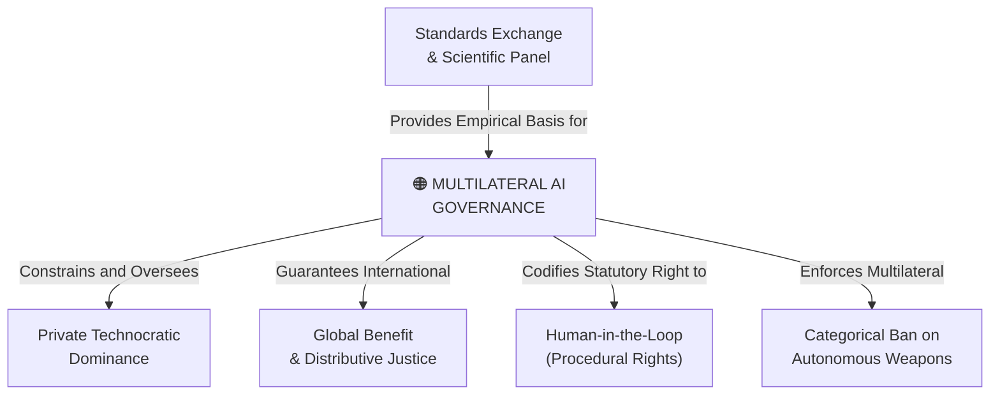

# Multilateral AI Governance

---

## 1. Executive Summary & Conceptual Thesis

**Multilateral AI Governance** encompasses the global institutional, statutory, and scientific structures designed to govern artificial intelligence across international borders. Because frontier model weights, cyber exploits, autonomous swarms, and synthetic media respect no national boundaries, purely domestic or voluntary self-regulatory regimes are structurally incapable of ensuring global safety, equity, and human rights.

A robust multilateral governance architecture requires three core pillars:
1. **Shared Scientific Consensus**: An independent, IPCC-style **International Scientific Panel on AI** to assess capability frontiers, catastrophic risks, and societal impacts free from corporate marketing spin.
2. **Binding Legal Rails**: Formal international treaties—such as the **Council of Europe Framework Convention on AI (CETS No. 225)**—establishing enforceable human rights baselines and judicial remedies.
3. **Verification & Standards Infrastructure**: An independent inspection agency modeled after **CERN** (scientific collaboration) and the **IAEA** (rigorous pre-deployment testing and physical compute monitoring), as proposed by Demis Hassabis and the UN Advisory Body.

---

## 2. Conceptual Mind Map & Relational Edges

---

## 3. Theoretical & Institutional Grounding

* ****United Nations High-Level Advisory Body on AI****: Issued seven actionable governance recommendations in *Governing AI for Humanity*, establishing an International Scientific Panel, Global AI Standards Exchange, and an AI Office within the UN Secretariat.
* ****Council of Europe Committee on AI (CAI)****: Promulgated CETS No. 225, the world's first legally binding international AI treaty, signed by European states alongside the US, UK, Canada, Japan, and Israel.
* **[DeepMind Institute (Demis Hassabis)](/ecosystem/institutions/deepmind-institute.md)**: Proposes an international frontier AI standards body conducting pre-deployment evaluations against autonomous self-replication, CBRN weaponization, and cyberwarfare.

---

## 4. Dialectical Tensions & Counter-Theses

### National Geopolitical Racing vs. Multilateral Treaties
* **National Realpolitik Stance**: Nations cannot bind themselves to multilateral treaties because adversarial geopolitical rivals will accelerate unconstrained to achieve military and economic dominance.
* **Multilateral Counter-Thesis**: Just as nuclear arms treaties and the Montreal Protocol succeeded despite the Cold War, planetary catastrophic risks demand coordinated verification regimes. Unconstrained acceleration guarantees mutual catastrophe.

---

## 5. Pedagogical, Architectural & Operational Implications

1. **Standards Compliance**: System schemas must conform to emerging international standards tracked by ISO/IEC and IEEE to ensure global auditability.
2. **HUDERIA Risk Assessments**: Prior to production rollout of predictive or classification algorithms, teams must complete a Human Rights, Democracy, and Rule of Law Impact Assessment.
3. **Civic Formation**: High school curriculum must teach students how multilateral treaties and global governance mechanisms function to resist technological fatalism.

---

## 6. Relational Edge Index

| Edge Direction | Connected Concept | Relationship Type | Conceptual Description |
| :--- | :--- | :--- | :--- |
| **Outbound** | **[Private Technocratic Dominance](/concepts/private-technocratic-dominance.md)** | *Constrains* | Multilateral bodies assert democratic oversight over private corporate monopolies. |
| **Outbound** | **[Categorical Ban on Autonomous Weapons](/concepts/autonomous-weapons-ban.md)** | *Enforces* | Banning autonomous weapons requires binding multilateral verification treaties. |
| **Outbound** | **[Human-in-the-Loop](/concepts/human-in-the-loop.md)** | *Codifies* | International treaties guarantee the procedural right to human review of AI actions. |
| **Inbound** | **[Global Benefit & Distributive Justice](/concepts/global-benefit.md)** | *Realized through* | Multilateral institutions administer global funds and equitable compute sharing. |

---

## 7. Related Knowledge Base Documents & Primary Sources

### Internal Knowledge Base Links
* [Concept Cluster: Power Concentration, Governance & Distributive Justice](/concepts/cluster-power-governance.md)
* **UN AI Advisory Body Profile**
* **Council of Europe Framework Convention Dossier**
* [The DeepMind Institute Dossier](/ecosystem/institutions/deepmind-institute.md)

### External Primary Sources
* UN High-Level Advisory Body on AI (2024). *Governing AI for Humanity*.
* Council of Europe (2024). *Framework Convention on AI (CETS No. 225)*.
* Hassabis, D. (2026). *A framework for frontier AI and the dawning of a new age*. DeepMind Institute.
