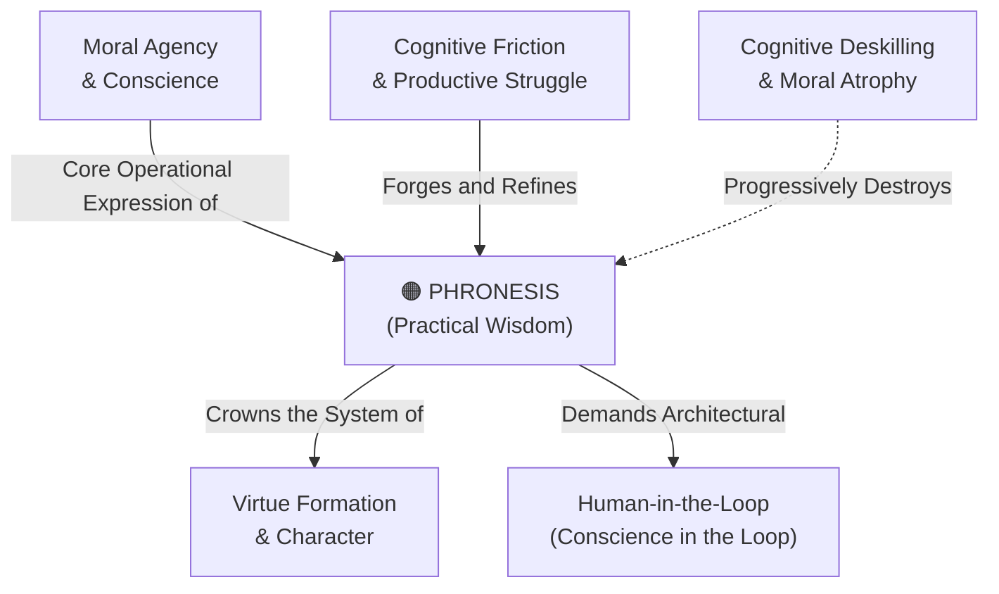

# Phronesis (Practical Wisdom)

---

## 1. Executive Summary & Conceptual Thesis

**Phronesis (Practical Wisdom)** is the intellectual and moral virtue identified by Aristotle in the *Nicomachean Ethics* (Book VI) as the capacity to deliberate well about what is good, expedient, and just in particular, concrete situations. Unlike theoretical scientific knowledge (*episteme*) or technical craft (*techne*), *phronesis* cannot be reduced to universal deductive formulas, decision trees, or statistical loss functions. It is the capacity to perceive the salient moral features of an ambiguous situation and discern the "golden mean" between extremes.

In artificial intelligence, *phronesis* represents the ultimate boundary separating computational calculation from authentic moral discernment. Large language models and predictive algorithms operate via probabilistic token matching across historical training corpuses; they possess neither moral perception, existential vulnerability, nor moral accountability.

Furthermore, when human beings delegate complex, context-dependent judgments—such as criminal sentencing, medical triage, student counseling, or warfare—to automated systems, they starve the human capacity for *phronesis*, inducing severe moral deskilling. *Phronesis* can only be developed through lived human friction, moral struggle, and personal accountability.

---

## 2. Conceptual Mind Map & Relational Edges

---

## 3. Theoretical & Institutional Grounding

* **[Oxford Institute for Ethics in AI](/ecosystem/institutions/oxford-ethics-ai.md)**: Coordinates *The Lyceum Project*, led by Prof. John Tasioulas and Prof. Philipp Koralus, bringing Aristotelian *phronesis* into direct conversation with computer science and software interface design.
* **[The DELTA Framework (Notre Dame)](/ecosystem/delta-framework.md)**: The **A (Agency)** pillar insists that moral discernment is an exercise of human conscience that cannot be offloaded to machine heuristics without surrendering human dignity.
* **[Encyclical Letter Magnifica Humanitas](/ecosystem/magnifica-humanitas.md)**: Pope Leo XIV warns against substituting algorithmic calculation for the discernment of the human heart, noting that machines lack moral conscience.

---

## 4. Dialectical Tensions & Counter-Theses

### Statistical Heuristics vs. Situational Phronesis
* **Technocratic Claim**: AI models aggregate millions of case studies and can therefore make more "objective," unbiased decisions than human judges or teachers.
* **Aristotelian Rebuttal**: Justice is not mechanical averages. Every human case contains unique, unquantifiable existential realities. Mechanical algorithms inevitably flatten contextual justice into blunt statistical profiling.

---

## 5. Pedagogical, Architectural & Operational Implications

1. **Preserving Human Deliberation**: High-stakes disciplinary and academic standing hearings at St. Francis High School must never use algorithmic scoring; discernment is reserved for faculty committees practicing communal *phronesis*.
2. **Case-Based Socratic Seminars**: Educational curricula must center on unstructured ethical dilemmas where there is no clean formula, forcing students to deliberate, defend, and critique moral choices.
3. **Decision-Support, Never Decision-Replacement**: Architecture invariant: software may summarize relevant historical precedents, but the final judgment interface must force explicit human deliberation.

---

## 6. Relational Edge Index

| Edge Direction | Connected Concept | Relationship Type | Conceptual Description |
| :--- | :--- | :--- | :--- |
| **Inbound** | **[Virtue Formation & Character](/concepts/virtue-formation.md)** | *Crowns* | Phronesis is the intellectual virtue that guides and harmonizes all moral virtues. |
| **Inbound** | **[Cognitive Friction & Productive Struggle](/concepts/cognitive-friction.md)** | *Cultivated via* | Practical wisdom cannot be acquired without interpretive difficulty and moral trial. |
| **Outbound** | **[Human-in-the-Loop](/concepts/human-in-the-loop.md)** | *Mandates* | Because machines lack phronesis, human conscience must remain the ultimate decision-maker. |
| **Outbound** | **[Cognitive Deskilling](/concepts/cognitive-deskilling.md)** | *Atrophied by* | Delegating nuanced human choices to AI causes the capacity for phronesis to wither. |

---

## 7. Related Knowledge Base Documents & Primary Sources

### Internal Knowledge Base Links
* [Concept Cluster: Human Flourishing & Virtue Formation](/concepts/cluster-human-flourishing.md)
* [Oxford Institute for Ethics in AI Profile](/ecosystem/institutions/oxford-ethics-ai.md)
* [Virtue Formation & Character](/concepts/virtue-formation.md)
* [Human-in-the-Loop (Conscience in the Loop)](/concepts/human-in-the-loop.md)

### External Primary Sources
* Aristotle. *Nicomachean Ethics*, Book VI.
* Tasioulas, J. (2024). *The Lyceum Project: AI Ethics and the Aristotelian Tradition*. Oxford University.
* Laukkonen, R. et al. (2026). *Positive Alignment: Artificial Intelligence for Human Flourishing*. arXiv:2605.10310.
