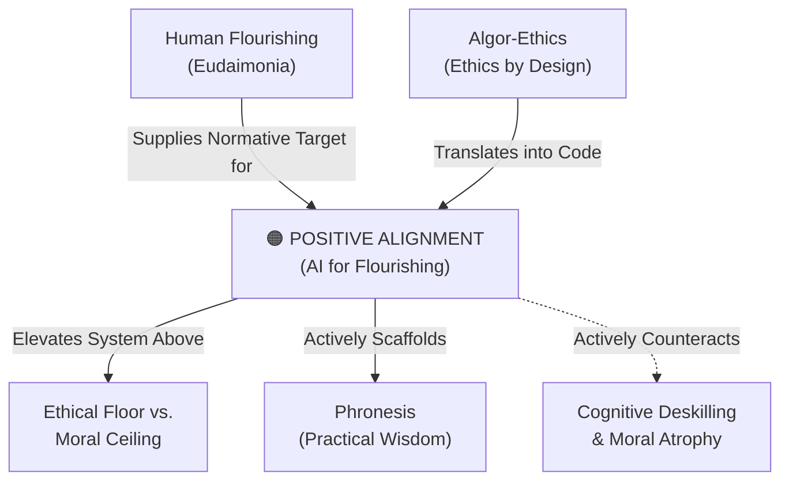

# Positive Alignment (AI for Human Flourishing)

---

## 1. Executive Summary & Conceptual Thesis

**Positive Alignment** is a paradigm shift within AI safety and governance formulated primarily by researchers at the **Oxford Institute for Ethics in AI** in collaboration with Google DeepMind, OpenAI, and Anthropic. For its first decade, AI alignment focused almost exclusively on **negative alignment**—preventing catastrophic risks, eliminating algorithmic toxicity, mitigating bias, and preventing models from assisting with dangerous biological or cyber capabilities.

While negative alignment builds an indispensable **[Ethical Floor](/concepts/ethical-floor-moral-ceiling.md)**, it is fundamentally insufficient. A system that causes zero harm can still induce civilizational stagnation, encourage passive addiction, and erode human agency. Positive Alignment asserts that AI systems must be actively steering toward the **[Moral Ceiling](/concepts/ethical-floor-moral-ceiling.md)** of **[Human Flourishing (Eudaimonia)](/concepts/eudaimonia.md)**.

Engineered systems must be evaluated by whether they scaffold user critical thinking, cultivate intellectual humility, foster authentic social community, and elevate human creative potential across polycentric cultural values.

---

## 2. Conceptual Mind Map & Relational Edges

---

## 3. Theoretical & Institutional Grounding

* ****Oxford Institute for Ethics in AI****: Dr. Ruben Laukkonen, Prof. John Tasioulas, and Prof. Philipp Koralus authored the foundational manifesto *Positive Alignment: Artificial Intelligence for Human Flourishing* (May 2026), defining mathematical and philosophical frameworks for multi-attribute flourishing optimization.
* **[The DeepMind Institute](/ecosystem/institutions/deepmind-institute.md)**: Dr. Iason Gabriel and Prof. Atoosa Kasirzadeh expanded on this agenda in *The Case for Global Benefit from AI*, arguing that positive alignment requires distributive justice and global democratic representation.
* **[The DELTA Framework](/ecosystem/delta-framework.md)**: Corresponds to DELTA’s moral ceiling imperative, ensuring technology actively supports personal and spiritual formation.

---

## 4. Dialectical Tensions & Counter-Theses

### Negative Alignment vs. Positive Alignment
* **Negative Alignment**: *"Ensure the model does not generate harmful, illegal, or offensive text."*
* **Positive Alignment**: *"Ensure the model challenges the student's intellectual complacency, models charitable discourse, and prompts independent critical inquiry."*

---

## 5. Pedagogical, Architectural & Operational Implications

1. **Flourishing Evaluation Benchmarks**: Systems must be evaluated using benchmarks that track user learning retention, autonomous problem-solving capacity, and psychological well-being over longitudinal interactions.
2. **Socratic Prompt Engineering**: Default system prompts must prohibit providing end-to-end completed essays; instead, models must act as dialogical intellectual sparring partners.
3. **Pluralistic Objective Functions**: Rejection of single-value utility functions; positive alignment embraces polycentric cultural frameworks for the good life.

---

## 6. Relational Edge Index

| Edge Direction | Connected Concept | Relationship Type | Conceptual Description |
| :--- | :--- | :--- | :--- |
| **Inbound** | **[Human Flourishing (Eudaimonia)](/concepts/eudaimonia.md)** | *Supplies Target* | Eudaimonia provides the philosophical destination that positive alignment engineers toward. |
| **Outbound** | **[Ethical Floor vs. Moral Ceiling](/concepts/ethical-floor-moral-ceiling.md)** | *Operationalizes* | Positive alignment is the concrete discipline of building toward the moral ceiling. |
| **Outbound** | **[Phronesis (Practical Wisdom)](/concepts/phronesis.md)** | *Scaffolds* | Positively aligned systems encourage users to practice and refine practical wisdom. |
| **Outbound** | **[Cognitive Deskilling](/concepts/cognitive-deskilling.md)** | *Counteracts* | By refusing to automate necessary cognitive struggle, positive alignment stops skill atrophy. |
| **Inbound** | **[Algor-Ethics](/concepts/algor-ethics.md)** | *Implements* | Algor-ethics provides the design methodology for encoding positive alignment into systems. |

---

## 7. Related Knowledge Base Documents & Primary Sources

### Internal Knowledge Base Links
* [Concept Cluster: Human Flourishing & Virtue Formation](/concepts/cluster-human-flourishing.md)
* **Oxford Institute for Ethics in AI Profile**
* [The DeepMind Institute Dossier](/ecosystem/institutions/deepmind-institute.md)
* [Ethical Floor vs. Moral Ceiling](/concepts/ethical-floor-moral-ceiling.md)

### External Primary Sources
* Laukkonen, R. et al. (2026). *Positive Alignment: Artificial Intelligence for Human Flourishing*. arXiv:2605.10310.
* Gabriel, I., & Kasirzadeh, A. (2026). *The case for global benefit from AI*. DeepMind Institute.
