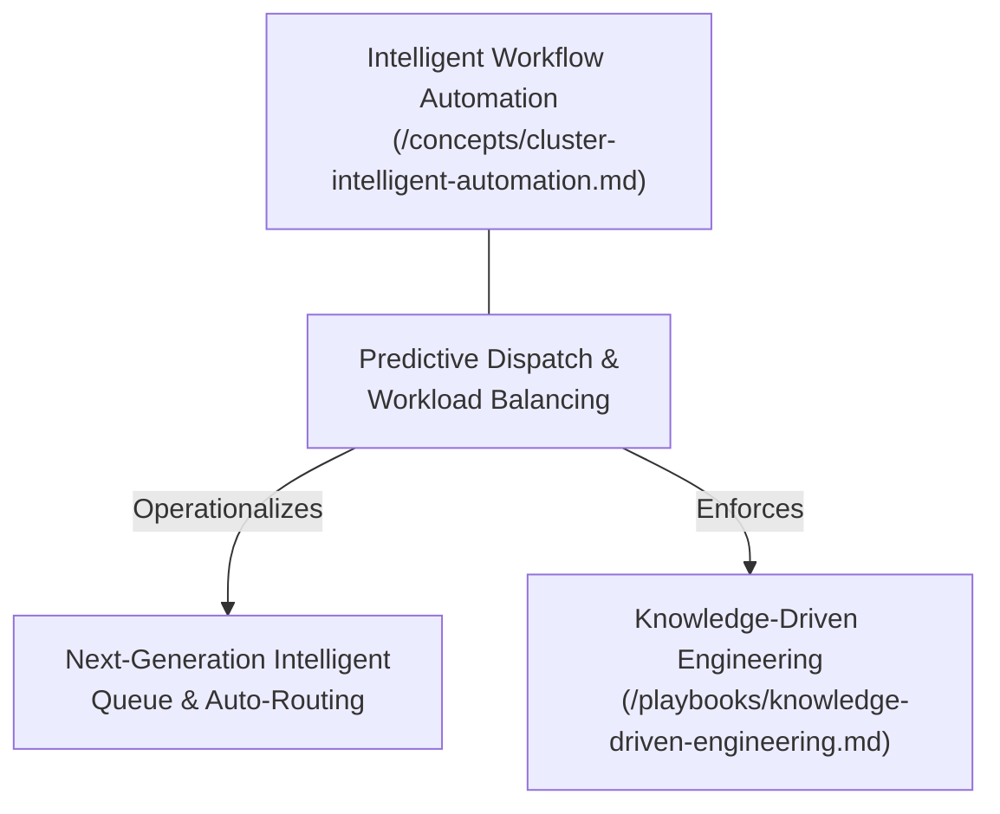

# Predictive Dispatch & Workload Balancing

---

## 1. Executive Summary & Conceptual Thesis

Even with automated request categorization, assigning tasks based strictly on raw operator availability results in workload imbalances, cognitive fatigue, and missed SLAs during traffic surges.

**Predictive Dispatch** models operator throughput, current task complexity, and historical resolution velocities to balance workloads equitably and reliably meet customer expectations.

---

## 2. Conceptual Mind Map & Relational Edges

---

## 3. Algorithmic Dispatch Model

The dispatch score $S(o, t)$ for assigning task $t$ to operator $o$ is calculated as:

$$S(o, t) = w_1 \cdot \text{SkillMatch}(o, t) - w_2 \cdot \text{ActiveLoad}(o) + w_3 \cdot \text{PredictedVelocity}(o, t)$$

Where:
* $\text{SkillMatch}(o, t) \in [0, 1]$ represents domain specialization alignment.
* $\text{ActiveLoad}(o)$ represents the weighted sum of in-flight tasks currently assigned to the operator.
* $\text{PredictedVelocity}(o, t)$ denotes the historical mean resolution rate for the given task category.

---

## 4. Applied Operational & Engineering Implications

1. **Concurrency Caps**: Hard limits preventing more than $N$ concurrent complex tasks from being routed to any single operator.
2. **Opt-Out & Escalation**: Operators can reject or escalate dispatched tasks with a single keypress, immediately triggering automated re-routing.
3. **Observability**: Live metrics tracking queue backpressure, operator load variance, and assignment fairness.

---

## 5. Relational Edge Index

| Edge Direction | Connected Concept | Relationship Type | Conceptual Description |
| :--- | :--- | :--- | :--- |
| **Outbound** | **[Intelligent Queue](/concepts/future-initiative.md)** | *Operationalizes* | Translates raw queue events into intelligent, equitable assignment decisions. |
| **Inbound** | **[Intelligent Queue](/concepts/future-initiative.md)** | *Requires* | Receives event streams and request payloads from the auto-routing ingress gateway. |
| **Outbound** | **[Production Workflow](/playbooks/knowledge-driven-engineering.md)** | *Enforces* | Protects engineering and triage teams from cognitive overload during operational sprints. |

---

## 6. Related Knowledge Base Documents & Primary Literature

### Internal Knowledge Base Links
* [Concept Cluster: Intelligent Workflow Automation](/concepts/cluster-intelligent-automation.md)
* [Next-Generation Intelligent Queue & Auto-Routing](/concepts/future-initiative.md)
* [Knowledge-Driven Engineering Playbook](/playbooks/knowledge-driven-engineering.md)

### External Primary Sources
* [Queueing Theory Fundamentals (2024)](https://en.wikipedia.org/wiki/Queueing_theory)
