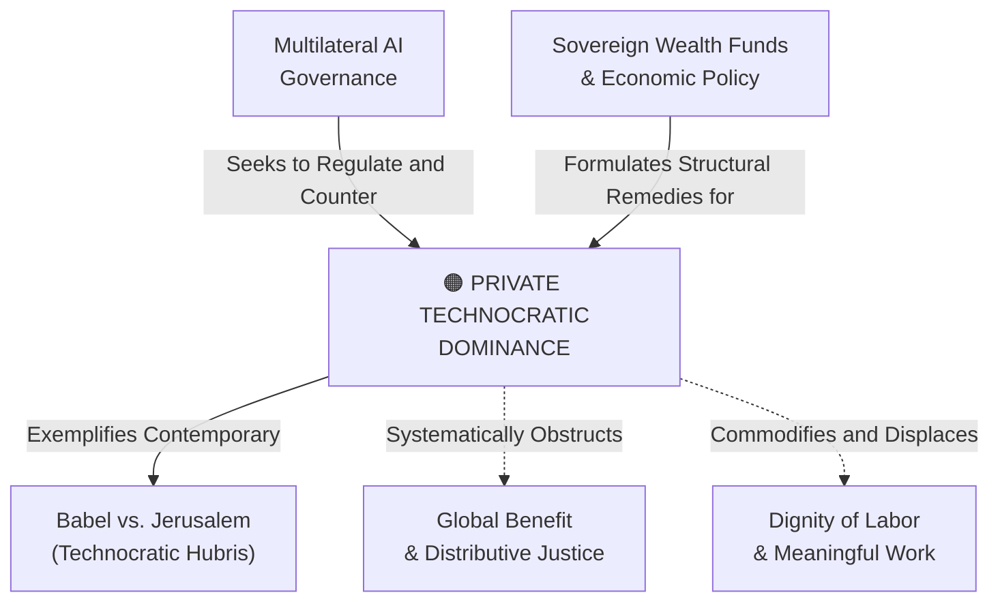

# Private Technocratic Dominance

---

## 1. Executive Summary & Conceptual Thesis

**Private Technocratic Dominance** denotes the historic shift in geopolitical and economic power wherein the frontier of artificial general intelligence (AGI) is controlled almost exclusively by a handful of private, transnational mega-corporations. Unlike earlier technological revolutions—such as the space race, atomic energy, or the early ARPANET internet, which were primarily funded, directed, and held accountable by public sovereign institutions—frontier AI development is financed and executed by private actors whose market capitalization, computational infrastructure, and global intervention capacity surpass those of most sovereign nations.

In *[Magnifica Humanitas](/ecosystem/magnifica-humanitas.md)* (§4–5), Pope Leo XIV sounds the alarm: *"Never has humanity had such power over itself... Today, however, the main drivers of development are private, often transnational, parties... Technological power thus takes on an unprecedented, predominantly 'private' aspect, which makes it even more challenging to discern, govern and direct such power toward the common good."*

This extreme concentration of capital creates a profound democratic governance deficit: key societal choices regarding values, cultural alignment, labor displacement, and catastrophic risk are determined behind closed corporate boardrooms rather than through democratic deliberation.

---

## 2. Conceptual Mind Map & Relational Edges

---

## 3. Theoretical & Institutional Grounding

* **[Encyclical Letter Magnifica Humanitas](/ecosystem/magnifica-humanitas.md)**: Highlights the private nature of 21st-century technological power and warns that corporate monopolies treat training data and computational power as private windfalls rather than the common heritage of humanity.
* ****UN High-Level Advisory Body on AI****: Points out that 118 nations have no representation in current AI governance architectures, leaving the global South completely dependent on private tech oligarchs.
* **[The DeepMind Institute Founding Charter](/ecosystem/institutions/deepmind-institute.md)**: Co-founders Shane Legg, James Manyika, and Demis Hassabis openly acknowledge that AGI development cannot remain a closed corporate initiative and must transition toward open societal partnership.

---

## 4. Dialectical Tensions & Counter-Theses

### Market Speed vs. Democratic Accountability
* **Corporate Tech Justification**: Only private venture capital and cloud conglomerates can mobilize the billions of dollars in GPU clusters required to train frontier frontier models.
* **Dignitarian Democratic Rebuttal**: When technologies possess the power to reshape employment, public truth, and biological safety, their governance cannot be subordinated to quarterly earnings and shareholder returns.

---

## 5. Pedagogical, Architectural & Operational Implications

1. **Vendor Diversity & Open Weights**: Educational institutions must avoid exclusive lock-in to proprietary corporate AI ecosystems, actively supporting open-source and publicly governed foundation models.
2. **Critical Systems Heuristics (CSH + DELTA)**: Engineering teams at St. Francis High School apply Werner Ulrich's CSH questions: *Who is the real beneficiary? Who bears the unstated externalities?*
3. **Data Sovereignty Protection**: Ensuring that student data and creative work are never fed into proprietary model training pipelines without informed, explicit parental consent.

---

## 6. Relational Edge Index

| Edge Direction | Connected Concept | Relationship Type | Conceptual Description |
| :--- | :--- | :--- | :--- |
| **Outbound** | **[Babel vs. Jerusalem](/concepts/babel-vs-jerusalem.md)** | *Exemplifies* | Tech monopolies epitomize the Babel archetype of self-sufficient technological hubris. |
| **Inbound** | **[Multilateral AI Governance](/concepts/multilateral-governance.md)** | *Counteracted by* | International scientific panels and treaties exist to reassert democratic sovereignty. |
| **Inbound** | **[Global Benefit & Distributive Justice](/concepts/global-benefit.md)** | *Opposed by* | Private dominance hoards windfalls that belong under the universal destination of goods. |
| **Outbound** | **[Sovereign AI Wealth Funds & Economic Policy](/concepts/sovereign-wealth-funds-economic-policy.md)** | *Remedied by* | Public compute and sovereign funds break private monopolistic capture. |

---

## 7. Related Knowledge Base Documents & Primary Sources

### Internal Knowledge Base Links
* [Concept Cluster: Power Concentration, Governance & Distributive Justice](/concepts/cluster-power-governance.md)
* [Encyclical Letter Magnifica Humanitas](/ecosystem/magnifica-humanitas.md)
* **UN AI Advisory Body Profile**
* [Babel vs. Jerusalem](/concepts/babel-vs-jerusalem.md)

### External Primary Sources
* Pope Leo XIV (2026). *Magnifica Humanitas*, Introduction & Chapter 3.
* UN High-Level Advisory Body on AI (2024). *Governing AI for Humanity*.
* Legg, S., Manyika, J., & Hassabis, D. (2026). *Introducing the DeepMind Institute*.
