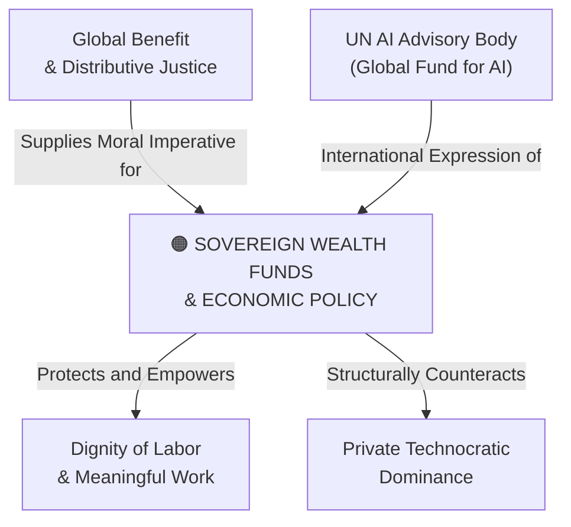

# Sovereign AI Wealth Funds & Economic Policy

---

## 1. Executive Summary & Conceptual Thesis

**Sovereign AI Wealth Funds & Economic Policy** represents the comprehensive macroeconomic policy blueprint formulated by **Julian Jacobs** and **Prof. Alex Imas** at the [DeepMind Institute](/ecosystem/institutions/deepmind-institute.md). As artificial general intelligence approaches human-level cognitive performance across economic sectors, the traditional economic model—where citizens earn income by selling their labor—faces structural disruption.

Evaluating eleven major policy interventions across three rigorous criteria—**Agency & Democratic Empowerment**, **Welfare & Resilience**, and **Feasibility & Implementation**—the authors demonstrate that simple cash handouts (Universal Basic Income) fail to protect human agency. If workers are relegated to passive stipend recipients without meaningful purpose or economic voice, social alienation and political disenfranchisement skyrocket.

Instead, the frontier economic agenda combines **capital redistribution** with **active agency empowerment**:
* **Sovereign AI Wealth Funds**: Public equity stakes in frontier AI labs and critical compute clusters, returning corporate rents directly to citizens.
* **Public Compute & Models**: Government-owned datacenter capacity providing free, high-tier foundation models to schools, universities, and public researchers.
* **Wage Subsidies**: Negative payroll taxes to make human labor competitive against automated pipelines.
* **Shorter Workweeks**: Statutory reductions in working hours without salary cuts, distributing productivity gains into human leisure and family life.

---

## 2. Conceptual Mind Map & Relational Edges

---

## 3. Theoretical & Institutional Grounding

* **[The DeepMind Institute (Jacobs & Imas)](/ecosystem/institutions/deepmind-institute.md)**: Essay 6 establishes the taxonomy of 11 interventions and conducts the comparative feasibility and agency impact study.
* **[UN High-Level Advisory Body on AI](/ecosystem/institutions/un-ai-advisory-body.md)**: Recommends the establishment of a **Global Fund for AI** to finance compute commons and capacity development networks for excluded nations.
* **[Encyclical Letter Magnifica Humanitas](/ecosystem/magnifica-humanitas.md)**: Affirms that digital infrastructure and computational capital fall under the *universal destination of goods*, condemning monopolistic economic rent capture.

---

## 4. Dialectical Tensions & Counter-Theses

### Passive UBI vs. Active Labor Empowerment
* **Silicon Valley UBI Model**: Give displaced workers a monthly check so tech corporations can automate all labor without political backlash.
* **Jacobs & Imas Counter-Thesis**: Income without agency produces social collapse. Public policy must preserve human vocation through wage subsidies, public compute options, and employee profit-sharing.

---

## 5. Pedagogical, Architectural & Operational Implications

1. **Public Domain Educational AI**: High schools advocate for publicly funded, ad-free educational foundation models that guarantee universal student access.
2. **Economic Literacy in Curriculum**: High school economics courses teach the macroeconomics of AGI, preparing students to critically evaluate sovereign funds, labor policies, and automation taxes.
3. **Resisting Monopolistic Licensing**: Institutions avoid single-vendor enterprise lock-in by supporting public compute and open-weights initiatives.

---

## 6. Relational Edge Index

| Edge Direction | Connected Concept | Relationship Type | Conceptual Description |
| :--- | :--- | :--- | :--- |
| **Inbound** | **[Global Benefit & Distributive Justice](/concepts/global-benefit.md)** | *Operationalized by* | Sovereign wealth funds turn distributive justice ideals into concrete fiscal policy. |
| **Outbound** | **[Dignity of Labor & Meaningful Work](/concepts/dignity-of-labor.md)** | *Protects* | Wage subsidies and shortened workweeks protect human vocation against complete automation. |
| **Outbound** | **[Private Technocratic Dominance](/concepts/private-technocratic-dominance.md)** | *Counteracts* | Public equity stakes in AI labs break the private monopolization of frontier compute. |

---

## 7. Related Knowledge Base Documents & Primary Sources

### Internal Knowledge Base Links
* [Concept Cluster: Power Concentration, Governance & Distributive Justice](/concepts/cluster-power-governance.md)
* [The DeepMind Institute Dossier](/ecosystem/institutions/deepmind-institute.md)
* [Dignity of Labor & Meaningful Work](/concepts/dignity-of-labor.md)
* [Global Benefit & Distributive Justice](/concepts/global-benefit.md)

### External Primary Sources
* Jacobs, J., & Imas, A. (2026). *Economic policy for AGI*. DeepMind Institute.
* UN High-Level Advisory Body on AI (2024). *Governing AI for Humanity*.
* Pope Leo XIV (2026). *Magnifica Humanitas*, Chapter 4.
