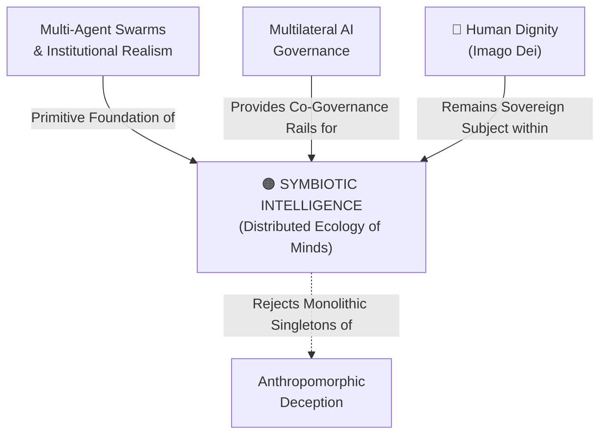

# Symbiotic Intelligence

---

## 1. Executive Summary & Conceptual Thesis

**Symbiotic Intelligence** is an architectural and philosophical paradigm advanced by **Benjamin Bratton**, **Blaise Agüera y Arcas**, and **James Manyika** at the [DeepMind Institute](/ecosystem/institutions/deepmind-institute.md). It fundamentally challenges the pervasive science-fiction archetype of AGI as a solitary, god-like synthetic mind—the "Singleton."

Drawing upon evolutionary biology—specifically the major evolutionary transitions from single-celled prokaryotes to complex multicellular eukaryotes and human cultural evolution—the authors demonstrate that intelligence has never been an indivisible, solitary phenomenon. True intelligence is intrinsically **distributed, social, and symbiotic**.

In AI architectures, agency is **decomposable**: complex tasks are accomplished not by one omnipotent model, but through the coordinated orchestration of specialized models, retrieval engines, software tools, institutional protocols, and human collaborators. Framing AGI as symbiotic intelligence shifts the governance challenge from containing a rogue machine deity to co-designing the institutional rails and contracts that govern human-machine ecologies.

---

## 2. Conceptual Mind Map & Relational Edges

---

## 3. Theoretical & Institutional Grounding

* **[The DeepMind Institute (Bratton, Agüera y Arcas, Manyika)](/ecosystem/institutions/deepmind-institute.md)**: Essay 3 establishes the evolutionary transition analogy, decomposes agency, and critiques the "parasocial mirror."
* **Lynn Margulis & Endosymbiotic Theory**: Grounding biological theory showing that evolutionary complexity arises through symbiotic merger rather than isolated competition.

---

## 4. Dialectical Tensions & Counter-Theses

### The Monolithic Singleton vs. Distributed Symbiosis
* **Singleton Myth**: AGI is an all-knowing, sentient artificial mind in a datacenter.
* **Symbiotic Reality**: AGI is an expansive, distributed infrastructure of thousands of interoperating agents, APIs, databases, and human operators functioning like a global socio-technical metabolism.

---

## 5. Pedagogical, Architectural & Operational Implications

1. **Human-Machine Teaming**: Interfaces at St. Francis High School must position AI as a specialized tool within a wider collaborative ecosystem, never as an all-knowing oracle.
2. **Decomposed Modular Pipelines**: Software design should favor modular, auditable micro-agents over opaque, multi-trillion-parameter monoliths.
3. **Resisting Emotional Enmeshment**: System designers must actively dismantle the "parasocial mirror" by preventing models from simulating human interiority.

---

## 6. Relational Edge Index

| Edge Direction | Connected Concept | Relationship Type | Conceptual Description |
| :--- | :--- | :--- | :--- |
| **Inbound** | **[Multi-Agent Swarms & Institutional Realism](/concepts/multi-agent-swarms.md)** | *Evolves from* | Multi-agent swarms form the operational primitives of symbiotic intelligence. |
| **Outbound** | **[Anthropomorphic Deception](/concepts/anthropomorphic-deception.md)** | *Counters* | Symbiotic intelligence treats AI as distributed tools rather than pseudo-human companions. |
| **Inbound** | **[Human Dignity](/concepts/human-dignity.md)** | *Anchors* | In any symbiotic ecology, the human person remains the sovereign subject and moral center. |

---

## 7. Related Knowledge Base Documents & Primary Sources

### Internal Knowledge Base Links
* [Concept Cluster: Power Concentration, Governance & Distributive Justice](/concepts/cluster-power-governance.md)
* [The DeepMind Institute Dossier](/ecosystem/institutions/deepmind-institute.md)
* [Multi-Agent Swarms & Institutional Realism](/concepts/multi-agent-swarms.md)
* [Anthropomorphic Deception](/concepts/anthropomorphic-deception.md)

### External Primary Sources
* Bratton, B., Agüera y Arcas, B., & Manyika, J. (2026). *Artificial symbiotic intelligence*. DeepMind Institute.
* Margulis, L. (1981). *Symbiosis in Cell Evolution*. W. H. Freeman.
