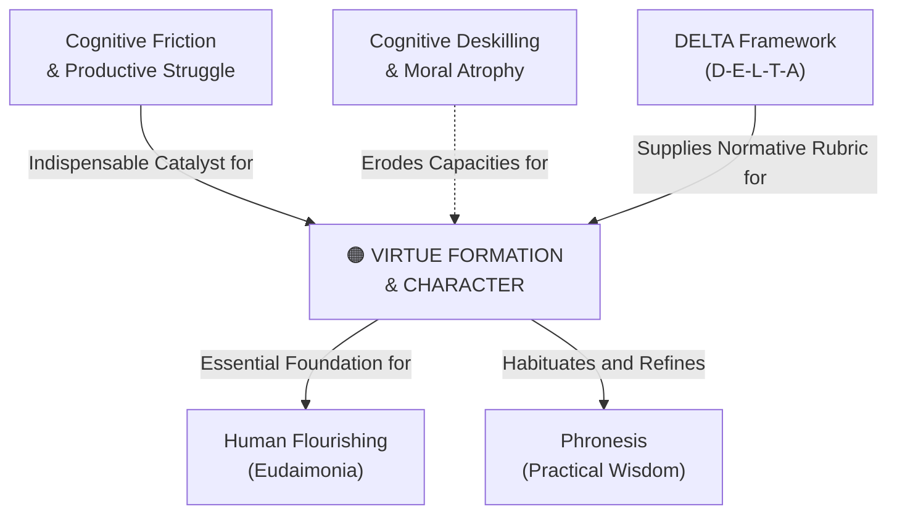

# Virtue Formation & Character

---

## 1. Executive Summary & Conceptual Thesis

**Virtue Formation & Character** refers to the intentional, habit-forming process through which individuals cultivate enduring moral and intellectual excellences—such as prudence, justice, fortitude, temperance, intellectual humility, and compassion. Drawing upon Aristotelian ethics and Christian moral philosophy, virtue is not an innate property or a theoretical set of rules memorized from a textbook; it is a disposition (*hexis*) acquired through repeated, effortful action, moral struggle, failure, reflection, and community mentorship.

In an era increasingly shaped by hyper-efficient generative AI, virtue formation is under unprecedented threat. When automated tools remove all friction, struggle, and intellectual difficulty from writing, analysis, problem-solving, and interpersonal communication, they bypass the very psychological and moral resistance required to build character. If students never struggle to find their own voice in a thesis, they never develop fortitude. If they never sit with moral ambiguity, they never develop practical wisdom (**[Phronesis](/concepts/phronesis.md)**).

Educational institutions like St. Francis High School must design learning environments that protect the crucible of character formation against cognitive bypass.

---

## 2. Conceptual Mind Map & Relational Edges

---

## 3. Theoretical & Institutional Grounding

* **[The DELTA Framework (Univ. of Notre Dame)](/ecosystem/delta-framework.md)**: Develops practical diagnostic tools—including the *Teacher's Examen*, *AI Assignment Decision Tree*, and *Scaffolded Writing Workshops*—explicitly designed to protect student character acquisition from automated shortcutting.
* **[Harvard Human Flourishing Program](/ecosystem/institutions/harvard-human-flourishing.md)**: Identifies Character and Virtue as the 4th canonical domain of human well-being, empirically demonstrating that individuals with cultivated moral habits exhibit significantly greater resilience and social cohesion.
* **[Oxford Institute for Ethics in AI (The Lyceum Project)](/ecosystem/institutions/oxford-ethics-ai.md)**: Translates classical Aristotelian virtue ethics into computer interface guidelines that prompt users toward reflective deliberation rather than impulsive reaction.

---

## 4. Dialectical Tensions & Counter-Theses

### Cognitive Convenience vs. Moral Character
* **AI Convenience Trap**: Generating instant thesis statements, summary outlines, and automated responses saves time and maximizes benchmark grades.
* **Virtue Formation Counter-Thesis**: The value of an assignment lies not in the final artifact, but in the internal transformation that occurs within the student during the struggle to create it.

---

## 5. Pedagogical, Architectural & Operational Implications

1. **The Teacher's Examen**: Faculty regularly audit classroom practices to ensure technology is not eliminating the necessary intellectual friction required for character growth.
2. **Scaffolded Analog Notebooks**: Mandatory analog writing stages where students draft, outline, and debate core arguments by hand before using digital formatting tools.
3. **Character-Centric Assessment Rubrics**: Grading systems that reward intellectual honesty, perseverance through error, and creative voice over generic, machine-polished prose.

---

## 6. Relational Edge Index

| Edge Direction | Connected Concept | Relationship Type | Conceptual Description |
| :--- | :--- | :--- | :--- |
| **Outbound** | **[Human Flourishing (Eudaimonia)](/concepts/eudaimonia.md)** | *Enables* | Character virtues are the internal engine through which eudaimonia is realized. |
| **Outbound** | **[Phronesis (Practical Wisdom)](/concepts/phronesis.md)** | *Habituates* | Virtue formation trains practical judgment through repeated real-world moral choices. |
| **Inbound** | **[Cognitive Friction & Productive Struggle](/concepts/cognitive-friction.md)** | *Catalyzed by* | Character cannot develop without the resistance provided by cognitive friction. |
| **Inbound** | **[Cognitive Deskilling & Moral Atrophy](/concepts/cognitive-deskilling.md)** | *Threatened by* | Offloading moral and intellectual effort leads directly to character erosion. |

---

## 7. Related Knowledge Base Documents & Primary Sources

### Internal Knowledge Base Links
* [Concept Cluster: Human Flourishing & Virtue Formation](/concepts/cluster-human-flourishing.md)
* [The DELTA Framework: Faith-Informed Virtue Ethics](/ecosystem/delta-framework.md)
* [Phronesis (Practical Wisdom)](/concepts/phronesis.md)
* [Cognitive Friction & Productive Struggle](/concepts/cognitive-friction.md)

### External Primary Sources
* Aristotle. *Nicomachean Ethics*, Book II (Moral Virtue and Habituation).
* Sullivan, M. & Kronk, A. (2026). *DELTA: Educating for Character in the Age of AI*. University of Notre Dame.
* VanderWeele, T. J. et al. (2026). *The Global Flourishing Study Methodology*. Gallup / Harvard.
