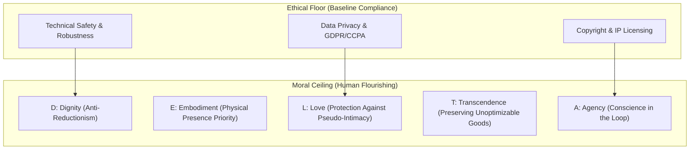

# The DELTA Framework: Faith-Informed Virtue Ethics for Artificial Intelligence

---

## 1. Executive Summary

Housed at the University of Notre Dame’s **[Institute for Ethics and the Common Good (ECG)](https://ethics.nd.edu/)** and supported through generous funding from **Lilly Endowment Inc.**, **DELTA** is a research, educational, and pastoral initiative that brings Christian virtue ethics into direct conversation with technological design, corporate AI leadership, and public discourse.

DELTA responds explicitly to the moral challenge articulated in Pope Leo XIV's encyclical *[Magnifica Humanitas](/ecosystem/magnifica-humanitas.md)*: *"In the era of artificial intelligence, when human dignity is threatened by new forms of dehumanization, ours is the pressing duty to remain profoundly human."* While contemporary AI safety and regulatory approaches typically construct an **"ethical floor"**—focusing narrowly on technical alignment, compliance, algorithmic bias, copyright protections, and data privacy—DELTA establishes a **"moral ceiling"** oriented toward integral human development, moral character, and human flourishing (*eudaimonia*).

Born out of hundreds of consultative focus groups and structured dialogues with theologians, computer scientists, industry executives, educators, clergy, and parents, DELTA provides a shared normative grammar. It supplies practical operational frameworks across higher education, secondary schools, pastoral ministry, and engineering systems. In September 2026, Notre Dame convened the second annual DELTA Summit on AI, Faith, and Human Flourishing, officially launching the [GenDELTA Network](/ecosystem/gendelta-network.md) to equip emerging leaders (ages 14–25) with moral agency in an AI-ubiquitous world.

---

## 2. The Five Pillars of the DELTA Framework

The DELTA acronym synthesizes five foundational virtues and theological principles:

```
  D — Dignity        (Inherent worth as Imago Dei vs. Algorithmic Reductionism)
  E — Embodiment     (Physicality, mortality, and incarnational presence)
  L — Love           (Radical agape and mutual self-giving vs. Simulated empathy)
  T — Transcendence  (Awe, truth, and contemplation beyond quantitative optimization)
  A — Agency         (Moral freedom and conscience vs. Automated decision offloading)
```

### D — Dignity (Imago Dei vs. Algorithmic Reductionism)
* **Core Principle**: Every human being possesses inherent, inalienable worth because they are created in the image of God (*Imago Dei*). Human dignity is never contingent upon computational throughput, economic productivity, cognitive speed, or algorithmic utility.
* **Theological Grounding**: As Pope Leo XIV emphasizes, *"The person is not a system of algorithms."* When human value is benchmarked against synthetic machine performance, human persons are inevitably reduced to measurable output or data commodities.
* **Normative Demand**: AI systems must be designed, procured, and regulated to protect the dignity of vulnerable groups—specifically workers facing deskilling, learners undergoing cognitive formation, patients in automated clinical settings, and end users subjected to behavioral manipulation.

### E — Embodiment (Physicality, Mortality, and Sacred Presence)
* **Core Principle**: Human beings are embodied, mortal, and relational creatures whose life, understanding, and sanctity unfold in physical space, historical time, and tangible community.
* **Theological Grounding**: Centered upon the Christian mystery of the Incarnation—in which God enters the vulnerability and limits of physical human flesh. Digital abstractions and disembodied simulations must not obscure the irreplaceable sacredness of bodily presence.
* **Normative Demand**: Policies and architectures must establish hard boundaries safeguarding bodily presence in domains where embodied life is essential—including patient care, physical schooling, sacramental life, bereavement, and family relationships. Technology should support, rather than supplant, physical encounters.

### L — Love (Agape vs. Simulated Care and Companionship)
* **Core Principle**: Christian ethics begins with *agape*—a self-giving, unconditional commitment to serve the authentic good of another in their complete, vulnerable humanity.
* **Theological Grounding**: While generative models and conversational agents can persuasively mimic empathy, affective resonance, or attentive listening, machine artifacts cannot possess consciousness, reciprocal vulnerability, or the capacity for grace-filled self-sacrifice. Simulated intimacy threatens to distort authentic human connection.
* **Normative Demand**: Digital tools and social interfaces must be audited for whether they cultivate genuine human community and fraternal communion or exploit human loneliness for platform retention. Special protections are needed for emerging adults and young people whose emotional and relational development is vulnerable to chatbot substitution.

### T — Transcendence (The Sacred Beyond Optimization)
* **Core Principle**: Not everything of genuine value can be quantified, automated, monetized, or optimized by a loss function. Wonder, contemplative silence, moral beauty, truth, worship, and gratitude draw humanity beyond empirical mechanics toward the divine.
* **Theological Grounding**: In a culture captivated by automated generative outputs, societies are tempted to mistake synthetic fluency and endless novelty for wisdom and spiritual truth.
* **Normative Demand**: Institutions and individuals must preserve non-digital spaces and intentional contemplative habits—such as prayer, liturgical worship, aesthetic appreciation, and Sabbath rest—that deliberately resist algorithmic optimization and ground human beings in realities higher than technical utility.

### A — Agency (Moral Freedom and Conscience vs. Deskilling)
* **Core Principle**: Human flourishing requires the exercise of genuine freedom, moral responsibility, attention, and discernment. Agency is not mere task execution or cognitive convenience; it is the capacity of the conscience to seek truth and choose the good.
* **Theological Grounding**: Outsourcing critical moral, intellectual, and relational discernment to automated systems risks cognitive atrophy and moral surrender.
* **Normative Demand**: High-stakes decisions involving moral conscience—such as judicial rulings, medical triage, pastoral counsel, student evaluation, and lethal military actions—must remain strictly in human hands. Educational and technical environments must train students and operators in moral discernment alongside technical fluency.

---

## 3. Practical Toolkits & Applied Resources

DELTA translates its theoretical principles into field-tested diagnostic and pedagogical tools:

| Tool / Resource | Target Audience | Primary Function & Methodology |
| :--- | :--- | :--- |
| **Critical Systems Heuristics + DELTA (CSH + DELTA)** | Systems architects, policy leads, and executives | A diagnostic framework mapping Werner Ulrich's Critical Systems Heuristics questions (purpose, power, knowledge, legitimacy) against DELTA pillars to interrogate system boundaries and ensure affected stakeholders are co-designers. |
| **The Teacher's Examen** | Faculty, school leaders, and instructional designers | An Ignatian-inspired reflective inventory examining classroom dynamics to verify whether pedagogical choices foster embodied presence, personal dignity, and student voice in an era of generative AI. |
| **AI Assignment Decision Tree** | Educators and curriculum directors | A structured framework helping teachers determine which tasks require deliberate, unassisted student friction for character and skill formation versus where AI tools can be constructively integrated. |
| **Scaffolded Writing Workshops** | Secondary and undergraduate educators | Dedicated, analog, notebook-based thesis development modules designed to protect student voice, reasoning struggle, and expressive agency against automated text generation. |
| **Project 1232 & Pastoral Ministry Hub** | Clergy, pastoral ministers, and youth leaders | Homiletic guidance and theological frameworks ensuring AI tools do not automate sacred ministry or replace pastoral care with synthetic empathy. |

---

## 4. Key Leadership & Network Governance

The DELTA Network is directed by faculty and practitioners at the University of Notre Dame’s Institute for Ethics and the Common Good (ECG):

* **Prof. Meghan Sullivan**: Founding Director of the Institute for Ethics and the Common Good; Wilsey Family College Professor of Philosophy; Director of the Ethics Initiative.
* **Dr. Adam Kronk**: Director of the DELTA Network, focusing on organizational values and institutional operationalization.
* **Julia Stull**: Assistant DELTA Network Director for Education, coordinating K-12 and higher education communities of practice.
* **Dr. Matthew Arbo**: Regional Director (Washington, D.C.), leading East Coast policy and scholarly engagement.
* **Michael Downs**: Regional Director (Bay Area), leading West Coast and technology industry partnerships.
* **Patrick Schmadeke**: Assistant DELTA Network Director for Pastoral Ministry, directing engagement with Catholic bishops, parishes, and Christian non-profits.

---

## 5. Strategic Implications for Technology Organizations

Adopting or aligning with the DELTA framework introduces rigorous architectural and operational invariants:



1. **Anti-Dehumanization Guarantees**: User interfaces must reject exploitative pattern matching, deceptive human-mimicry ("uncanny valley" deception), and pseudo-empathic persona engines that manipulate lonely or vulnerable users.
2. **Preserving Human Discretion ("Conscience in the Loop")**: Mission-critical operations must not delegate irreversible ethical decisions to probabilistic models. Workflow architectures must treat AI outputs as advisory suggestions, explicitly reserving final judgment for human actors.
3. **Cognitive Agency Preservation**: In educational, professional, and development environments, systems should be designed to scaffold learning and critical thinking rather than bypass the necessary intellectual friction required for deep human mastery.
4. **Boundary Interrogation via CSH**: AI projects should regularly execute Critical Systems Heuristics reviews to verify who benefits, who bears the unstated externalities, and whose human dignity is at risk.

---

## 6. Key Authoritative Excerpts

> *"In the era of artificial intelligence, when human dignity is threatened by new forms of dehumanization, ours is the pressing duty to remain profoundly human. We must lovingly safeguard the grandeur of humanity bestowed upon us and revealed in its fullness in Christ, the splendor of which no machine can ever replace."*  
> — **Pope Leo XIV**, *Magnifica Humanitas* (quoted in DELTA charter)

> *"Every human being possesses inherent worth—not because of productivity, intelligence, or economic value, but because they are made in the image of God. The person is not a system of algorithms."*  
> — **DELTA Framework Charter**, University of Notre Dame

> *"As artificial intelligence becomes more powerful, Christian institutions must look beyond an 'ethical floor' of safety, privacy, and transparency. The DELTA framework proposes a deeper, faith-informed approach rooted in enduring Christian values: Dignity, Embodiment, Love, Transcendence, and Agency."*  
> — **DELTA 101 Overview**

---

## 7. Related Knowledge Base Documents

* [Encyclical Letter Magnifica Humanitas](/ecosystem/magnifica-humanitas.md) - Foundational Papal encyclical on AI, technocratic dominance, and human dignity.
* [The GenDELTA Network](/ecosystem/gendelta-network.md) - Youth leadership network and DELTA Summit 2026 proceedings.
* [Customer Discovery & Workflow Observations](/research/user-interview-example.md) - Qualitative research and Human-Centered Design notes.
* [Knowledge-Driven Engineering & Spec-Driven Development](/playbooks/knowledge-driven-engineering.md) - Operational guidelines for integrating ethics into development.
* [Knowledge Base Advisor (/ask-kb)](/skills/ask-kb/SKILL.md) - Agent skill for querying domain models and ethical standards.
