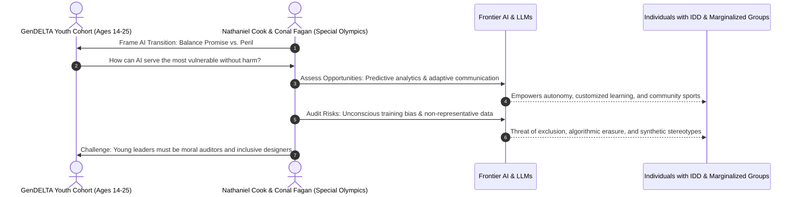

# The GenDELTA Network: Youth Leadership, Human Flourishing, and AI Ethics

---

## 1. Executive Summary & Institutional Context

Housed within the University of Notre Dame’s **[Institute for Ethics and the Common Good (ECG)](https://ethics.nd.edu/)** as an extension of the **[DELTA Framework](/ecosystem/delta-framework.md)**, the **GenDELTA Network** is an initiative dedicated to convening, equipping, and mobilizing young leaders who are coming of age in an AI-pervasive world.

The network was formally convened for the first time during the second annual **DELTA Summit on AI, Faith, and Human Flourishing** (September 21–23, 2026) at Notre Dame. The cohort brought together over 50 young adults ranging in age from 14 to 25, spanning secondary school and university environments.

```
       ┌────────────────────────────────────────────────────────┐
       │   University of Notre Dame (ECG) & Lilly Endowment    │
       └───────────────────────────┬────────────────────────────┘
                                   │
                    ┌──────────────┴──────────────┐
                    ▼                             ▼
       ┌─────────────────────────┐   ┌───────────────────────────┐
       │  DELTA Ethics Framework │   │     GenDELTA Network      │
       │   (D - E - L - T - A)   │   │  50+ Young Adults (14-25) │
       │  Normative Moral Floor  │   │  High School & University │
       │     & Moral Ceiling     │   │     "Getting AI Right"    │
       └─────────────────────────┘   └─────────────┬─────────────┘
                                                   │
                       ┌───────────────────────────┴───────────────────────────┐
                       ▼                                                       ▼
       ┌───────────────────────────────┐                       ┌───────────────────────────────┐
       │   Inclusive Innovation &      │                       │  Faith-Informed Discernment   │
       │  Marginalized Communities     │                       │    & The Future of Labor      │
       │  (Special Olympics Partner)   │                       │  (St. Francis & Partner K-12) │
       └───────────────────────────────┘                       └───────────────────────────────┘
```

### The Rationale for GenDELTA
While industry consortia and legislative bodies predominantly feature senior researchers, executives, and policymakers, current high school and college students will bear a disproportionate burden of the structural consequences of frontier AI. As DELTA Network Director Adam Kronk emphasized, these emerging leaders hold the primary moral agency and creative imperative to help "get AI right"—ensuring that technological transitions expand integral human flourishing rather than causing widespread deskilling, isolation, or alienation.

---

## 2. Core Pillars & The GenDELTA Mandate

The GenDELTA initiative translates the five core pillars of the **DELTA Framework** into practical discernment and action for young people:

| DELTA Pillar | GenDELTA Generational Application | Anti-Pattern Rejected |
| :--- | :--- | :--- |
| **Dignity** (*Imago Dei*) | Grounding student and worker identity in sacred, intrinsic worth rather than algorithmic productivity or academic benchmarking. | **Algorithmic Reductionism**: Valuing individuals purely by exam scores, code output, or automated metrics. |
| **Embodiment** (*Incarnational Presence*) | Prioritizing embodied classroom communities, physical mentorship, and tangible fellowship over simulated interaction. | **Synthetic Intimacy**: Substituting genuine relational bonds with conversational bots or parasocial avatars. |
| **Love** (*Agape*) | Directing technological skills to serve marginalized populations, especially those with disabilities and vulnerable workers. | **Technocratic Indifference**: Designing AI tools that optimize capital efficiency while ignoring social externalities. |
| **Transcendence** (*Contemplation & Truth*) | Cultivating silence, wonder, and vocational discernment that transcend computational optimization. | **Efficiency Absolutism**: Attempting to automate reflection, philosophical contemplation, and spiritual formation. |
| **Agency** (*Conscience in the Loop*) | Retaining human moral responsibility, intellectual struggle, and conscience in all AI-augmented workflows. | **Cognitive Deskilling**: Passive surrender of writing, critical thinking, and moral judgment to foundation models. |

---

## 3. Summit Highlights: "GenDELTA: AI as an Agent of Change"

A centerpiece of the 2026 DELTA Summit programming was the plenary dialogue **"GenDELTA: AI as an Agent of Change"** (streamed live on September 23, 2026), hosted by the Institute for Ethics and the Common Good.

### Featured Speakers
* **Nathaniel Cook**: Chief Information and Technology Officer, Special Olympics International.
* **Conal Fagan**: Senior Manager for Global Strategic Partnerships, Special Olympics International.

### Key Themes & Insights



1. **The Promise of AI for Inclusion & Dignity**:
   * Special Olympics highlighted how emerging AI capabilities can support athletes and individuals with intellectual and developmental disabilities (IDD).
   * Predictive analysis, adaptive assistive technologies, and personalized communicative interfaces can expand accessibility, strengthen health monitoring, and empower greater self-determination in sports, education, and community life.

2. **The Peril of Implicit Bias in Foundation Models**:
   * Large Language Models (LLMs) trained on unfiltered web corpora carry systemic implicit biases that frequently mischaracterize or ignore neurodivergent perspectives.
   * Algorithms trained purely on dominant norms risk marginalizing individuals with developmental differences or erasing nuanced human accessibility requirements.

3. **The Regulatory and Governance Horizon**:
   * Traditional policy frameworks and institutional compliance mechanisms lag behind the breakneck velocity of foundation model deployment.
   * Cook and Fagan challenged the GenDELTA cohort to act not merely as end-users, but as **moral architects and inclusive auditors** who demand that AI systems account for vulnerability from the initial design phase rather than as an afterthought.

---

## 4. Strategic Implications for Education, Technology & Faith

### A. The Third Way: Beyond Policing and Surrender
GenDELTA models an alternative to the dead-end educational debate between:
1. **Adversarial Policing**: Deploying brittle AI detectors to punish synthetic writing, fostering an atmosphere of mutual suspicion.
2. **Passive Surrender**: Abdicating critical cognitive struggle and allowing students to outsource intellectual growth to commercial chat interfaces.

By treating young adults as partners in moral discernment, GenDELTA creates spaces where students can articulate the value of **[Cognitive Friction](/concepts/cognitive-friction.md)**—understanding that intellectual and moral character requires productive struggle.

### B. Vocational Discernment in an Automated Economy
As generative models automate entry-level white-collar and technical tasks, GenDELTA reframes the future of work around **[Dignity of Labor](/concepts/dignity-of-labor.md)**. Labor is treated as co-creation and stewardship, guiding students to cultivate virtues that algorithms cannot duplicate: *phronesis* (practical wisdom), empathy, moral courage, and spiritual discernment.

### C. Applied Storyboarding and Classroom Co-Creation
Programs aligned with GenDELTA—such as the applied pilot at Saint Francis High School (SFHS)—utilize participatory visual tools (e.g. `/generate-storyboards`) to translate ethical concepts into concrete interface designs and educational policies.

---

## 5. Key Authoritative Excerpts

> *"Recognizing that current high school and college students will be disproportionately impacted by both the promise and peril of AI and other emerging technologies, the GenDELTA Network brings together young adults interested in wrestling with tough questions about AI and exploring how to tangibly support human flourishing and the common good as they navigate this transition."*  
> — **DELTA Summit 2026 Charter**, University of Notre Dame Institute for Ethics and the Common Good

> *"These young leaders are the ones with the most agency to help get AI right. Their voices and moral convictions must shape the technologies that will define their future."*  
> — **Adam Kronk**, Director of the DELTA Network, University of Notre Dame

> *"AI has immense potential to enhance productivity and predictive analysis for individuals with intellectual and developmental disabilities, but without vigilant moral stewardship and anti-bias auditing, rapid model deployment risks deepening societal exclusion."*  
> — **Nathaniel Cook & Conal Fagan**, Special Olympics International, *GenDELTA: AI as an Agent of Change*

---

## 6. Related Knowledge Base Documents

* [The DELTA Framework](/ecosystem/delta-framework.md) - Foundational virtue ethics framework from Notre Dame.
* [Catholic Companion Framework for Technology and Innovation](/ecosystem/catholic-companion-framework.md) - Practical K-12 and university integration strands.
* [Encyclical Letter Magnifica Humanitas](/ecosystem/magnifica-humanitas.md) - Papal teaching on AI, human dignity, and technocratic hegemony.
* [Secondary School AI Pedagogy & Assessment Blueprint](/frontier/secondary-school-ai-pedagogy.md) - Three-zone pedagogical architecture preserving cognitive struggle.
* [Human Dignity (Imago Dei)](/concepts/human-dignity.md) - Foundational theological concept anchoring inherent human worth.
* [Dignity of Labor & Meaningful Work](/concepts/dignity-of-labor.md) - Vocational ethics in an era of automated knowledge work.
* [Cognitive Friction & Productive Struggle](/concepts/cognitive-friction.md) - Pedagogical guardrails against intellectual deskilling.
