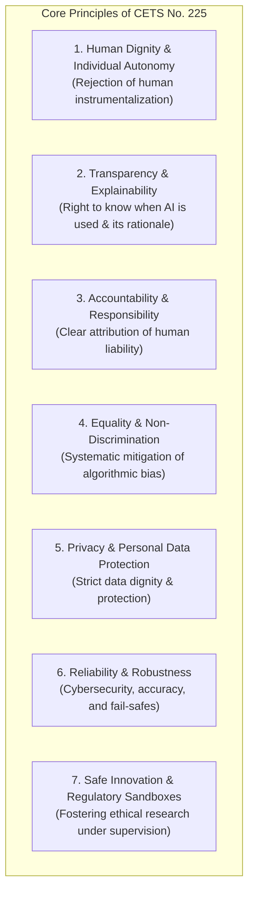
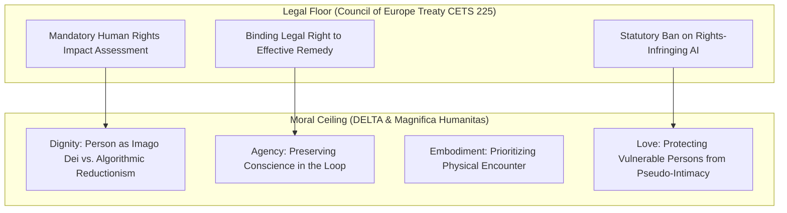

# Council of Europe: Framework Convention on Artificial Intelligence and Human Rights

---

## 1. Executive Summary

Adopted by the Committee of Ministers on May 17, 2024, and officially opened for signature in Vilnius, Lithuania on **September 5, 2024**, the **[Council of Europe Framework Convention on Artificial Intelligence and Human Rights, Democracy, and the Rule of Law](https://www.coe.int/en/web/conventions/full-list?module=treaty-detail&treatynum=225)** (Council of Europe Treaty Series No. 225) represents the **world’s first legally binding international treaty** governing artificial intelligence systems.

Negotiated by the Committee on Artificial Intelligence (CAI) with active participation from 46 Council of Europe member states, the European Union, and key non-European observer states—including the **United States, Canada, Japan, the United Kingdom, and Israel**—the Convention establishes an enforceable legal bedrock. It legally obligates signatory states to ensure that AI activities throughout their entire lifecycle (conception, design, development, testing, deployment, and use) respect human rights, preserve democratic institutions, and uphold the rule of law.

Unlike non-binding declarations, voluntary codes of conduct, or ethical guidelines, CETS No. 225 creates sovereign international treaty obligations. It forms an interlocking global regulatory triangle alongside the **European Union AI Act** (statutory market regulation) and the **OECD Revised Recommendation on AI** (multilateral policy standards), transforming abstract ethical principles into actionable, auditable legal mandates.

---

## 2. Treaty Architecture, Scope & Sovereign Signatories

```
┌─────────────────────────────────────────────────────────────────────────────┐
│          COUNCIL OF EUROPE FRAMEWORK CONVENTION ON AI (CETS NO. 225)        │
├─────────────────────────────────────────────────────────────────────────────┤
│ Adoption Date:      17 May 2024 (Committee of Ministers)                    │
│ Opened for Signing: 5 September 2024 (Vilnius, Lithuania)                   │
│ Drafting Body:      Committee on Artificial Intelligence (CAI)              │
│ Initial Signatories:European Union, United States, United Kingdom, Israel,  │
│                     Norway, Iceland, Georgia, Moldova, Andorra, San Marino  │
├─────────────────────────────────────────────────────────────────────────────┤
│ Core Legal Scope:                                                           │
│  • Public Sector: Direct, mandatory compliance for all public authority AI. │
│  • Private Sector: Parties must address risks arising from private actors   │
│    through regulation or appropriate measures.                              │
│  • Exemptions: National defense and military AI are carved out, but national│
│    security operations remain subject to international human rights law.    │
└─────────────────────────────────────────────────────────────────────────────┘
```

The Convention is intentionally structured as an open framework treaty, permitting non-European nations that share commitments to human rights and democracy to formally accede and be bound by its provisions.

---

## 3. Core Principles & Binding Obligations

The Convention establishes seven foundational principles that signatory states must enshrine in domestic law and enforcement frameworks:



### Detailed Treaty Mandates:

1. **Human Dignity and Autonomy**:
   * AI systems must respect human agency and dignity. Systems that dehumanize individuals, erode free will, or reduce human persons to mere algorithmic objects are strictly prohibited.
2. **Transparency and Notification**:
   * Individuals have an explicit legal right to be informed when they are interacting directly with an AI system or when decisions affecting their rights, health, or livelihoods are generated or assisted by automated systems.
3. **Right to Effective Remedies and Procedural Safeguards**:
   * Persons subjected to automated decisions have the legal right to challenge the decision, request meaningful human review, understand the reasoning, and seek judicial remedy for rights violations.
4. **Risk and Impact Assessment Frameworks**:
   * Mandatory pre-deployment impact assessments evaluating human rights, democracy, and rule of law impacts for any high-risk AI application.
5. **Protection of Democratic Processes**:
   * Signatory states must establish robust safeguards preventing AI from undermining electoral integrity, subverting public debate through synthetic disinformation, or eroding judicial independence.

---

## 4. The Interlocking Global Regulatory Rails

The Council of Europe Convention does not operate in isolation; it anchors an interconnected tripartite framework of transatlantic AI governance:

| Governance Layer | Primary Instrument | Institutional Authority | Nature of Instrument | Core Focus |
| :--- | :--- | :--- | :--- | :--- |
| **International Legal Bedrock** | **Council of Europe CETS No. 225** | Council of Europe & Global Signatories | **Legally Binding Treaty** | Enforceable human rights, democracy, procedural remedies, and rule of law. |
| **Market & Product Safety** | **EU Artificial Intelligence Act** | European Commission & EU Member States | **Legally Binding Regulation** | Product safety, market conformity, risk tiering, and prohibited practices. |
| **Intergovernmental Policy** | **OECD Revised AI Principles (2024)** | OECD Member Countries (47 States) | **Multilateral Policy Standard** | Inclusive growth, sustainability, well-being, and cross-border alignment. |

This convergence ensures that whether an AI system is evaluated as a commercial product (EU AI Act), an economic policy instrument (OECD), or a civic tool (Council of Europe), human dignity and autonomy remain paramount.

---

## 5. Comparative Alignment: Legal Rights vs. Virtue Ethics

The Council of Europe treaty provides the enforceable secular and legal counterpart to the ethical frameworks in our knowledge base:



* **From Compliance Floor to Moral Ceiling**: The Council of Europe Convention defines what states must legally forbid to prevent tyranny and abuse (*the ethical floor*). The [DELTA Framework](/ecosystem/delta-framework.md) and [*Magnifica Humanitas*](/ecosystem/magnifica-humanitas.md) define the positive virtues, character, and love toward which society must aspire (*the moral ceiling*).
* **Consensus on "Human in the Loop"**: CETS No. 225’s guarantee of human review for high-stakes decisions directly reinforces the Papal mandate that moral judgment and life-and-death determinations must never be abdicated to algorithms.

---

## 6. Operational & Architectural Compliance Requirements

Engineering teams and educational institutions operating within or deploying across treaty signatory jurisdictions must ensure:

1. **Explicit AI Disclosure**: Implement automated disclaimers and user notifications whenever users interact with generative conversational agents or when grading, admissions, or administrative decisions are automated.
2. **Audit Trails and Explanation Logs**: Maintain tamper-evident logs of model inputs, system reasoning (chain-of-thought traces), and final model weights to support statutory accountability and human review requests.
3. **Formal Human Rights Impact Assessments (HRIA)**: Before deploying predictive or algorithmic models impacting students, workers, or customers, conduct formal assessments evaluating bias, dignity risks, and unintended disparate impacts.

---

## 7. Related Knowledge Base Documents

* [Global AI Institutions Observatory](/ecosystem/institutions/overview.md) — Matrix tracking global standards bodies, treaty authorities, and research labs.
* [Encyclical Letter Magnifica Humanitas](/ecosystem/magnifica-humanitas.md) — Foundational Papal encyclical on human dignity, labor, and technocratic power.
* [The DELTA Framework: Faith-Informed Virtue Ethics for AI](/ecosystem/delta-framework.md) — Five normative pillars for human flourishing.
* [UN High-Level Advisory Body on AI](/ecosystem/institutions/un-ai-advisory-body.md) — Global multilateral blueprint for AI governance and equity.
* [The DeepMind Institute Dossier](/ecosystem/institutions/deepmind-institute.md) — Frontier industry research on AGI governance and safety.
