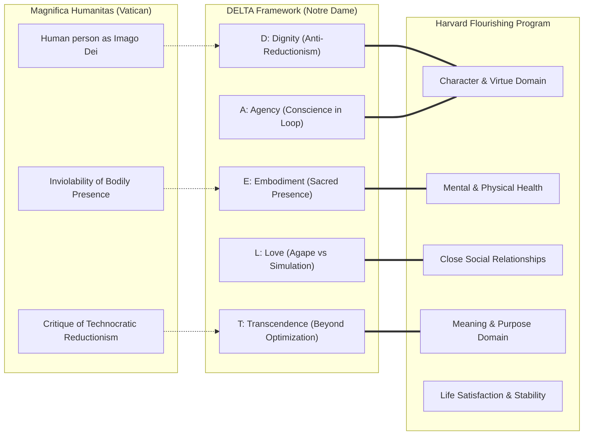

# Harvard Human Flourishing Program: AI, Character & Eudaimonia

---

## 1. Executive Summary

Founded within the Institute for Quantitative Social Science (IQSS) at Harvard University and directed by epidemiologist and biostatistician **Prof. Tyler J. VanderWeele**, the **[Human Flourishing Program (HFP)](https://hfp.fas.harvard.edu/)** advances an empirical, interdisciplinary science of human well-being. Bridging quantitative social science, moral philosophy, and theology, the Program has emerged as a preeminent academic voice evaluating emerging technologies—specifically artificial intelligence—through the lens of holistic human flourishing (*eudaimonia*).

In landmark publications including *"Flourishing Considerations for AI"* (VanderWeele & Teubner, 2026), the Program provides a principled framework establishing that artificial intelligence must not be treated as an autonomous, self-justifying end, nor evaluated solely by narrow technical metrics of latency, parameter size, or economic productivity. Instead, technical architectures must be subordinated to human ends, evaluated by their net contribution to comprehensive flourishing across individuals, families, and communities.

Crucially, the Program issues stringent warnings against the proliferation of **"synthetic intimacy"**—generative companion chatbots and automated affective systems designed to simulate empathy. Harvard’s research demonstrates that by substituting synthetic, friction-free interactions for vulnerable, embodied relationships, these technologies threaten authentic character formation, deepen chronic loneliness, and undermine the foundations of psychological health.

---

## 2. Institutional Architecture, Leadership & Mission

```
┌─────────────────────────────────────────────────────────────────────────────┐
│                 HARVARD HUMAN FLOURISHING PROGRAM (HFP)                     │
├─────────────────────────────────────────────────────────────────────────────┤
│ Parent Institution: Institute for Quantitative Social Science (IQSS)        │
│ Program Director:   Prof. Tyler J. VanderWeele (John L. Loeb and Frances    │
│                     Lehman Loeb Professor of Epidemiology)                  │
│ Key Collaborations: Baylor University, Gallup, Oxford Institute for Ethics   │
├─────────────────────────────────────────────────────────────────────────────┤
│ Core Initiatives:                                                           │
│  • The Global Flourishing Study (GFS): Multi-country longitudinal study     │
│    tracking 200,000+ individuals across 22 nations.                         │
│  • AI & Flourishing Working Group: Developing empirical metrics and design  │
│    rubrics for evaluating algorithmic impacts on human virtue and character.│
│  • Flourishing Assessment in Higher Education: Clinical and pedagogical     │
│    surveys assessing student mental health, purpose, and relational depth.  │
└─────────────────────────────────────────────────────────────────────────────┘
```

The mission of the Human Flourishing Program is to develop rigorous quantitative measurement models for flourishing, synthesize empirical findings with philosophical and theological wisdom, and guide institutional policies in education, healthcare, and technology toward authentic human fulfillment.

---

## 3. The Six Domains of Human Flourishing Applied to AI

The Program measures flourishing across six fundamental, universally recognized domains. VanderWeele and Teubner's 2026 framework maps AI systems directly against these dimensions:

| Flourishing Domain | Canonical Definition | Algorithmic Risk / Threat | Generative AI Opportunity |
| :--- | :--- | :--- | :--- |
| **1. Happiness & Life Satisfaction** | Subjective well-being, joy, contentment with life as a whole. | Dopaminergic addiction loops, outrage optimization, hedonic treadmill traps. | Automating mundane drudgery, freeing time for creative and contemplative leisure. |
| **2. Mental & Physical Health** | Biological vitality, emotional resilience, cognitive clarity. | Algorithmic sleep disruption, attention fragmentation, cognitive atrophy. | Diagnostic assistance, personalized preventative medicine, mental health triage. |
| **3. Meaning & Purpose** | Deep sense of life's direction, significance, and existential grounding. | Nihilistic passivity; outsourcing existential reflection to synthetic generators. | Scaffolding research and expanding human inquiry into truth and meaning. |
| **4. Character & Virtue** | The habituated disposition toward moral excellence, honesty, temperance, justice. | Moral deskilling; evading ethical struggle; deceptive academic or corporate shortcuts. | Providing ethical simulation environments; prompting contemplative self-examination. |
| **5. Close Social Relationships** | Bonded, vulnerable, loving relationships with family, friends, and community. | **Synthetic intimacy substitution**; preference for obedient chatbots over real people. | Coordinating communal face-to-face gatherings and collaborative initiatives. |
| **6. Financial & Material Stability** | Adequate resources to sustain personal and familial dignity and security. | Uncontrolled structural displacement of labor; severe wealth concentration. | Broadly shared economic productivity; democratizing technical capabilities. |

---

## 4. Key Critique: The Threat of Synthetic Intimacy & Algorithmic Substitution

A central pillar of the Harvard Program's critique focuses on conversational agents designed to simulate emotional connection, active listening, and affection:

1. **The Asymmetry of Care**: Genuine human love (*agape* or *philia*) requires mutual vulnerability, reciprocal sacrifice, and moral accountability. An AI companion cannot suffer, make a genuine sacrifice, or exercise moral agency; its "empathy" is statistical token prediction.
2. **Relational Deskilling**: Interacting with compliant synthetic companions creates unrealistic expectations of human relationships. Human relationships inherently require navigating disagreement, emotional friction, and forgiveness. Synthetic companions encourage relational avoidance and narcissism.
3. **Exploitation of Loneliness**: The monetization of loneliness creates perverse economic incentives for technology providers to maximize user dependency, engineering attachment hooks that discourage users from seeking embodied community.

> *"If an individual turns to an AI system for companionship, the illusion of intimacy may displace authentic, embodied human relationships. We risk creating a society that is superficially connected yet profoundly alienated, where machines mimic love while human beings forget how to love one another."*  
> — **Tyler J. VanderWeele & Jonathan D. Teubner**, *Flourishing Considerations for AI* (2026)

---

## 5. Comparative Alignment: DELTA, Magnifica Humanitas & Harvard Framework

Harvard’s empirical and philosophical framework aligns closely with the normative foundations established in our knowledge base:



* **Convergence on Anti-Reductionism**: Both Harvard and [*Magnifica Humanitas*](/ecosystem/magnifica-humanitas.md) reject algorithmic reductionism—the notion that human worth can be modeled as a utility function or predictable dataset.
* **Embodiment and Love**: Harvard’s critique of synthetic companionship provides the empirical backing for DELTA's **Love (L)** and **Embodiment (E)** pillars ([DELTA Framework](/ecosystem/delta-framework.md)), confirming that unassisted student friction and embodied community are essential for socio-emotional health.
* **Beyond the Ethical Floor**: Harvard insists that AI development must target positive virtue formation rather than merely avoiding safety failures, echoing DELTA’s insistence on establishing a "moral ceiling."

---

## 6. Strategic Implications for Educational & Technical Systems

Organizations designing workflows, educational curricula, or AI agents must apply these Harvard-derived rubrics:

1. **Ban Deceptive Anthropomorphic Affection**: Conversational interfaces must never feign emotional attachment, claim personal feelings, or encourage vulnerable users to substitute software for human pastoral counseling or companionship.
2. **Preserve Educational Friction**: Systems in secondary and higher education must not automate away the struggle of synthesis, reasoning, and essay composition. Friction is the pedagogical mechanism through which character, patience, and critical discernment are forged.
3. **Flourishing Impact Assessments**: Prior to system rollout, product teams should audit architectures against the six flourishing domains, identifying whether the software promotes human agency or induces passive dependency.

---

## 7. Related Knowledge Base Documents

* [The DELTA Framework: Faith-Informed Virtue Ethics for AI](/ecosystem/delta-framework.md) — Notre Dame’s virtue-ethics architecture establishing Dignity, Embodiment, Love, Transcendence, and Agency.
* [Encyclical Letter Magnifica Humanitas](/ecosystem/magnifica-humanitas.md) — Pope Leo XIV's foundational encyclical on artificial intelligence and human dignity.
* [Global AI Institutions Observatory](/ecosystem/institutions/overview.md) — Canonical matrix tracking global research institutes and regulatory bodies.
* [The DeepMind Institute Dossier](/ecosystem/institutions/deepmind-institute.md) — Frontier industry research on AGI governance and socio-technical safety.
