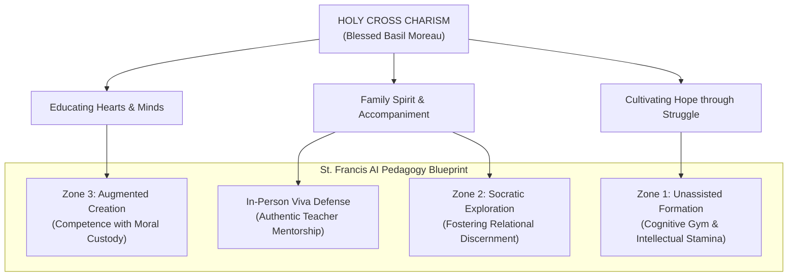

# Congregation of Holy Cross: Educational Charism & Pedagogy of Heart and Mind

---

## 1. Executive Summary & Institutional Heritage

Founded in 1837 in Le Mans, France, by **Blessed Basil Anthony Moreau** (1799–1873), the **Congregation of Holy Cross** (*Congregatio a Sancta Cruce* - C.S.C.) is the Catholic religious community whose Brothers and Priests founded and sponsor Catholic educational institutions worldwide, including the University of Notre Dame, the University of Portland, and secondary schools such as **St. Francis High School** (Mountain View, California).

Father Moreau established Holy Cross in the chaotic aftermath of the **French Revolution**, a period marked by civil devastation, the collapse of rural schooling, and acute moral disorientation. Moreau’s response was not retreat, but bold educational reconstruction: gathering priests, auxiliary brothers, and sisters to rebuild society by forming the whole person. 

The foundational axiom of Holy Cross education was codified in Moreau’s 1856 circular treatise *Christian Education*:
> *"We shall always place education side by side with instruction; the mind will not be cultivated at the expense of the heart. While we prepare useful citizens for society, we shall likewise do our utmost to prepare citizens for heaven."*

In the context of generative artificial intelligence and digital automation, the Holy Cross charism provides St. Francis High School with an authentic, non-technocratic compass: evaluating technology not merely by intellectual speed or algorithmic utility, but by whether it cultivates human hearts oriented toward compassion, moral courage, and hope.

---

## 2. Institutional Architecture & Sponsoring Typology

```
Typology:         Catholic Religious Institute / Educational Sponsoring Body
Founder:          Blessed Basil Anthony Moreau (1799–1873)
Sponsoring Body:  Congregation of Holy Cross (Midwest / Moreau Province of Brothers)
Secondary Anchor: St. Francis High School (Mountain View, CA) & Global Holy Cross School Network
Pillars of Charism: Educating Hearts and Minds, Building Family Spirit, Bringing Hope, Being Ministers of Grace
```

---

## 3. The Hermeneutical Filter: Elevating Charism vs. 19th-Century Context

> [!NOTE]
> **Understanding "Charism"**: In Catholic education, a *charism* (from the Greek *charisma*, meaning "gift of grace") refers to an institution's distinct spiritual identity, guiding ethos, and core animating spirit passed down from its founder—its spiritual DNA—as distinguished from routine administrative policies or historical, time-bound rules.

When examining historical Holy Cross source texts, contemporary educators and AI knowledge bases must apply an explicit **hermeneutical filter** that distinguishes the enduring spiritual charism from 19th-century post-revolutionary social anachronisms:

```
┌──────────────────────────────────────────────────────────────────────────────────────────┐
│                           HOLY CROSS HERMENEUTICAL FILTER                                │
├──────────────────────────┬───────────────────────────────┬───────────────────────────────┤
│ Domain                   │ 19th-Century Historical Context│ Timeless Enduring Charism     │
│                          │ (To Filter / Contextualize)   │ (To Elevate for AI Era)       │
├──────────────────────────┼───────────────────────────────┼───────────────────────────────┤
│ Disciplinary Rhetoric    │ Severe admonitions regarding  │ Unconditional affirmation of  │
│                          │ "indolent students" & rigid   │ every learner's dignity and   │
│                          │ penal boarding-school routines│ latent potential for growth   │
├──────────────────────────┼───────────────────────────────┼───────────────────────────────┤
│ Pedagogical Authority    │ Top-down French pedagogical   │ "Family Spirit": teachers as  │
│                          │ surveillance & strict control │ mentors, companions, and      │
│                          │                               │ ministers of divine grace     │
├──────────────────────────┼───────────────────────────────┼───────────────────────────────┤
│ Academic Formation       │ Rote memorization of classical│ Holistic synthesis of deep    │
│                          │ grammar and recitation drills │ intellect, ethical conscience,│
│                          │                               │ and practical capability      │
├──────────────────────────┼───────────────────────────────┼───────────────────────────────┤
│ Stance toward the World  │ Defensive shielding against   │ Active engagement: forming    │
│                          │ post-revolutionary secularism │ students with competence and  │
│                          │                               │ courage to transform society  │
└──────────────────────────┴───────────────────────────────┴───────────────────────────────┘
```

By applying this filter, modern educators avoid archaic disciplinary misunderstandings while elevating Moreau's transformative pedagogical principles directly into the design of AI course policies, syllabus contracts, and advisory practices.

---

## 4. Core Pillars of Holy Cross Education in the AI Age

### 4.1 Educating Hearts and Minds
Artificial intelligence excels at processing information, generating structured text, and synthesizing logical steps. In Holy Cross pedagogy, this represents mere "instruction" (the training of the intellect). If education is reduced to cognitive calculation, AI simply automates and hollows out the student.

Holy Cross insists that **education is the cultivation of the heart**:
* Instilling empathy, justice, and solidarity alongside computational competence.
* Cultivating the moral imagination so that students ask not only *"What can this model generate?"* but *"What good does this generation serve?"*

### 4.2 Building Family Spirit (*Esprit de Famille*)
Moreau insisted that a Holy Cross school must resemble a home marked by warmth, mutual respect, and shared responsibility. In an era where students increasingly retreat into solitary interactions with conversational AI chatbots, Holy Cross pedagogy mandates an intentional counter-movement:
* Protecting **Incarnational Presence**: prioritising face-to-face peer cohorts, collaborative physical projects, and communal struggle.
* Resisting student isolation and atomization by reinforcing classroom community.

### 4.3 Educators as Ministers of Grace
Holy Cross educators are not academic police officers managing plagiarism detection software or enforcing algorithmic compliance. They are called to be **ministers of grace**—mentors who accompany students through intellectual struggle, model ethical discernment, and provide patient encouragement when learners experience failure.

### 4.4 Bringing Hope (*Ave Crux, Spes Unica*)
The motto of the Congregation of Holy Cross—*Ave Crux, Spes Unica* ("Hail the Cross, Our Only Hope")—proclaims that hope is born through perseverance in the face of trial. In education, this directly aligns with the necessity of [Cognitive Friction & Productive Struggle](/concepts/cognitive-friction.md): true intellectual confidence and hope are forged when students wrestle through difficulty rather than surrendering to automated shortcuts.

---

## 5. Strategic Integration with St. Francis High School AI Pedagogy



1. **Zone 1 (Analog Gym)**: Protects the sacred formation of the mind and interior schema before students engage with external AI assistants.
2. **Zone 2 (Socratic Partner)**: Ensures AI tools remain subordinate sparring partners that prompt reflection rather than dispensing unearned answers.
3. **Zone 3 (Studio)**: Cultivates competence and moral custody, ensuring students act as ethical directors of technology in service of the common good.
4. **Viva Voce Defense**: Transforms assessment into an authentic, relational dialogue between educator and student, embodying Holy Cross accompaniment.

---

## 6. Standardized 5-Point Observatory Evaluation

| Evaluative Dimension | Holy Cross Educational Tradition Posture | Strategic Analysis & Evidence |
| :--- | :--- | :--- |
| **1. Normative Grounding** | **Christian Personalism & Holistic Formation** | Founded on the non-negotiable dignity of the person; explicitly balances intellectual instruction with moral and spiritual formation (*Minds and Hearts*). |
| **2. Capability vs. Safety Stance** | **Formation over Surveillance** | Rejects punitive surveillance and adversarial policing in favor of relational mentoring, conscience formation, and mutual trust. |
| **3. Governance & Enforcement Model** | **Subsidiarity & Shared Community Standards** | Classrooms operate through transparent, purpose-driven contracts; teachers exercise pedagogical autonomy in dialogue with institutional mission. |
| **4. Stance on Human Agency & Labor** | **Vocation, Agency & Self-Transcendence** | Regards intellectual struggle as integral to personal vocation; warns against cognitive surrender that deprives students of their creative agency. |
| **5. Openness & Distributive Commitments** | **Preferential Care for Learners & Universal Dignity** | Prioritizes accessible education, welcoming students of diverse backgrounds, and fostering community solidarity. |

---

## 7. Related Knowledge Base Documents & Citations

* [Global AI Institutions & Research Labs Observatory](/ecosystem/institutions/overview.md) — Landscape of global research institutes and moral authorities.
* [The DELTA Framework: Faith-Informed Virtue Ethics for AI](/ecosystem/delta-framework.md) — Notre Dame's virtue-ethics framework founded by the same Holy Cross tradition.
* [Encyclical Letter Magnifica Humanitas](/ecosystem/magnifica-humanitas.md) — Papal AI doctrine defending human dignity and labor.
* [Encyclical Letter Laudato Si'](/ecosystem/laudato-si.md) — Pope Francis's foundational social encyclical on integral ecology.
* [Secondary School AI Pedagogy & Assessment Blueprint](/frontier/secondary-school-ai-pedagogy.md) — St. Francis High School's 3-zone classroom model and viva assessment system.
* [Cognitive Friction & Productive Struggle](/concepts/cognitive-friction.md) — Pedagogical preservation of intellectual resistance.
* [Incarnational Presence](/concepts/incarnational-presence.md) — Physical embodiment and authentic human encounter.
