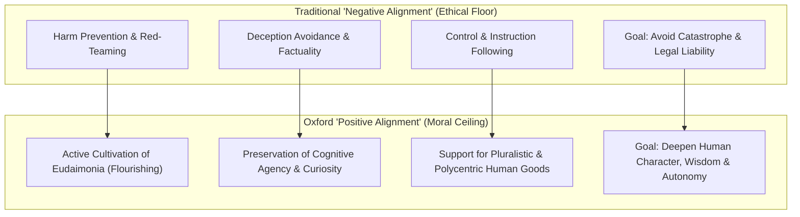

# Oxford Institute for Ethics in AI: Positive Alignment & Aristotelian Virtue

---

## 1. Executive Summary

Housed within the Faculty of Philosophy at the University of Oxford and directed by **Prof. John Tasioulas**, the **[Institute for Ethics in AI](https://www.ox.ac.uk/research/institutions/ethics-in-ai)** brings centuries of rigorous philosophical thought—specifically Aristotelian virtue ethics, democratic political philosophy, and human rights jurisprudence—to bear on the design and governance of artificial intelligence.

In collaboration with researchers at Google DeepMind, OpenAI, Anthropic, and Tufts University, Institute-affiliated researchers spearheaded the groundbreaking 2026 paper **["Positive Alignment: Artificial Intelligence for Human Flourishing"](https://arxiv.org/abs/2605.10310)** (Laukkonen et al., 2026). The paper argues that contemporary AI alignment has been hamstrung by a purely defensive, "negative" focus—concentrating exclusively on mitigating harm, avoiding hallucinations, and enforcing compliance. Drawing an analogy to the history of psychology, the authors argue that while avoiding catastrophe is an indispensable *ethical floor*, it is fundamentally incomplete without a vision of the *good life*.

The Oxford paradigm champions **"Positive Alignment"**: designing AI systems, multi-agent ecologies, and human-computer interfaces that actively cultivate human flourishing (*eudaimonia*), protect human cognitive agency, and nurture **practical wisdom (*phronesis*)** rather than inducing cognitive atrophy or passive algorithmic dependency.

---

## 2. Institutional Architecture, Leadership & Mission

```
┌─────────────────────────────────────────────────────────────────────────────┐
│                 OXFORD INSTITUTE FOR ETHICS IN AI                           │
├─────────────────────────────────────────────────────────────────────────────┤
│ Parent Institution: Faculty of Philosophy, University of Oxford             │
│ Inaugural Director: Prof. John Tasioulas (Professor of Ethics and Legal     │
│                     Philosophy)                                             │
│ Key Labs & Nodes:   Human-Centered AI (HAI) Lab (Prof. Philipp Koralus)      │
│ External Alliances: Cosmos Institute, MIT, DeepMind, Stanford HAI           │
├─────────────────────────────────────────────────────────────────────────────┤
│ Core Research Pillars:                                                      │
│  1. Philosophical Foundations: Virtue ethics, human rights, and autonomy.   │
│  2. The Positive Alignment Agenda: Engineering AI for human flourishing.    │
│  3. The Lyceum Project: Operationalizing Aristotelian concepts into code.   │
│  4. Democratic AI Governance: Resisting centralized technocratic oligarchy. │
└─────────────────────────────────────────────────────────────────────────────┘
```

The Institute’s mission is to ensure that AI serves the advancement of human civilization, asserting that questions regarding the purpose and deployment of AI are fundamentally moral, political, and philosophical questions—not mere engineering optimizations.

---

## 3. The "Positive Alignment" Paradigm Shift

The seminal contribution of the Oxford-led research coalition (Laukkonen et al., 2026) is the formal articulation of **Positive Alignment**:



### Core Tenets of Positive Alignment:

1. **Beyond Risk Mitigation**: Minimizing risk does not equal maximizing good. An AI system that never hallucinates, insults, or leaks data may still completely impoverish human culture if it hollows out human critical thinking, destroys creative struggle, and encourages social isolation.
2. **Pluralism and Polycentricity**: Different human societies and philosophical traditions hold divergent conceptions of flourishing. Positive alignment rejects top-down monocultural value imposition, insisting on systems that allow communities to define and author their own goals.
3. **Agency-Enhancing Scaffolding**: Rather than replacing human thought, positive alignment requires AI systems to act as cognitive scaffolds—challenging users with dialectical counter-arguments, exposing underlying assumptions, and stimulating human creativity.

---

## 4. Preserving *Phronesis* (Practical Wisdom) vs. Algorithmic Atrophy

Through **The Lyceum Project** and the HAI Lab, Oxford scholars explore how relying on AI for cognitive tasks threatens Aristotle’s concept of **practical wisdom (*phronesis*)**:

* **The Necessity of Friction in Moral Development**: In Aristotelian ethics, virtue is not a theoretical rule memorized from a textbook; it is a habituated skill acquired through lived experience, moral struggle, failure, and deliberate reflection.
* **The Danger of Cognitive Offloading**: If individuals offload difficult intellectual, ethical, and interpersonal decisions to algorithmic engines, the "moral muscles" of human discernment inevitably atrophy.
* **The Socratic Machine**: Instead of providing instant, authoritative answers that close down inquiry, Oxford researchers propose AI interfaces engineered to use the Socratic method—guiding users to discover truths through guided friction.

> *"If we configure artificial intelligence merely to remove friction from existence, we will inadvertently remove the very conditions required for human greatness. Character, virtue, and practical wisdom are forged precisely through friction. True alignment means aligning machines to elevate our humanity, not replace it."*  
> — **Prof. John Tasioulas & Ruben Laukkonen**, *The Lyceum Project on AI & Ethics* (2024–2026)

---

## 5. Comparative Alignment: DELTA, Magnifica Humanitas & Oxford

Oxford’s philosophical framework provides secular and classical validation for our core knowledge base documents:

| Concept / Domain | Oxford Institute (Virtue / Positive Alignment) | The DELTA Framework ([DELTA Framework](/ecosystem/delta-framework.md)) | Catholic Social Teaching ([*Magnifica Humanitas*](/ecosystem/magnifica-humanitas.md)) |
| :--- | :--- | :--- | :--- |
| **Human Fulfillment** | *Eudaimonia* (flourishing through the active exercise of virtue). | Integral human development; moral ceiling over compliance floor. | Splendor of the human person created in the image of God (*Imago Dei*). |
| **Wisdom & Discernment** | *Phronesis* (practical wisdom forged through cognitive friction). | **Agency (A)**: Conscience in the loop; avoiding cognitive deskilling. | Human moral conscience; rejecting automated ethical judgment. |
| **Love vs. Simulation** | Rejection of synthetic intimacy; authentic friendships require reciprocity. | **Love (L)**: *Agape* vs. simulated empathy; protecting youth. | Rejection of digital dependency and emotional exploitation (§4). |
| **Governance Structure** | Democratic deliberation; rejecting technocratic oligarchy. | Critical Systems Heuristics (CSH + DELTA); interrogating system power. | Denounces private technocratic dominance; rebuilding Jerusalem. |

---

## 6. Architectural & Educational Implications

For schools, universities, and software engineers implementing AI agents:

1. **Implement Dialectical & Socratic UI Modes**: Educational interfaces should offer "Tutor" and "Socratic" modes that guide students with questions, hints, and conceptual critiques rather than writing complete answers for them.
2. **Measure Long-Term Agency Impacts**: Evaluators must measure whether users of an AI tool become more capable, curious, and independent over time, or whether their unassisted problem-solving ability deteriorates.
3. **Reject Monocultural Optimizations**: Refuse single-objective loss functions that optimize purely for engagement, time-on-app, or task completion speed, substituting multidimensional well-being metrics.

---

## 7. Related Knowledge Base Documents

* [The DELTA Framework: Faith-Informed Virtue Ethics for AI](/ecosystem/delta-framework.md) — Notre Dame’s virtue-ethics architecture for educational and system design.
* [Encyclical Letter Magnifica Humanitas](/ecosystem/magnifica-humanitas.md) — Pope Leo XIV's social encyclical on artificial intelligence and human dignity.
* [Harvard Human Flourishing Program](/ecosystem/institutions/harvard-human-flourishing.md) — Empirical research on well-being domains and synthetic intimacy.
* [Global AI Institutions Observatory](/ecosystem/institutions/overview.md) — Master matrix tracking international research institutes and authorities.
* [The DeepMind Institute Dossier](/ecosystem/institutions/deepmind-institute.md) — Frontier industry research on AGI governance and reasoning transparency.
