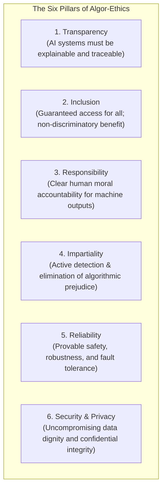

# The Rome Call for AI Ethics & The Hiroshima Appeal: Global Interfaith Algor-Ethics

---

## 1. Executive Summary

Originally promulgated in February 2020 by the Holy See’s **[Pontifical Academy for Life](https://www.academyforlife.va/)** and the **[RenAIssance Foundation](https://www.romecall.org/)**, the **Rome Call for AI Ethics** established the foundational paradigm of **"algor-ethics"**—the systematic integration of ethical values into the design, mathematical objective functions, training protocols, and governance of artificial intelligence.

On **July 9–10, 2024**, at the Hiroshima Peace Memorial Park in Japan, the coalition achieved a historic interfaith milestone: the **"AI Ethics for Peace"** summit. In a deeply symbolic gathering at the site of the atomic bomb, leaders from the world’s major **Eastern spiritual traditions—including Buddhism, Hinduism, Shinto, Sikhism, Zoroastrianism, and the Bahá'í faith**—formally signed the Rome Call, joining Christian, Jewish, and Muslim leaders alongside global technology giants (Microsoft, IBM, Cisco).

Together with the signing, the coalition issued the **[Hiroshima Appeal](https://www.romecall.org/)**, declaring that artificial intelligence must remain subservient to the sacred dignity of life, human fraternity, and planetary peace. The signatories issued a joint, categorical demand for an international treaty banning **Lethal Autonomous Weapons Systems (LAWS)**, declaring that no machine should ever possess the sovereign authority to extinguish human life.

---

## 2. Coalition Architecture, Leadership & Historical Evolution

```
┌─────────────────────────────────────────────────────────────────────────────┐
│                 ROME CALL INTERFAITH ALLIANCE (2020–2026)                   │
├─────────────────────────────────────────────────────────────────────────────┤
│ Foundational Sponsor: Pontifical Academy for Life & RenAIssance Foundation  │
│ President:            Archbishop Vincenzo Paglia                            │
│ Co-Organizers:        Religions for Peace Japan, Abu Dhabi Forum for Peace, │
│                       Chief Rabbinate of Israel                             │
│ Industry Signatories: Microsoft (Brad Smith), IBM (Darío Gil), Cisco        │
├─────────────────────────────────────────────────────────────────────────────┤
│ Expansion Trajectory:                                                       │
│  • February 2020: Initial Signing (Vatican, Microsoft, IBM, FAO, Italy)     │
│  • January 2023:  Abrahamic Expansion (Christian, Jewish, & Muslim leaders) │
│  • July 2024:     Hiroshima Expansion (Eastern Religions: Buddhism, Shinto, │
│                   Hinduism, Sikhism, Zoroastrianism, Bahá'í)                │
└─────────────────────────────────────────────────────────────────────────────┘
```

The Rome Call represents the broadest interreligious, cross-sectoral consensus on technology governance in history, demonstrating that human dignity and reverence for moral agency transcend theological and civilizational boundaries.

---

## 3. The Six Core Algor-Ethics Principles

The Rome Call establishes six non-negotiable principles that must be embedded throughout the computational lifecycle:



### Detailed Principle Definitions:

1. **Transparency**: In principle, AI systems must be understandable to users. Systems must disclose when decisions are machine-generated, and users have the right to inspect the reasoning behind automated evaluations.
2. **Inclusion**: The needs of all human beings must be respected so that everyone may benefit and each individual can be offered the best possible conditions to express themselves and develop.
3. **Responsibility**: Those who design, train, and deploy AI must proceed with responsibility and transparency, maintaining clear lines of human moral and legal accountability.
4. **Impartiality**: Systems must not create or perpetuate bias; training data and optimization targets must be regularly audited to protect human dignity.
5. **Reliability**: AI systems must be technically reliable, secure against adversarial exploits, and capable of graceful degradation in novel environments.
6. **Security & Privacy**: AI systems must operate securely, respecting user privacy, data confidentiality, and rejecting manipulative behavioral tracking.

---

## 4. The Absolute Ban on Lethal Autonomous Weapons (LAWS)

The Hiroshima Appeal articulates an unequivocal moral red line regarding autonomous weapons systems:

* **Absence of Moral Conscience**: Algorithms operate via pattern matching, statistical prediction, and loss minimization. They cannot experience guilt, weigh proportional justice, understand the sacredness of life, or exercise true mercy.
* **Dehumanization of Warfare**: Delegating the targeting and killing of human beings to autonomous software reduces human beings to tactical data points, representing the ultimate triumph of technocratic reductionism.
* **The Moral Invariant**: Both Pope Francis (at the 2024 G7 Summit) and Pope Leo XIV (in [*Magnifica Humanitas*](/ecosystem/magnifica-humanitas.md)) reiterated the joint interfaith consensus formulated at Hiroshima:

> *"No machine should ever choose to take the life of a human being. The decision to take a human life requires a moral conscience that belongs exclusively to human beings made in the image of God. To delegate the power of lethal force to an algorithm is an abdication of human moral conscience and a grave regression of human civilization."*  
> — **The Hiroshima Appeal on AI Ethics & Peace** (July 2024)

---

## 5. Comparative Alignment: Interfaith Algor-Ethics vs. DELTA & Magnifica Humanitas

The Rome Call coalition reinforces and enriches our internal ethical benchmarks:

| Algor-Ethics Principle | Catholic Social Teaching ([*Magnifica Humanitas*](/ecosystem/magnifica-humanitas.md)) | The DELTA Framework ([DELTA Framework](/ecosystem/delta-framework.md)) | Eastern Spiritual Insights (Hiroshima 2024) |
| :--- | :--- | :--- | :--- |
| **Human Dignity** | Man as *Imago Dei*; transcendent worth beyond economic productivity. | **Dignity (D)**: Resistance to algorithmic reductionism and token commodification. | Interdependence (*Pratītyasamutpāda*); reverence for the spark of universal consciousness. |
| **Responsibility / Agency** | Non-delegable human moral responsibility in high-stakes discernment. | **Agency (A)**: Conscience in the loop; rejection of automated cognitive deskilling. | *Karma* (volitional action and moral consequence); actions cannot be offloaded to software. |
| **Inclusion / Common Good** | Universal Destination of Goods; technology belongs to all humankind. | **Love (L)**: Radical self-giving (*agape*) prioritizing the vulnerable. | Compassion (*Karuṇā*) and universal welfare (*Sarvodaya*). |
| **Embodiment / Sacred Presence** | Mystery of the Incarnation; bodily presence is sacred. | **Embodiment (E)**: Safeguarding physical encounter over synthetic simulation. | Respect for physical reality, nature, and the balance of the material cosmos (*Dharma*). |

---

## 6. Strategic & Operational Engineering Mandates

Organizations building AI agents, educational software, or administrative platforms must uphold the Rome Call standards:

1. **Mandatory Human Veto on Critical Decisions**: No student disciplinary measure, academic failure, medical diagnosis, or employee termination may be executed solely by an algorithm without a required human-in-the-loop sovereign veto.
2. **Refusal of Autonomous Lethal Contracting**: Strict engineering refusal to develop, maintain, or integrate software components into autonomous lethal weapon systems or targeting pipelines lacking real-time human control.
3. **Bias Mitigation & Algorithmic Inclusion**: Regular auditing of instructional algorithms to ensure diverse cultural representation and prevent historical biases from limiting student opportunities.

---

## 7. Related Knowledge Base Documents

* [Encyclical Letter Magnifica Humanitas](/ecosystem/magnifica-humanitas.md) — Canonical papal encyclical by Pope Leo XIV on AI, labor dignity, and autonomous weapons.
* [The DELTA Framework: Faith-Informed Virtue Ethics for AI](/ecosystem/delta-framework.md) — Five core normative pillars: Dignity, Embodiment, Love, Transcendence, and Agency.
* [Global AI Institutions Observatory](/ecosystem/institutions/overview.md) — Master catalog of AI research institutes, standards bodies, and moral authorities.
* [UN High-Level Advisory Body on AI](/ecosystem/institutions/un-ai-advisory-body.md) — Multilateral framework for global AI governance and equitable compute distribution.
* [Council of Europe AI Framework Convention](/ecosystem/institutions/council-of-europe-ai.md) — The world's first legally binding international treaty on AI and human rights.
