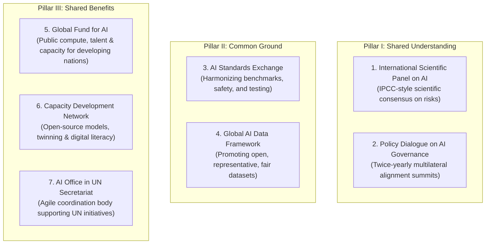

# United Nations High-Level Advisory Body on AI: Governing AI for Humanity

---

## 1. Executive Summary

Convened in October 2023 by United Nations Secretary-General **António Guterres**, the **[United Nations High-Level Advisory Body on Artificial Intelligence](https://www.un.org/en/ai-advisory-body)** brought together 39 eminent experts from government, industry, academia, and civil society across 33 nations. In September 2024, the Advisory Body released its definitive final report: **["Governing AI for Humanity"](https://www.un.org/sites/un2.un.org/files/governing_ai_for_humanity_final_report_en.pdf)**.

The report identifies a perilous **"global governance deficit"** in the development and stewardship of artificial intelligence. While generative AI models and multi-agent infrastructure are developed across national borders and deployed transnationally, AI governance has remained geographically concentrated: **118 member states** have been entirely excluded from the major multilateral AI governance initiatives.

The UN framework insists that AI must be governed as a **global public good** anchored in the UN Charter, the Universal Declaration of Human Rights, and the Sustainable Development Goals (SDGs). Rejecting technological exceptionalism, the UN report outlines an actionable architecture to ensure that the economic and cognitive benefits of AI are distributed equitably, preventing emerging economies from being relegated to data-harvesting colonies or captive consumers of proprietary foreign frontier models.

---

## 2. Institutional Architecture, Leadership & Mandate

```
┌─────────────────────────────────────────────────────────────────────────────┐
│                 UN HIGH-LEVEL ADVISORY BODY ON AI                           │
├─────────────────────────────────────────────────────────────────────────────┤
│ Convener:           United Nations Secretary-General António Guterres       │
│ Co-Chairs:          Carme Artigas (Spain) & James Manyika (US/DeepMind)     │
│ Composition:        39 global experts across 33 countries (gender balanced, │
│                     multidisciplinary, cross-regional)                      │
├─────────────────────────────────────────────────────────────────────────────┤
│ Core Mandates:                                                              │
│  1. Build global scientific consensus on AI risks, opportunities, and trends│
│  2. Foster international policy interoperability across national AI acts    │
│  3. Formulate concrete mechanisms to bridge the digital and compute divide  │
│  4. Align AI deployment with human rights, gender equality, and public good │
└─────────────────────────────────────────────────────────────────────────────┘
```

The Advisory Body operated through extensive consultations, conducting 18 deep-dive thematic sessions, over 50 regional roundtables, and reviewing more than 250 formal submissions from sovereign states, tech companies, and non-governmental organizations.

---

## 3. The Seven Actionable Recommendations

To resolve the global governance deficit, the UN report establishes seven concrete, interconnected institutional recommendations organized around three core pillars: **Shared Understanding**, **Common Ground**, and **Shared Benefits**.



### Detailed Breakdown of Recommendations:

1. **International Scientific Panel on AI**:
   * Modeled after the Intergovernmental Panel on Climate Change (IPCC), this independent scientific body will issue annual assessments on frontier AI capabilities, safety thresholds, potential existential or catastrophic risks, and societal impacts.
2. **Policy Dialogue on AI Governance**:
   * A twice-yearly intergovernmental policy forum to foster cross-border regulatory interoperability, preventing fragmented regional "splinternets" and regulatory arbitrage.
3. **AI Standards Exchange**:
   * A technical clearinghouse bringing together standards-development organizations (ISO, IEC, IEEE, ITU) and national institutes (NIST, UK AISI) to develop harmonized technical definitions, safety evaluations, and red-teaming benchmarks.
4. **Capacity Development Network**:
   * A collaborative alliance connecting universities, computing centers, and tech companies to provide open-source algorithms, educational exchanges, and technical mentorship to researchers in the Global South.
5. **Global Fund for AI**:
   * A multilateral financing mechanism dedicated to funding public compute access, localized training datasets, and infrastructure projects to ensure AI development is not monopolized by high-income nations and multinational corporations.
6. **Global AI Data Framework**:
   * Normative rules and tools ensuring data dignity, provenance transparency, non-discriminatory training sets, and fair economic compensation for creators and vulnerable communities whose data powers foundation models.
7. **AI Office in the UN Secretariat**:
   * A lightweight, agile coordination office within the UN Secretariat reporting directly to the Secretary-General to execute these mandates without creating cumbersome bureaucratic overhead.

---

## 4. Addressing the Governance Deficit & Technological Colonialism

The UN Advisory Body places acute emphasis on the perils of **technological colonialism**:

* **Asymmetric Compute Concentration**: The immense capital expenditures required to train cutting-edge foundation models have concentrated technological power in a tiny handful of private conglomerates located in two geographic hubs (the United States and China).
* **Cultural and Linguistic Erasure**: The overwhelming predominance of high-resource languages (predominantly English) in model training datasets creates severe cultural flattening, marginalizing indigenous traditions, local jurisprudence, and regional histories.
* **Labor Exploitation in Data Pipelines**: The report condemns the opaque subcontracting of low-wage workers in developing nations for traumatic data labeling and content moderation without psychological support, living wages, or fair labor protections.

> *"AI must serve all of humanity equitably. We cannot accept a future where artificial intelligence entrenches systemic inequalities, creates captive markets in the Global South, or concentrates unimaginable power in the hands of a few corporate executives answerable to no public constituency."*  
> — **UN High-Level Advisory Body on AI**, *Governing AI for Humanity* (September 2024)

---

## 5. Comparative Alignment: UN Multilateralism vs. Catholic Social Teaching & DELTA

The UN consensus directly parallels the foundational moral architecture established in our knowledge base:

| Dimension | UN Report: *Governing AI for Humanity* | Papal Teaching: *Magnifica Humanitas* | The DELTA Framework (Notre Dame) |
| :--- | :--- | :--- | :--- |
| **Concentration of Power** | Denounces the "governance deficit" and corporate dominance rivaling sovereign states. | Denounces private technocratic dominance surpassing sovereign nations (§4–5). | Rejects algorithmic monopolies; demands system boundary reviews via CSH. |
| **Distributive Justice** | Calls for Global Fund for AI and universal compute access. | Invokes the **Universal Destination of Goods**—knowledge belongs to all humanity. | Universal worth of the person as *Imago Dei*; technology must elevate vulnerable communities. |
| **Human Agency** | Mandates human rights impact assessments and human-in-the-loop oversight. | Rejects algorithmic reductionism: *"The person is not a system of algorithms."* | **Agency (A)**: Moral responsibility must remain rooted in human conscience. |
| **Cultural Integrity** | Calls for Global Data Framework to protect linguistic and regional diversity. | Warns against the algorithmic **Tower of Babel** and cultural homogenization. | **Embodiment (E)**: Value of physical, rooted, local communities against disembodied monoculture. |

---

## 6. Strategic Implications for Systems Design & Sovereign Tech

For engineering organizations, schools, and civic bodies implementing AI systems:

1. **Prioritize Open and Interoperable Standards**: Systems should avoid closed, proprietary vendor lock-in that restricts data sovereignty or prevents institutional auditing.
2. **Support Localized and Multilingual Data Dignity**: Training workflows and application prompts must respect cultural context, local dialect nuances, and preserve authentic cultural expression.
3. **Mandatory Human Rights & Equity Audits**: Prior to deploying automated sorting, evaluation, or grading mechanisms, systems must undergo formal impact assessments to verify that vulnerable, marginalized, or under-resourced users are not systematically disadvantaged.

---

## 7. Related Knowledge Base Documents

* [Global AI Institutions Observatory](/ecosystem/institutions/overview.md) — Registry of international AI governance institutes, frontier labs, and standards bodies.
* [Encyclical Letter Magnifica Humanitas](/ecosystem/magnifica-humanitas.md) — Pope Leo XIV's papal encyclical addressing private technocratic dominance and human dignity.
* [The DELTA Framework: Faith-Informed Virtue Ethics for AI](/ecosystem/delta-framework.md) — Five normative pillars for human flourishing in the AI era.
* [The DeepMind Institute Dossier](/ecosystem/institutions/deepmind-institute.md) — Frontier industry research on global benefit and multi-agent governance.
* [Harvard Human Flourishing Program](/ecosystem/institutions/harvard-human-flourishing.md) — Academic framework evaluating AI against holistic well-being domains.
