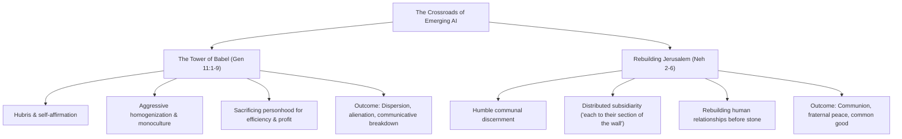

# Encyclical Letter Magnifica Humanitas: Safeguarding Humanity in the Time of AI

---

## 1. Executive Summary

Promulgated on **May 15, 2026** to commemorate the 135th anniversary of Pope Leo XIII’s landmark social encyclical *Rerum Novarum* (1891), **[Magnifica Humanitas](https://www.vatican.va/content/leo-xiv/en/encyclicals/documents/20260515-magnifica-humanitas.html)** ("The Splendor of Humanity") constitutes the Catholic Church’s canonical, magisterial treatise on artificial intelligence, robotics, and the digital economy.

In this encyclical, **Pope Leo XIV** directly addresses the *res novae* ("new things") of the 21st century: the profound acceleration of generative AI, the rise of transnational private tech conglomerates whose power and capital rival or exceed sovereign states, the threat of algorithmic dehumanization, and the perilous automation of warfare. Pope Leo XIV warns that humanity is undergoing not merely an era of technological change, but a fundamental *"change of era."*

Rather than presenting an anti-technological manifesto, the encyclical positions scientific discovery as a God-given talent entrusted to humanity. However, Leo XIV insists that technology is **never neutral**; it inherently embodies the moral worldview, profit motives, and structural interests of those who design, finance, and govern it. The encyclical calls for comprehensive multilateral governance, binding human-in-the-loop safeguards, and an urgent cultural commitment to build a *"civilization of love"* rather than an algorithmic *"Tower of Babel."*

---

## 2. Foundational Archetypes: Babel vs. Jerusalem

Pope Leo XIV frames the contemporary global dilemma through two contrasting biblical narratives:

1. **The Tower of Babel (*Genesis* 11:1-9)**: Represents the technocratic temptation toward self-sufficiency, centralization, and profit idolatry. In seeking to "make a name" for themselves through a single language and centralized apparatus, the builders sacrifice individual personhood to mechanical efficiency. The inevitable result of Babel is not authentic unity, but communicative breakdown, confusion, and societal fragmentation.
2. **Rebuilding the Walls of Jerusalem (*Nehemiah* 2–6)**: Represents the path of shared discernment and solidarity. Nehemiah does not impose a top-down technocratic solution; he examines the city's ruins in contemplative prayer, gathers families, artisans, leaders, and youth, and assigns each group their own section of the wall to restore. Jerusalem is renewed because relationships and communion are restored before physical infrastructure.

---

## 3. Comprehensive Breakdown of Magisterial Chapters

### Introduction: The *Res Novae* of Technological Dominance
* Humanity stands at a crossroads between constructing a new digital Babel or cultivating a fraternal city.
* In previous industrial eras, nation-states played the primary role in directing technological development. Today, the drivers of innovation are private transnational entities whose economic resources and technological intervention capacity surpass those of many sovereign governments.
* This predominantly **private concentration of digital power** makes governance, moral accountability, and orientation toward the common good exceptionally challenging.

### Chapter 1: A Dynamic Approach Faithful to the Gospel
* Traces the evolution of Catholic Social Teaching (CST) from Leo XIII's *Rerum Novarum* through Vatican II (*Gaudium et Spes*), St. John Paul II (*Laborem Exercens*, *Centesimus Annus*), Benedict XVI (*Caritas in Veritate*), and Francis (*Laudato Si'*, *Fratelli Tutti*).
* Asserts that CST is not an inert museum piece, but a dynamic, living *corpus* of truth that must engage directly with modern human sciences, data architectures, and computer engineering.

### Chapter 2: Foundations & Principles of Catholic Social Teaching
Reaffirms the inviolable benchmarks for assessing any technical system:
* **The Human Person as *Imago Dei***: The transcendent dignity of the human person is foundational; humans are subjects of history, never instruments of computation.
* **The Universal Destination of Goods**: Digital infrastructure, training data, computational power, and scientific discoveries are common heritage meant for the integral development of all humanity, not private monopolies.
* **Subsidiarity & Solidarity**: Decision-making authority must reside at the closest competent human level, protecting local communities from algorithmic paternalism.

### Chapter 3: Technology and Dominance — AI and the Technocratic Paradigm
* **The Technocratic Paradigm**: Denounces the assumption that every human problem has an algorithmic optimization, or that efficiency alone should dictate economic and social life.
* **Critique of Transhumanism & Posthumanism**:
  * Condemns ideological frameworks that view the human body as an obsolete container or treat biological mortality as an engineering bug to be erased.
  * Reaffirms *"the limit, the heart, and the grandeur of the human person."* Authentic human transcendence is achieved not through computational immortality or neural upload, but through divine grace, humility, and moral self-giving.
* **Algorithmic Reductionism**: Rebukes the tendency to treat human beings as predictable collections of data points: *"The person is not a system of algorithms."*

### Chapter 4: Safeguarding Humanity — Truth, Work, and Freedom
* **Truth as a Common Good**:
  * Synthetic media, generative deepfakes, and algorithmic amplification of polarization pollute the public epistemological commons and undermine democratic self-governance.
  * Calls for an **"ecology of communication"** and an urgent educational alliance uniting families, schools, and civic organizations to cultivate critical discernment.
* **The Dignity of Work**:
  * Work is an essential component of personal vocation, psychological health, and social participation.
  * Condemns reckless corporate strategies that automate human labor solely to suppress wage costs or maximize shareholder profit, warning of devastating structural unemployment and youth disenfranchisement.
* **Freedom vs. Digital Dependency**:
  * Exposes algorithmic addiction engines and behavioral manipulation designed to maximize screen capture.
  * Identifies data exploitation and attention monetization as *"new forms of digital slavery"* that compromise human free will and interior contemplative capacity.

### Chapter 5: The Culture of Power vs. The Civilization of Love
* **Absolute Prohibition of Autonomous Weapons (LAWS)**:
  * Forcefully repudiates Lethal Autonomous Weapon Systems and algorithmic targeting systems: *"A machine must never choose to take a human life."*
  * Machines lack moral conscience, compassion, and the capacity to weigh proportional justice; delegating life-and-death decisions to software algorithms is an affront to humanity.
* **Disarming Digital Words**: Rebukes algorithmic echo chambers that foster outrage, dehumanizing speech, and ideological warfare, calling for an intentional culture of fraternal dialogue and multilateral diplomacy.

### Conclusion: The Incarnation and the *Magnificat*
* Points to the mystery of the Incarnation (*"The Word became flesh"*) as the supreme defense of bodily, vulnerable human existence against disembodied synthetic simulation.
* Closes with the Virgin Mary's *Magnificat*—celebrating a God who casts down the arrogant and mighty from their technocratic thrones and exalts the humble and vulnerable.

---

## 4. Key Magisterial Directives for AI Governance

| Governance Dimension | Papal Mandate in *Magnifica Humanitas* | Operational & Engineering Obligation |
| :--- | :--- | :--- |
| **Autonomous Weapons** | Categorical moral ban on lethal autonomous decision-making. | Complete refusal to deploy fully autonomous lethal targeting software; mandatory sovereign human veto. |
| **High-Stakes Decisions** | Prohibition of automated judgment in judiciary, healthcare triage, and pastoral care. | Non-delegable "human-in-the-loop" mandates; algorithms may only provide advisory data inputs. |
| **Labor & Automation** | Technological transitions must safeguard human livelihood and meaningful work. | Mandatory human impact assessments before replacing workforce functions with autonomous pipelines. |
| **Epistemic Integrity** | Preservation of public truth and transparent provenance. | Robust digital provenance, synthetic media watermarking, and transparency regarding generative agents. |
| **Mental Health & Youth** | Protection of human agency and emotional development against synthetic intimacy. | Stringent guardrails against behavioral exploitation, addictive reward mechanics, and deceptive synthetic companionship. |

---

## 5. Direct Authoritative Quotes

> *"In the era of artificial intelligence, when human dignity is threatened by new forms of dehumanization, ours is the pressing duty to remain profoundly human. We must lovingly safeguard the grandeur of humanity bestowed upon us and revealed in its fullness in Christ, the splendor of which no machine can ever replace."*  
> — **Pope Leo XIV**, *Magnifica Humanitas*, Introduction

> *"The person is not a system of algorithms. Whenever humanity is in danger of marring its true identity, we Christians lift our eyes to the Incarnate God, knowing that it is only in the mystery of the Word made flesh that the mystery of humanity truly becomes clear."*  
> — **Pope Leo XIV**, *Magnifica Humanitas*, §1 & §49

> *"Never has humanity had such power over itself... Today, however, the main drivers of development are private, often transnational, parties that are endowed with resources and the capacity to intervene that surpass those of many Governments. Technological power thus takes on an unprecedented, predominantly 'private' aspect, which makes it even more challenging to discern, govern and direct such power toward the common good."*  
> — **Pope Leo XIV**, *Magnifica Humanitas*, §4–5

> *"Technology in and of itself is not a solution to humanity's problems, just as it is not inherently evil. In practice, however, technology is never neutral, because it takes on the characteristics of those who devise, finance, regulate and use it. Therefore, the primary choice is not between a 'yes' or 'no' to technology, but rather between constructing Babel or rebuilding Jerusalem."*  
> — **Pope Leo XIV**, *Magnifica Humanitas*, §9

> *"No machine can or should ever possess the sovereign authority to determine whether a human person lives or dies. To delegate the power of lethal force to an algorithm is an abdication of human moral conscience and a grave regression of human civilization."*  
> — **Pope Leo XIV**, *Magnifica Humanitas*, Chapter 5

---

## 6. Strategic Implications for Technology Organizations

Organizations building AI agents, infrastructure, or predictive workflows must align their practices with these core mandates:

1. **Reject Algorithmic Determinism**: Systems must not treat human identity, character, or future potential as a closed variable predictable by historical data tokens.
2. **Prevent Anthropomorphic Deception**: Generative systems, conversational agents, and emotional companions must never masquerade as conscious human persons or claim reciprocal affection.
3. **Equitable Access to Compute and Capabilities**: Under the *universal destination of goods*, digital technologies should prioritize uplifting marginalized communities, public healthcare, and educational access over elite capital accumulation.
4. **Resist the Technocratic Paradigm**: Technical efficiency must remain subservient to human dignity, worker well-being, and social peace.

---

## 7. Related Knowledge Base Documents

* [The DELTA Framework: Faith-Informed Virtue Ethics for AI](/ecosystem/delta-framework.md) - Notre Dame's applied implementation of *Magnifica Humanitas* across education, systems, and pastoral care.
* [Customer Discovery & Workflow Observations](/research/user-interview-example.md) - Qualitative research and Human-Centered Design notes.
* [Knowledge-Driven Engineering & Spec-Driven Development](/playbooks/knowledge-driven-engineering.md) - Operational guidelines for integrating ethics into development.
* [Knowledge Base Advisor (/ask-kb)](/skills/ask-kb/SKILL.md) - Domain consulting skill for interrogating knowledge base policies.
