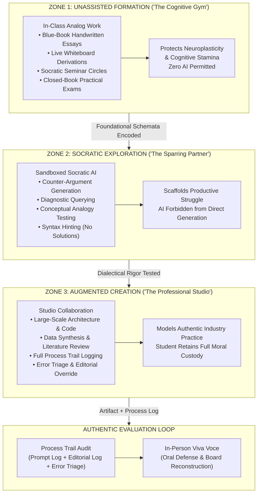
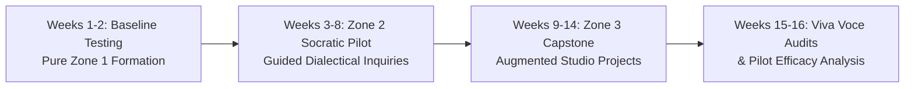

# Secondary School AI Pedagogy & Assessment Blueprint

## 1. Executive Summary & Core Hypothesis

The advent of highly capable generative artificial intelligence has dissolved the historical foundation of secondary school assessment: the take-home, unmonitored text assignment. Across high school humanities, mathematics, natural sciences, and computer science, students now possess frictionless access to synthetic generation engines that produce fluent essays, solve complex multi-step calculus problems, and generate complete software programs in seconds.

In response to this disruption, educational institutions face a profound moral and pedagogical fork in the road:
1. **Adversarial Policing**: Enter an unwinnable technological arms race utilizing unreliable probabilistic AI text detectors, fostering mutual distrust, algorithmic surveillance, and false accusations.
2. **Uncritical Surrender**: Concede foundational cognitive tasks to automated models under the guise of "modern efficiency," precipitating catastrophic [Cognitive Deskilling & Moral Atrophy](/concepts/cognitive-deskilling.md).
3. **Virtue-Informed Demarcation (The St. Francis Model)**: Re-anchor secondary education in first principles of human formation, embodied community, and intentional [Cognitive Friction & Productive Struggle](/concepts/cognitive-friction.md).

* **Core Hypothesis**: By structuring secondary school curricula into three rigorously demarcated cognitive operating environments—**Zone 1: Unassisted Formation ("The Cognitive Gym")**, **Zone 2: Socratic Exploration ("The Sparring Partner")**, and **Zone 3: Augmented Creation ("The Professional Studio")**—schools can safeguard foundational neuroplasticity and critical thinking while equipping adolescents with the [Moral Agency & Conscience](/concepts/moral-agency.md) and [Phronesis (Practical Wisdom)](/concepts/phronesis.md) necessary to direct AI tools toward the common good.
* **Intended Value**: 
  * **For Students**: Protects the intellectual stamina, original voice, and confidence that can only be forged through unassisted productive struggle; equips them with transparent, auditable practices for professional AI collaboration.
  * **For Faculty**: Eliminates the demoralizing burden of detective policing; provides defensible, department-specific syllabus contracts and an authentic evaluation framework rooted in in-person oral defense and process trails.
  * **For the Institution**: Fulfills the Catholic and Franciscan mission of St. Francis High School—forming the whole person (heart, mind, and hands) in light of [Human Dignity (Imago Dei)](/concepts/human-dignity.md), incarnational presence, and humble service.

---

## 2. Horizon Context & Enabling Shifts

### Technological Catalysts
* **Multi-Modal Reasoning Models**: Frontier foundation models no longer merely predict the next token; they execute chain-of-thought planning, generate syntactically correct code across dozens of languages, solve complex STEM Olympiad problems, and imitate nuanced literary styles.
* **Ambient Conversational Agents**: Generative assistants are now natively embedded within word processors, IDEs, web browsers, and messaging apps, making "AI avoidance" impossible through software bans alone.
* **Detector Obsolescence**: Empirical benchmarks demonstrate that watermarking evasion, paraphrasing attacks, and fine-tuning render third-party AI detectors ineffective, disproportionately producing false positives against neurodivergent learners and English language learners.

### Pedagogical & Operational Context
* **The Cognitive Crisis of Adolescence**: High school represents a critical window of neurobiological synaptic pruning, abstract executive function development, and identity formation. If students delegate thesis synthesis, syntactic construction, and mathematical struggle to algorithms, they risk graduating with synthetic credentials but hollowed-out interiority.
* **The "Ethical Floor" vs. "Moral Ceiling" Gap**: Contemporary academic integrity policies operate exclusively on an [Ethical Floor vs. Moral Ceiling](/concepts/ethical-floor-moral-ceiling.md) framework—defining what constitutes cheating and plagiarism. St. Francis High School requires a *moral ceiling* that articulates what authentic human learning (*[Eudaimonia](/concepts/eudaimonia.md)*) looks like in a digital age.
* **The Failure of Take-Home Formative Work**: Homework can no longer serve as a valid proxy for student competence unless accompanied by verifiable process documentation or in-person demonstration.

### External Reference Points
* **[The DELTA Framework (University of Notre Dame)](/ecosystem/delta-framework.md)**: Julia Stull's K-12 education initiatives, the *Teacher's Examen*, and the *AI Assignment Decision Tree* provide the normative foundation for distinguishing between tasks requiring unassisted human friction and tasks suited for supervised augmentation.
* **Pope Leo XIV's Encyclical *[Magnifica Humanitas](/ecosystem/magnifica-humanitas.md)***: Provides the overarching theological imperative: *"The person is not a system of algorithms."* The encyclical insists on the preservation of [Incarnational Presence](/concepts/incarnational-presence.md), the dignity of human labor, and the non-delegable nature of human conscience.
* **[Saint Francis High School Mission & Graduation Outcomes](/references/st-francis-mission-outcomes.md)**: The foundational institutional mandate establishing the 3 graduate profiles—*Person of Faith*, *Intrinsically Motivated Scholar*, and *Engaged Individual*—as the ultimate target of all AI guidelines.
* **[Catholic Companion Framework for Technology and Innovation](/ecosystem/catholic-companion-framework.md)**: Meaghan Crowley-Sullivan's 5 anchor strands (*Imago Dei*, *Co-Creation & Stewardship*, *Moral Conscience*, *Communion & Solidarity*, and *Wonder, Mystery & Awe*), providing the K-12 digital discipleship roadmap.
* **[Saint Francis High School Sustainability Framework](/references/st-francis-sustainability.md)**: Animates the initiative with *Spiritual Ecology*, linking campus conservation with classroom computational stewardship and green IT procurement.
* **[Congregation of Holy Cross Educational Tradition](/ecosystem/institutions/holy-cross-tradition.md)** & **[Curated Holy Cross Quotes](/references/holy-cross-quotes.md)**: Rooted in Blessed Basil Moreau's founding charism—*educating the mind without neglecting the heart*, family spirit, patience, and educators acting as ministers of grace rather than adversarial plagiarism detectives.
* **[Encyclical Letter Laudato Si'](/ecosystem/laudato-si.md) & [Integral Ecology in AI](/concepts/integral-ecology-ai.md)**: Expanding the DELTA Dignity pillar so that *Dignity includes the earth*, cultivating adolescent computational stewardship regarding the physical energy and water costs of AI generation.
* **[MIT AI in Education](/ecosystem/institutions/mit-ai-education.md) & [MIT RAISE Day of AI](/ecosystem/institutions/mit-day-of-ai.md)**: Secular human-centered models countering *Cognitive Surrender*, scaffolding foundational K-12 AI awareness, and transitioning from take-home assessments to oral viva defense.
* **Franciscan Pedagogical Heritage**: Relational fraternity, contemplation, and radical humility—countering the technocratic pride of [Babel vs. Jerusalem](/concepts/babel-vs-jerusalem.md).

---

## 3. Conceptual Architecture & User Flow



---

### 3.1 The 3-Zone Classroom Operating Model

Classroom activities, homework assignments, and assessments at St. Francis High School are explicitly categorized into three distinct operating zones. Every syllabus and assignment prompt must prominently display the active zone icon and operating parameters.

#### Zone 1: Unassisted Formation ("The Cognitive Gym")
* **Pedagogical Purpose**: Protect foundational brain plasticity, working memory, long-term conceptual schema encoding, and personal voice. Just as athletic strength cannot be developed by watching an automated machine lift weights, intellectual stamina cannot be forged without direct, unassisted struggle.
* **Operating Environment**: Fully analog or air-gapped classroom settings.
  * In-class handwritten blue-book essays and timed synthesis papers.
  * Live whiteboard problem derivations and step-by-step mathematical proofs.
  * Socratic seminar discussions, oral debates, and Harkness table dialogues.
  * Physical laboratory experiments with handwritten observation notebooks.
  * Closed-network coding exams on offline machines without autocomplete or internet access.
* **AI Policy**: **Strict Zero-AI Tolerance**. Any use of generative models, predictive auto-completion, or digital synthesis constitutes a foundational violation of the exercise.

#### Zone 2: Socratic Exploration ("The Sparring Partner")
* **Pedagogical Purpose**: Cultivate dialectical reasoning, hypothesis stress-testing, and self-directed questioning. The AI serves not as an oracle of answers, but as a tireless, challenging interlocutor that prompts the student to think deeper.
* **Operating Environment**: Sandboxed AI interfaces configured with strict Socratic system instructions.
  * **System Constraints**: The AI is explicitly forbidden from:
    1. Writing sentences, thesis statements, or paragraphs for the student.
    2. Providing direct solutions to mathematical, scientific, or algorithmic problems.
    3. Generating complete code blocks or debugging patches.
  * **Approved Socratic Functions**:
    * Posing counter-arguments and steelmanning alternative historical or literary perspectives.
    * Asking probing questions: *"What assumption are you making about Macbeth's motivation in Act III?"*
    * Providing conceptual hints: *"Which conservation law applies when no external torque acts on the system?"*
    * Generating practice problems tailored to student-identified weaknesses.
* **AI Policy**: **Sandboxed Supervised Use**. All interactions must occur within school-approved, auditable environments. Students must submit conversational transcripts demonstrating their iterative questioning.

#### Zone 3: Augmented Creation ("The Professional Studio")
* **Pedagogical Purpose**: Prepare students for higher education and ethical leadership in modern industry, where human-AI symbiosis is standard. Students tackle complex, ambitious, multi-week projects that exceed what an unassisted high schooler could create alone, while maintaining complete intellectual custody over the output.
* **Operating Environment**: Modern production studios, collaborative IDEs, and research workstations.
  * Full-stack software engineering projects, data science analyses, and hardware prototypes.
  * Multimedia journalism, documentary scripts, and comprehensive public policy proposals.
  * Multi-source historical research syntheses and comparative literature investigations.
* **AI Policy**: **Overt AI Collaboration with Mandatory Process Logging**. Generative models may be used for brainstorming, structural refactoring, syntax checking, code scaffolding, and literature exploration. 
* **Non-Negotiable Constraint**: The student must maintain intellectual ownership. Every deliverable must include an auditable **Process Trail** and is subject to an **Oral Defense (Viva Voce)**.

---

### 3.2 Concrete Syllabus Boilerplate Clauses

Department chairs and faculty may adapt the following canonical clauses directly into their course syllabi:

#### 1. Humanities & English Department Policy
> ### Academic Integrity, Voice, and Generative AI in English
> In this course, we believe that writing is not merely a method for communicating thoughts already formed; writing is the very crucible in which thought itself is born. When you surrender the act of drafting to an artificial language model, you surrender your own interiority, voice, and intellectual formation.
>
> * **Zone 1 (Foundational Writing)**: All major analytical essays, personal narratives, and reading response journals will be written by hand in blue books during class or on air-gapped classroom devices. These exercises are the "cognitive gym" where your voice is developed. No AI assistance of any kind is permitted.
> * **Zone 2 (Ideation & The Socratic Sparring Partner)**: For research papers, you may use approved Socratic prompts to challenge your working thesis, brainstorm counterarguments, or locate primary textual references. The AI must never generate prose, outlines, or citations for you. You must submit your prompt transcript alongside your final submission.
> * **Voice Verification & Oral Defense**: The instructor reserves the right to conduct an in-person, 5-minute oral conference (*Viva Voce*) on any written work. If you cannot explain your vocabulary, structural choices, or thematic reasoning in person, the written grade will be vacated until mastery is demonstrated.

#### 2. Mathematics & Natural Sciences Department Policy
> ### Artificial Intelligence Policy: Derivation, Understanding, and Proof
> In mathematics and the natural sciences, the goal of education is not simply arriving at a numerical answer; it is mastering the conceptual architecture of physical reality and logical deduction.
>
> * **Zone 1 (Core Fluency & Exam Protocol)**: All weekly quizzes, unit assessments, and laboratory derivations are strictly Zone 1. No digital calculation tools with symbolic solvers (e.g., CAS, Photomath, WolframAlpha, LLMs) are permitted. All work must be shown step-by-step by hand.
> * **Zone 2 (Conceptual Exploration & Diagnostic Tutoring)**: When completing homework problem sets, you are encouraged to use approved Socratic AI tools as personal tutors. You may ask the AI to explain underlying principles (e.g., *"Explain why integration by parts relates to the product rule"*), but you may never ask an AI to solve assigned problems or check answers prior to your own derivation.
> * **Black-Box Prohibition**: Submitting an answer or code snippet generated by an AI without understanding every mathematical intermediate step constitutes academic dishonesty. You must be prepared to reconstruct any submitted solution on the classroom whiteboard upon request.

#### 3. Computer Science & Engineering Department Policy
> ### Generative AI, Code Synthesis, and the Verification Imperative
> In professional software engineering, AI assistants (such as Copilot, Gemini Code Assist, and Claude) are powerful tools for accelerated development. However, an engineer who cannot debug, verify, and explain code from first principles is a dangerous liability to any team.
>
> * **Zone 1 (Syntactic & Algorithmic Foundations)**: During Units 1–3 (Core Data Structures, Control Flow, and Algorithms), all coding will occur in an unassisted environment without copilot, autocomplete, or generative models. You must develop mental execution tracing and syntactic muscle memory.
> * **Zone 3 (The Software Studio Capstone)**: During the semester capstone project, overt use of generative AI for code scaffolding, boilerplate generation, unit test writing, and refactoring is permitted and encouraged.
> * **The Verification Rule & Process Trail**: For every AI-assisted code commit, your Git commit message or pull request must link to a **Process Trail Entry** detailing: (1) The prompt used, (2) The code generated by the AI, (3) The security, logic, or architectural flaws you identified in the AI's output, and (4) The manual corrections you applied. You remain personally responsible for every bug, vulnerability, or failure in your submitted program.

#### 4. Universal Institutional Clause: The In-Person "Oral Defense / Viva Voce"
> ### The St. Francis Oral Defense (Viva Voce) Invariant
> To preserve the sacred integrity of learning and ensure equity across all technological environments, St. Francis High School institutes an institutional **Viva Voce** protocol across all academic departments.
>
> 1. **Randomized & Triggered Audits**: For any major assignment (papers, coding projects, science capstones), teachers may conduct an informal 3-to-5 minute oral review. Audits may be randomized or triggered by significant stylistic divergence from in-class Zone 1 performance.
> 2. **Evaluation Criteria**: During the Viva Voce, the student will be asked to:
>    * Explain the central thesis, methodology, or algorithmic design without reference to outside notes.
>    * Define advanced vocabulary or syntactical structures present in their submitted artifact.
>    * Live-edit a paragraph, derive a formula on the board, or modify a code function to prove operational mastery.
> 3. **Grading Precedence**: The oral defense takes absolute evaluative precedence over the submitted text. If a student produces an eloquent 10-page research paper or complex software system but is unable to converse intelligently about its claims or mechanics, the assignment will be recorded as incomplete until the student resubmits an unassisted Zone 1 defense.

---

### 3.3 The "Process Trail" Evaluation Rubric

For Zone 3 (Augmented Creation) projects, traditional rubrics that assess only the final artifact are fundamentally inadequate. A student who spends 30 seconds generating a flawless report via a prompt engine must not receive the same grade as a student who spent 20 hours wrestling with sources, iteratively debugging code, and synthesizing original insights.

The **Process Trail Rubric** evaluates the human cognitive journey alongside the final deliverable across four weighted domains:

| Evaluative Domain | Weight | Exemplary (90–100%) | Proficient (75–89%) | Developing (60–74%) | Inadequate / Non-Compliant (<60%) |
| :--- | :---: | :--- | :--- | :--- | :--- |
| **1. Intellectual Custody & Oral Defense (Viva Voce)** | **30%** | Demonstrates fluent, spontaneous mastery; eloquently defends arguments, explains every technical mechanism, and handles counter-questions with ease. | Explains major claims and mechanisms clearly; minor hesitation on nuanced edge cases, but unquestionable ownership of the material. | Struggles to explain vocabulary, syntax, or complex logic without consulting the written text; partial ownership demonstrated. | Unable to explain claims, arguments, or code; evident disassociation between student and submitted artifact. Mandatory redo in Zone 1. |
| **2. Process Trail & Metacognitive Log** | **25%** | Comprehensive log detailing prompt iterations, AI hallucinations caught, explicit rationale for overriding machine suggestions, and deep reflection on learning friction. | Complete log showing prompt sequences and basic error correction; clearly identifies where human judgment diverged from machine output. | Minimal or superficial log; lists raw prompts without critical commentary, error triage, or reflection on the collaborative dialogue. | Missing log, fraudulent transcripts, or post-hoc generated summaries designed to conceal passive copy-pasting. |
| **3. Analytical Rigor & Original Synthesis** | **25%** | Artifact integrates unique personal voice, lived communal context, novel synthesis of primary sources, and creative connections beyond standard LLM cliches. | Sound analytical structure; well-supported claims; relies occasionally on conventional formulas, but reflects authentic human synthesis. | Generic, bland, or "encyclopedic" tone characteristic of unedited LLM outputs; lacks distinctive human perspective or critical edge. | Total reliance on generic synthetic prose; superficial summaries without depth, rigorous proof, or valid empirical evidence. |
| **4. Craftsmanship, Execution & Verification** | **20%** | Flawless technical or literary execution; rigorous fact-checking; zero unverified citations; code is fully tested, secure, and idiomatic. | High quality execution; minimal formatting or minor logic flaws; all external references verified and properly attributed. | Moderate execution defects; unaddressed edge cases; includes questionable citations or unverified statistical claims. | Broken execution; code does not compile or run; contains fabricated AI citations (*hallucinations*); pervasive uncorrected errors. |

---

## 4. Ethical Stress-Testing & Virtue Alignment

To ensure this pedagogical framework does not devolve into mere administrative bureaucracy, it is stress-tested against the five pillars of the [DELTA Framework](/ecosystem/delta-framework.md) and the principles of Franciscan Humanism:

```
  D — Dignity        (Inherent worth as Imago Dei vs. Algorithmic Reductionism)
  E — Embodiment     (Physicality, mortality, and incarnational presence)
  L — Love           (Radical agape and mutual self-giving vs. Simulated empathy)
  T — Transcendence  (Awe, truth, and contemplation beyond quantitative optimization)
  A — Agency         (Moral freedom and conscience vs. Automated decision offloading)
```

| Evaluative Dimension | Framework Reference | Pedagogical Manifestation & Safeguards |
| :--- | :--- | :--- |
| **Human Dignity & Non-Reductionism** | DELTA **Dignity** / *[Magnifica Humanitas](/ecosystem/magnifica-humanitas.md)* §12 | **Refusal to Benchmark Students Against Machine Speed**: In an algorithmic culture, human worth is frequently conflated with throughput. Zone 1 protects the student's right to think slowly, to hesitate, to write imperfectly, and to experience failure as a holy crucible of growth. Assessment honors the human person created in the image of God (*[Human Dignity (Imago Dei)](/concepts/human-dignity.md)*), never reducing their learning to an automated token stream. |
| **Incarnational Presence & Physicality** | DELTA **Embodiment** / *Magnifica Humanitas* §18 | **The In-Person Classroom as Sacred Sanctuary**: Counters the disembodied virtualization of learning. Zone 1 activities (handwriting, physical labs, vocal debates) reaffirm that authentic learning takes place through mortal bodies in shared physical space. The Viva Voce restores face-to-face dialogue, eye contact, and vocal presence as the ultimate anchor of truth, countering [Anthropomorphic Deception](/concepts/anthropomorphic-deception.md). |
| **Agape & Relational Accompaniment** | DELTA **Love** / Franciscan Humanism (*Fratelli Tutti*) | **Restoring the Teacher as Mentor, Not Cop**: Replacing punitive AI detectors with Socratic coaching transforms classroom culture from an adversarial panopticon into a community of mutual trust (*fraternitas*). The teacher accompanies the student through their intellectual struggle with compassion, patience, and love, rejecting the emotional substitution of [Synthetic Intimacy & Parasocial Harm](/concepts/synthetic-intimacy.md). |
| **Contemplation Beyond Optimization** | DELTA **Transcendence** / *Magnifica Humanitas* §24 | **Sabbath Pauses & Epistemic Humility**: Generative AI encourages manic overproduction—flooding the world with endless synthetic verbiage. This blueprint incorporates [Contemplation & Sabbath Rest](/concepts/contemplation-sabbath.md), teaching students the spiritual discipline of silence, deep reading, and prayerful reflection before touching a keyboard. It instills Franciscan poverty of spirit—recognizing the limits of human knowledge against technocratic hubris ([Babel vs. Jerusalem](/concepts/babel-vs-jerusalem.md)). |
| **Moral Agency & Conscience Preservation** | DELTA **Agency** / *Magnifica Humanitas* §30 | **Non-Delegable Intellectual Accountability**: Conscience cannot be outsourced to a neural network ([Moral Agency & Conscience](/concepts/moral-agency.md)). The Process Trail and Viva Voce force students to take explicit moral and intellectual responsibility for every line submitted. Students learn practical wisdom ([Phronesis](/concepts/phronesis.md)) by actively interrogating model outputs for bias, falsehood, and ethical compromise. |
| **Franciscan Peace & Epistemic Stewardship** | Franciscan Tradition (*Poverello*) | **Stewardship of the Intellectual Commons**: Teaches students that technological tools must serve the poorest and most vulnerable. In Zone 3, students are challenged to direct their augmented capabilities toward solving real-world community problems (ecological care, social justice, tutoring peers), embodying St. Francis's call to be instruments of peace. |

---

## 5. Experimentation Plan, Metrics & Kill Criteria

### Phase 1 Pilot Protocol (Spring Semester 2027)
* **Cohort Selection**: A structured 16-week pilot across three diverse academic departments at St. Francis High School:
  * **Humanities**: Two sections of Grade 10 World Literature (approx. 50 students).
  * **STEM**: Two sections of Grade 11 AP Calculus AB (approx. 45 students).
  * **Computer Science**: One section of Grade 11–12 Honors Computer Science / Software Engineering (approx. 25 students).
* **Sandboxed Tooling**: Deployment of an auditable, privacy-compliant Socratic AI portal configured strictly with Zone 2 system prompts (no direct answer output, strict dialectical guidance, zero telemetry retention).



### Validation Metrics & Leading Indicators
1. **Metacognitive Stamina & Voice Index**: Pre- and post-pilot qualitative assessments measuring student confidence in writing without digital assistance. Target: >80% of students report reduced anxiety when writing unassisted timed blue-book essays.
2. **Oral Defense Mastery Rate**: Percentage of students successfully demonstrating full intellectual custody during the Viva Voce. Target: >90% first-attempt clearance, indicating that Zone 3 collaboration was authentically verified.
3. **Faculty Relational Satisfaction**: Teacher survey measuring time spent on adversarial policing vs. pedagogical mentoring. Target: >70% reduction in teacher time spent investigating suspected AI plagiarism; 100% elimination of commercial AI detector tools.
4. **Epistemic Integrity Verification**: Process Trail audit scores assessing student ability to identify and correct synthetic hallucinations, factual inaccuracies, and logical fallacies generated during Zone 2 and Zone 3 exercises.

### Kill Criteria & Course Correction Triggers
The pilot leadership team will convene bi-weekly. If any of the following critical failure modes are detected, the initiative will be immediately halted or fundamentally redesigned:

| Failure Mode | Trigger Indicator | Immediate Corrective Protocol |
| :--- | :--- | :--- |
| **Zone 1 Performance Collapse** | Significant drop (>15%) in handwritten, closed-book exam scores relative to historic historical controls. | **Immediate Reversion**: Revert all homework assignments to pure Zone 1; suspend Zone 2/3 pilots until foundational conceptual mastery is restored. |
| **Superficial Process Falsification** | Evidence of students using secondary AI models to generate fake "Process Trail logs" and synthetic error reflections. | **Syllabus Retraction**: Shift to 100% in-person Viva Voce weighting; mandate live, in-class screen recordings or in-person pair-programming sessions. |
| **Teacher Grading Exhaustion** | Faculty reporting that reading multi-page Process Trail logs increases grading workload by more than 25%. | **Streamlining Heuristic**: Replace comprehensive prompt logging with a 3-question structured reflection sheet and a 3-minute oral check-in. |
| **Socratic Sandboxing Leakage** | Students discovering jailbreaks that cause the Zone 2 Socratic engine to output direct assignment answers or prose. | **Infrastructure Freeze**: Temporarily revoke student access to the API sandbox; tighten system prompts with adversarial red-teaming prior to re-deployment. |

---

## 6. Relational Edge Index & Knowledge Graph Grounding

To maintain structural integrity within the Open Knowledge Format (OKF v0.2) bundle, this frontier exploration links directly into our active conceptual and institutional foundations:

| Direction | Target Knowledge Document | Relationship Verb | Theoretical Context & Grounding |
| :--- | :--- | :--- | :--- |
| **Outbound** | **[The DELTA Framework](/ecosystem/delta-framework.md)** | *operationalizes* | Implements the Notre Dame virtue-ethics framework (Dignity, Embodiment, Love, Transcendence, Agency) within secondary school classroom mechanics. |
| **Outbound** | **[Encyclical Magnifica Humanitas](/ecosystem/magnifica-humanitas.md)** | *embodies* | Responds directly to Pope Leo XIV's call to defend human dignity, physical presence, and the non-delegable nature of human conscience in education. |
| **Outbound** | **[Cognitive Friction & Productive Struggle](/concepts/cognitive-friction.md)** | *institutionalizes* | Translates the psychological necessity of productive struggle into concrete Zone 1 blue-book writing and live derivations. |
| **Outbound** | **[Cognitive Deskilling & Moral Atrophy](/concepts/cognitive-deskilling.md)** | *mitigates* | Provides an actionable institutional defense against the systemic atrophy of adolescent critical thinking and writing stamina. |
| **Outbound** | **[Moral Agency & Conscience](/concepts/moral-agency.md)** | *cultivates* | Establishes the Viva Voce and Process Trail as non-negotiable crucibles where students exercise personal moral responsibility. |
| **Outbound** | **[Incarnational Presence](/concepts/incarnational-presence.md)** | *reclaims* | Restores the physical high school classroom, face-to-face oral dialogue, and handwritten craft as sacred counters to disembodied simulation. |
| **Outbound** | **[Ethical Floor vs. Moral Ceiling](/concepts/ethical-floor-moral-ceiling.md)** | *elevates* | Shifts secondary school course policy from baseline anti-cheating prohibitions (floor) to character and virtue formation (ceiling). |
| **Outbound** | **[Human Dignity (Imago Dei)](/concepts/human-dignity.md)** | *anchors* | Affirms that every student possesses sacred, inalienable worth independent of their computational throughput or technical speed. |
| **Outbound** | **[Congregation of Holy Cross: Educational Charism](/ecosystem/institutions/holy-cross-tradition.md)** | *embodies* | Formulates minds and hearts in hope, moving from punitive policing to relational mentorship. |
| **Outbound** | **[MIT AI and Education Initiative](/ecosystem/institutions/mit-ai-education.md)** | *adopts* | Integrates assessment redesign countering cognitive surrender with oral vivas and process trails. |
| **Outbound** | **[MIT RAISE: Day of AI](/ecosystem/institutions/mit-day-of-ai.md)** | *implements* | Supplies modular K-12 curriculum units for foundational student AI awareness and environmental literacy. |
| **Outbound** | **[Integral Ecology in AI](/concepts/integral-ecology-ai.md)** | *inculcates* | Teaches students computational conscience and stewardship over the physical resources of AI. |
| **Outbound** | **[Saint Francis High School Mission & Graduation Outcomes](/references/st-francis-mission-outcomes.md)** | *fulfills* | Grounds 3-zone pedagogy in forming Faith, intrinsically motivated Scholarship, and engaged leadership. |
| **Outbound** | **[Catholic Companion Framework for Technology and Innovation](/ecosystem/catholic-companion-framework.md)** | *incorporates* | Bridges Catholic moral theology with modern AI literacy across the five anchor strands. |
| **Outbound** | **[Saint Francis High School Sustainability Framework](/references/st-francis-sustainability.md)** | *integrates* | Implements computational stewardship and campus environmental education through green AI awareness. |
| **Outbound** | **[Curated Holy Cross Quotations & Foundational Maxims](/references/holy-cross-quotes.md)** | *operationalizes* | Provides canonical maxims guiding syllabus contracts and teacher discernment. |
