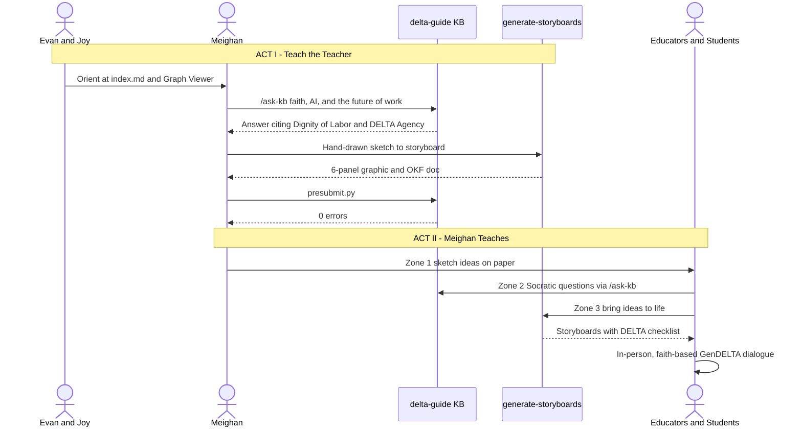

# GenDELTA Storyboard: Teach the Teacher

> [!NOTE]
> This is a **frontier proposal** (`status: draft`), describing "what could be." It is not a description of a production system. The knowledge-base tools it shows (`index.md`, `/ask-kb`, `/generate-storyboards`, `presubmit.py`) do exist in this repository today. The GenDELTA workshop format is the part that is still a proposal.

---

## 1. Executive Summary & Context

* **Target Audience / Users**
  * **Evan & Joy**: People who build and maintain the delta-guide knowledge base and mentor new users.
    * *Evan (visual reference)*: Caucasian man, brown hair, glasses, clean-shaven, navy quarter-zip.
    * *Joy (visual reference)*: Caucasian woman, glasses, green cardigan.
  * **Meighan**: An educator who learns the tools and then leads a GenDELTA session for others.
    * *Meighan (visual reference)*: Caucasian woman, long hair, glasses, cream blouse with school lanyard.
  * **Educators & Students**: Saint Francis High School teachers and students in the GenDELTA community. They bring their own ideas about AI, faith, school, and work.
* **Core Problem**: Conversations about AI in schools tend to go one of two ways. Some stay abstract ("Is AI good or bad?"). Others become tool tutorials that skip the moral questions. Teachers rarely have an easy way to turn a student's intuition, such as "I'm worried AI will take my dad's job," into something concrete the group can discuss with the theological depth of the [DELTA Framework](/ecosystem/delta-framework.md) and [*Magnifica Humanitas*](/ecosystem/magnifica-humanitas.md).
* **Solution Summary**: The proposal uses a **teach-the-teacher** model in two acts.
  * **Act I**: Evan and Joy walk Meighan through the knowledge base. She learns to orient at the index, ask grounded questions, and turn a hand-drawn idea into a validated storyboard.
  * **Act II**: Meighan passes these skills on. Educators and students sketch their ideas on paper first, use the storyboard feature to make them visible, and then gather in person, with laptops open or closed as needed, for an embodied, faith-based conversation about which work will always need a human heart.

---

## 2. Panel-by-Panel Detailed Script

### ACT I — Evan & Joy Teach Meighan

### Panel 1: Start at the Index
* **Setting & Actors**: A sunlit SFHS classroom after school. Evan and Joy sit on either side of Meighan at a laptop.
* **Digital Touchpoint**: The [Knowledge Graph Viewer](/viewer/index.html) and [`index.md`](/index.md), with the five DELTA pillars shown as hub nodes.
* **Key Action**: Joy explains how progressive disclosure works: *"Everything starts at index.md."* Together they trace a path from the DELTA Framework to its concept clusters, such as [Human Flourishing](/concepts/cluster-human-flourishing.md) and [Moral Agency](/concepts/cluster-moral-agency.md). Meighan sees that the knowledge base is a map of linked ideas, not a pile of PDFs.

### Panel 2: Ask the Knowledge Base
* **Setting & Actors**: Meighan types and Evan coaches.
* **Digital Touchpoint**: The [`/ask-kb`](/skills/ask-kb/SKILL.md) skill.
* **Key Action**: Meighan asks: *"How does faith speak to AI and the future of work?"* The answer cites [Dignity of Labor & Meaningful Work](/concepts/dignity-of-labor.md) and the DELTA **Agency** pillar, with links to its sources. Evan points out the most important habit for reading the knowledge base: **`stable` = what is, `draft` = what could be.** Meighan learns to check where a claim comes from before passing it on to students.

### Panel 3: Her First Storyboard
* **Setting & Actors**: Meighan holds a paper sketch. Evan and Joy give a thumbs-up.
* **Digital Touchpoint**: [`/generate-storyboards`](/skills/generate-storyboards/SKILL.md) and `./scripts/presubmit.py`.
* **Key Action**: Meighan's hand-drawn idea becomes a clean 6-panel storyboard, and the presubmit gate reports **0 errors**. The lesson she takes away is about order: *the human idea comes first, and the tool only helps make it visible.* Now she is ready to teach.

### ACT II — Meighan Teaches Educators & Students

### Panel 4: Ideas Start on Paper
* **Setting & Actors**: Meighan stands at a whiteboard with **D-E-L-T-A** written down the side. A mixed group of teachers and students sit at tables. No screens are on.
* **Digital Touchpoint**: None, on purpose. This is **Zone 1: Unassisted Formation** from the [Secondary School AI Pedagogy](/frontier/secondary-school-ai-pedagogy.md) model.
* **Key Action**: Each person sketches, in a notebook, a scene from a future school or workplace shaped by AI. This keeps the student's own voice and the [productive struggle](/concepts/cognitive-friction.md) of forming an idea. **Caption: "Human ideas first."**

### Panel 5: Ideas Come to Life
* **Setting & Actors**: Small groups, each with one teacher and two students, around tablets and laptops.
* **Digital Touchpoint**: `/generate-storyboards`, with `/ask-kb` as a Socratic sparring partner. This is **Zone 2 moving into Zone 3**.
* **Key Action**: The groups turn their sketches into storyboards. One shows an AI tutor that *coaches but does not write for* the student. Another shows a nurse whose AI handles charting so she can spend more time at the bedside. Each group checks its storyboard against a DELTA checklist:
  * **Dignity**: Is anyone reduced to their output?
  * **Embodiment**: Is physical presence protected?
  * **Love**: Is real care replaced by simulated empathy?
  * **Transcendence**: What here cannot be optimized?
  * **Agency**: Who makes the final moral call?

### Panel 6: The GenDELTA Conversation
* **Setting & Actors**: Teachers and students sit in a circle of chairs. The printed storyboards are pinned to a corkboard beneath a simple wooden cross, under a GenDELTA banner.
* **Digital Touchpoint**: Printed storyboards, plus open laptops where groups want to show or refer back to their work. Devices may stay open; the focus is the face-to-face circle, in the spirit of [Incarnational Presence](/concepts/incarnational-presence.md).
* **Key Action**: A student asks the question that anchors the session: ***"What work will always need a human heart?"*** The conversation draws on [Human Dignity (Imago Dei)](/concepts/human-dignity.md), [Dignity of Labor](/concepts/dignity-of-labor.md), and the [Catholic Companion Framework](/ecosystem/catholic-companion-framework.md) strands of *Co-Creation & Stewardship* and *Communion & Solidarity*. It also ties to SFHS's [Graduation Outcomes](/references/st-francis-mission-outcomes.md) of being a *Person of Faith* and an *Engaged Individual*. Students leave having named their own calling, not as consumers of AI but as people who will direct it toward the common good.

---

## 3. System Touchpoints & Data Flow

| Panel | Actor | Touchpoint | Data Exchanged | Outcome |
| :--- | :--- | :--- | :--- | :--- |
| **1. Start at the Index** | Evan, Joy → Meighan | `index.md`, Graph Viewer | Category map, DELTA hubs | Meighan can find her way around the knowledge base |
| **2. Ask the KB** | Meighan | `/ask-kb` | Question → answer with cited sources | Habit of checking sources and status |
| **3. First Storyboard** | Meighan | `/generate-storyboards`, `presubmit.py` | Sketch → graphic + OKF doc | Validated storyboard, 0 errors |
| **4. Ideas on Paper** | Educators, Students | Notebooks (analog) | None (no data captured) | Original ideas in the participants' own words |
| **5. Ideas Come to Life** | Mixed groups | `/generate-storyboards`, `/ask-kb` | Idea description (no PII) → storyboard | Ideas made visible and checked against DELTA |
| **6. GenDELTA Conversation** | Whole circle | Printed storyboards, open laptops (optional) | Storyboards shown for reference (in-person dialogue) | Shared reflection on faith, work, and vocation |

---

## 4. DELTA Alignment & Safeguards

| Pillar | How the Storyboard Honors It |
| :--- | :--- |
| **Dignity** | Every participant's idea counts. Storyboards show people as moral agents, never as costs to be automated away. |
| **Embodiment** | The session opens with screen-free paper sketching (Panel 4) and closes with a face-to-face circle (Panel 6). Laptops may stay open there, but they support the people in the room rather than replace them. |
| **Love** | Mentorship passes from person to person (Evan & Joy → Meighan → community). The tool supports relationships; it does not stand in for them. |
| **Transcendence** | The closing question about vocation and the heart deliberately points beyond what can be optimized. |
| **Agency** | Students write and own their ideas. AI only illustrates them, and the moral discernment stays with the people in the room. |

* **Privacy**: Storyboard prompts describe *ideas and roles*, never named students or personal details. Generated artifacts must not contain student PII.
* **Graceful Degradation**: If the network fails, the workshop still works. Panel 4 is fully analog, Panel 6 works with printed storyboards alone, and Panel 5 can fall back to hand-drawn storyboard templates.

---

## 5. Expected Formation & Community Impact

* **Multiplication**: One mentoring session (Act I) prepares a facilitator who can lead many GenDELTA circles (Act II). Two KB stewards' expertise grows into school-wide capacity.
* **Depth of Dialogue**: Students arrive with something concrete they made. That replaces abstract debate and invites grounded theological reflection.
* **Vocational Clarity**: Participants say, in their own words, which human work carries dignity that AI should serve rather than replace.
* **Teacher Confidence**: Educators gain a repeatable, mission-aligned format for talking about AI that is neither tool-policing nor hype.

---

## 6. Related Knowledge Base Documents

* [The DELTA Framework](/ecosystem/delta-framework.md)
* [The GenDELTA Network](/ecosystem/gendelta-network.md)
* [Magnifica Humanitas](/ecosystem/magnifica-humanitas.md)
* [Catholic Companion Framework](/ecosystem/catholic-companion-framework.md)
* [Secondary School AI Pedagogy (3-Zone Model)](/frontier/secondary-school-ai-pedagogy.md)
* [Dignity of Labor & Meaningful Work](/concepts/dignity-of-labor.md)
* [SFHS Mission, Vision & Graduation Outcomes](/references/st-francis-mission-outcomes.md)
* [Product Concept Storyboarding Playbook](/playbooks/generating-product-storyboards.md)
