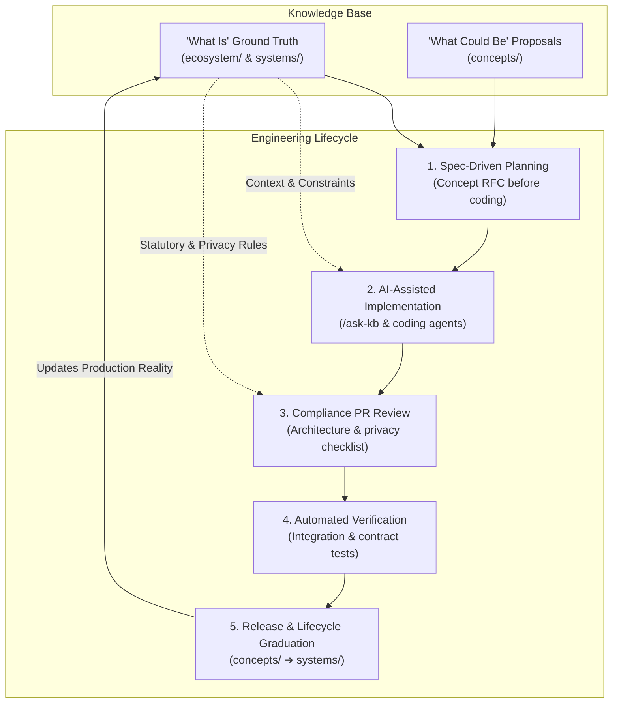
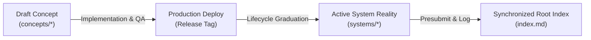

# Knowledge-Driven Engineering & Spec-Driven Development

## 1. Executive Summary

Traditional engineering organizations suffer from **documentation drift**: wikis decay into outdated text while code evolves independently. This creates architectural blind spots, forgotten regulatory constraints, and regression risks.

**Knowledge-Driven Engineering (KDE)** solves this by treating the **Google Open Knowledge Format (OKF v0.2)** knowledge base as an active, executable partner in the software development lifecycle (SDLC).



---

## 2. The 5-Stage Engineering Process

### Stage 1: Inception & Refinement (Spec-Driven Planning)
**Core Rule**: No non-trivial feature is scheduled for development without an associated OKF specification.

1. **Feature Inception**:
   * Features begin as a concept proposal in [`concepts/`](/concepts/).
   * Every concept starts with `status: draft` and adheres to OKF v0.2 frontmatter.
2. **Contract Definition**:
   * Each feature document must define its **API data contract**, database persistence strategy, and third-party dependencies.
   * Cross-reference [`/systems/core-architecture.md`](/systems/core-architecture.md) for shared service touchpoints.
3. **Ticket Linking**:
   * Issue tracker tickets (Jira, Linear, GitHub Issues) must link directly to the bundle-relative OKF document path (e.g. `OKF-Ref: /concepts/future-initiative.md`).

---

### Stage 2: Implementation & AI Pair Programming
**Core Rule**: Developers and coding agents use the knowledge base as active context before and during code authoring.

1. **Domain Consultation**:
   * Developers and agents query architectural and regulatory constraints directly via the [`ask-kb`](/skills/ask-kb/SKILL.md) skill or `/ask-kb` slash command:
     * *"What is our idempotency contract for payment mutating endpoints?"*
     * *"What external data residency rules apply to customer records?"*
     * *"How should PII be masked in application telemetry?"*
2. **Component Implementation**:
   * Align frontend UI and backend endpoints with the contracts defined in the concept document.
   * Preserve offline resilience and optimistic UI updates where applicable.
3. **API & Interoperability**:
   * Adhere to schema patterns documented in [`/systems/`](/systems/).

---

### Stage 3: Pull Request Review & Compliance Gatekeeping
**Core Rule**: Code reviews verify statutory, architectural, and privacy compliance alongside code quality.

Every Pull Request must include the following verification block:

```markdown
### 📚 Knowledge Base Alignment & Compliance
- [ ] **OKF Reference**: Links to `/concepts/...` or `/systems/...`
- [ ] **Data Protection & Privacy**: No unmasked PII, credentials, or sensitive customer data stored in client storage or unredacted logs.
- [ ] **Architecture Invariants**: Complies with stateless container guidelines and idempotency requirements.
- [ ] **Offline Resilience**: Component degrades gracefully or queues operations when network connection drops.
- [ ] **Presubmit Validation**: Bundle presubmit passed with 0 errors (`./scripts/presubmit.py`).
```

---

### Stage 4: Automated Testing & Living Contracts
**Core Rule**: Specifications act as test harnesses, eliminating regression drift.

1. **End-to-End Mapping**:
   * Integration and E2E test suites map directly to scenarios declared in concept documents.
2. **Automated Verification Stamp**:
   * When CI pipelines pass against staging, the concept's `verified:` frontmatter is updated with `process:ci` and the git commit hash.

---

### Stage 5: Release & Lifecycle Graduation
**Core Rule**: Successful production deployments transition documentation from "What Could Be" to "What Is".



1. **Graduation PR**:
   * Once a feature is shipped to production, its operational behavior is documented under [`systems/`](/systems/).
   * The original concept in `concepts/` is marked `status: stable` or updated with a pointer: `superseded_by: /systems/<feature>.md`.
2. **Bundle Log Entry**:
   * Record the release milestone in [`log.md`](/log.md) under the deployment date.
3. **Presubmit Validation**:
   * Run `./scripts/presubmit.py` to ensure all links and index entries remain valid.

---

## 3. Developer & Agent Skill Arsenal

| Skill | Invocation | Primary Purpose |
| :--- | :--- | :--- |
| **[`ask-kb`](/skills/ask-kb/SKILL.md)** | `/ask-kb <query>`<br>CLI: `scripts/query_kb.py` | Instant domain, architectural, and compliance consulting. |
| **[`manage-knowledge-base`](/skills/manage-knowledge-base/SKILL.md)** | `/manage-knowledge-base`<br>CLI: `scripts/presubmit.py` | Validating bundle integrity, authoring new concepts, and updating index. |
| **[`ingest`](/skills/ingest/SKILL.md)** | `/ingest <url>` | Downloading external specifications, regulatory circulars, or docs into OKF format. |

---

## 4. Presubmit & Git Workflow for Engineers

Every engineer should run the bundle presubmit script before submitting changes:

```bash
# Verify knowledge base integrity, auto-fix frontmatter, and sync index:
./scripts/presubmit.py

# Push changes:
git commit -m "docs: graduate queue concept to active system specification"
git push
```
