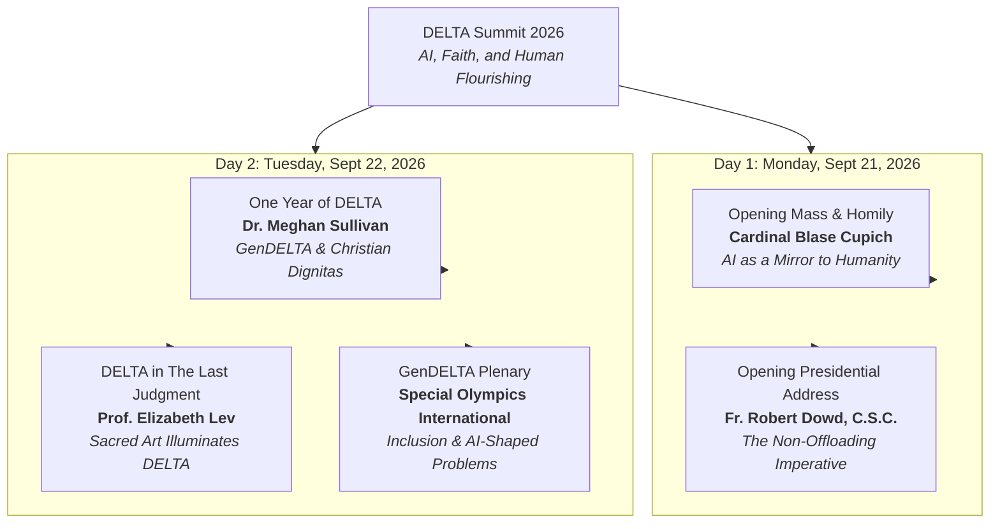

# DELTA Summit 2026: Proceedings, Keynotes, and Strategic Summaries

Held on **September 21–23, 2026**, at the **University of Notre Dame**, the inaugural **DELTA Summit on AI, Faith, and Human Flourishing** convened global technologists, moral authorities, academic researchers, K-12 and university educators, and emerging youth leaders. Organized by the **Notre Dame Institute for Ethics and the Common Good (ECG)** with support from the **Lilly Endowment Inc.**, the summit addressed the foundational Notre Dame Forum question:

> *"What does it mean to live a good life in the age of AI?"*

This document serves as the master index and executive briefing for all recorded proceedings, keynote addresses, liturgical homilies, and plenary discussions preserved in the knowledge base.

---

## 1. The 5 Canonical DELTA Pillars

Throughout the summit, speakers and working groups organized their inquiries around the 5 core pillars of the **[DELTA Framework](/ecosystem/delta-framework.md)**:

| Pillar | Theological & Philosophical Foundation | Modern AI Governance Translation |
| :--- | :--- | :--- |
| **D — Dignity** | *Imago Dei*; intrinsic, non-forfeitable worth conferred by God out of love. | Human value cannot be reduced to data doubles, productivity metrics, or behavioral profiles. |
| **E — Embodiment** | Physical presence, mortality, and vulnerability as prerequisites for empathy. | Rejecting disembodied algorithmic detachment; prioritizing face-to-face communion and physical encounters. |
| **L — Love** | *Agape* and the "logic of gift"; cosmic relational care (*"L'amor che move il sole"*). | Rejecting utilitarian optimization as the sole ethical standard; centering relational accompaniment and solidarity. |
| **T — Transcendence** | Openness to mystery, divine grace, beauty, and objective truth. | Human consciousness is open to the sacred in ways token prediction and silicon circuits cannot replicate. |
| **A — Agency** | Conscience and conscious moral responsibility. | The **Non-Offloading Imperative**: Never delegating moral judgment or accountability to automated systems. |

---

## 2. Master Session Index & Recorded Proceedings

### Day 1: Monday, September 21, 2026

#### 1. Opening Mass: AI as a Mirror to Humanity
* **Presider & Homilist**: Cardinal Blase J. Cupich (Archbishop of Chicago)
* **Host**: Rev. Robert A. Dowd, C.S.C. (President, University of Notre Dame)
* **Venue**: Basilica of the Sacred Heart (Feast of St. Matthew, Apostle and Evangelist)
* **Document**: [`2026-09-21-opening-mass-homily.md`](/references/events/delta-summit-2026/2026-09-21-opening-mass-homily.md) | [YouTube Recording](https://www.youtube.com/watch?v=JkHafKFDzzY)
* **Core Takeaways**:
  * **AI as an Amplifier, Not an Alien Threat**: AI does not invent cold, deterministic reductions of people out of thin air. It acts as a high-speed mirror reflecting society's longstanding habit of categorizing, indexing, and cancelling neighbors based on historical data.
  * **The St. Matthew Paradigm**: Christ calls Matthew while he is sitting at the customs post—liberating him from transactional calculation into life as a vocation (*vocatio*).
  * **The Logic of Gift vs. The Logic of Exchange**: True human flourishing requires rejecting transactional market optimization in favor of gratuitous love, unmerited grace, and relational solidarity.

#### 2. Opening Dinner: Presidential Address on the Good Life and DELTA Pillars
* **Keynote Speaker**: Rev. Robert A. Dowd, C.S.C. (President, University of Notre Dame)
* **Master of Ceremonies**: Adam Kronk (DELTA Network Director)
* **Venue**: University of Notre Dame Campus
* **Document**: [`2026-09-21-opening-dinner-remarks.md`](/references/events/delta-summit-2026/2026-09-21-opening-dinner-remarks.md) | [YouTube Recording](https://www.youtube.com/watch?v=THah2O76wLo)
* **Core Takeaways**:
  * **Urgency of Moral Action**: Academic institutions and faith communities cannot remain passive observers while generative AI reshapes societal structures.
  * **The Non-Offloading Imperative**: A direct ethical mandate warning against offloading human moral agency, discernment, and institutional accountability to algorithmic systems, with acute boundaries around surveillance, biological experimentation, autonomous warfare, and the dignity of work.
  * **Grounding in *Magnifica Humanitas***: Connecting university initiatives with Pope Leo XIV’s encyclical on human dignity and technology.

---

### Day 2: Tuesday, September 22, 2026

#### 3. Morning Keynote: One Year of DELTA — Stories, Epiphanies, and Prophecies
* **Keynote Speaker**: Dr. Meghan Sullivan (Wilsey Family College Professor of Philosophy; Director, Notre Dame Institute for Ethics and the Common Good)
* **Document**: [`2026-09-22-one-year-of-delta-meghan-sullivan.md`](/references/events/delta-summit-2026/2026-09-22-one-year-of-delta-meghan-sullivan.md) | [YouTube Recording](https://www.youtube.com/watch?v=DZSet3DrrJ4)
* **Core Takeaways**:
  * **Year 1 International Trajectory**: Over 77 live engagements, 47 trips across three continents, and wide coverage across national press (WSJ, NYT, NPR).
  * **De-Coupling Worth from Velocity**: Human value has never rested on processing speed or computational output.
  * **The Subversive Nature of Christian *Dignitas***: Unlike Roman imperial hierarchy where dignity was earned through conquest or status, Christian dignity is conferred equally by God out of love.
  * **Launch of GenDELTA**: Rejecting the treatment of young adults (ages 15–25) as passive "moral patients" of technology disruption; mobilizing them as active "moral agents" seated at corporate, institutional, and governance tables.

#### 4. Sacred Art Keynote: DELTA in *The Last Judgment*
* **Keynote Speaker**: Prof. Elizabeth Lev (Professor of Christian Art and Architecture, Pontifical University of Saint Thomas Aquinas / Angelicum, Rome)
* **Document**: [`2026-09-22-delta-in-the-last-judgment-elizabeth-lev.md`](/references/events/delta-summit-2026/2026-09-22-delta-in-the-last-judgment-elizabeth-lev.md) | [YouTube Recording](https://www.youtube.com/watch?v=kdn9R0eQEwo)
* **Core Takeaways**:
  * **D — Dignity (Judgment Presupposes Worth)**: Only beings possessing authentic moral freedom and divine dignity can have their choices judged (echoing Pope Paul III’s 1537 anti-slavery encyclical *Sublimis Deus*).
  * **E — Embodiment (The Sacred Physical Locus)**: Michelangelo’s Sistine Chapel wall asserts that vulnerable, physical bodies are the sacred arena of the *Imago Dei* ("human form sublime"), directly confronting modern algorithmic disembodiment.
  * **L — Love (The Central Vector)**: Love occupies the center of the DELTA acronym, echoing Dante’s *Divine Comedy* (*"L'amor che move il sole e l'altre stelle"*). Christ is portrayed as cosmic, restorative love rather than a cold calculation engine.
  * **T — Transcendence (Art Beyond Itself)**: Genuine sacred art points toward a divine mystery beyond silicon capacity.
  * **A — Agency (Conscience in Action)**: Embodied agency depicted through mutual aid (lifting souls via the rosary) and female martyrs exercising moral fortitude against empire.

#### 5. GenDELTA Plenary: AI as an Agent of Change
* **Keynote Speakers**: Nathaniel Cook (Chief Information and Technology Officer) and Conal Fagan (Senior Manager for Global Strategic Operations; ND '21), **Special Olympics International**
* **Document**: [`2026-09-22-gendelta-ai-agent-of-change-special-olympics.md`](/references/events/delta-summit-2026/2026-09-22-gendelta-ai-agent-of-change-special-olympics.md) | [YouTube Recording](https://www.youtube.com/watch?v=dP3fS1g1XPQ)
* **Core Takeaways**:
  * **Inclusion Precedes Optimization**: Training models exclusively on "average" human traits systematically erases persons with intellectual and physical disabilities. Accessibility must be designed into foundational data schemas rather than treated as a compliance afterthought.
  * **Doctrine of "AI-Shaped Problems"**: Avoiding technological shoehorning ("hammering a nail with a screwdriver"). Organizations must isolate the exact bottlenecks where machine intelligence excels—such as multilingual volunteer matching and dialect translation.
  * **Confronting the Digital Divide**: Bridging physical access gaps across the Global South (e.g. Burkina Faso) where device scarcity precedes software utility.
  * **Commissioning via St. John Henry Newman**: Charging GenDELTA delegates with their *"definite service"*—infusing human dignity into software roadmaps, policy committees, and classroom environments.

---

## 3. Key Strategic Initiatives & Policy Takeaways

1. **The GenDELTA Network**:
   Formally inaugurated at the summit, the [GenDELTA Network](/ecosystem/gendelta-network.md) convenes 50+ emerging leaders (ages 14–25) across secondary and higher education to actively govern and shape AI adoption rather than merely adapting to market displacements.
2. **The Non-Offloading Imperative**:
   Institutions adopting DELTA principles must maintain explicit architectural policies preventing the automated offloading of critical moral judgment (grading, hiring, medical triage, legal determinations, and weaponized force).
3. **The "AI-Shaped Problems" Heuristic**:
   A practical framework for IT and product teams to evaluate AI use-cases based on genuine organizational bottlenecks rather than vendor-driven hype.
4. **Integration with Vatican Algor-Ethics**:
   The summit established a direct North American academic and operational bridge to Pope Leo XIV’s [*Magnifica Humanitas*](/ecosystem/magnifica-humanitas.md).

---

## 4. Cross-References & Ecosystem Connections

* [`/ecosystem/delta-framework.md`](/ecosystem/delta-framework.md) — Canonical architectural overview of the DELTA Framework.
* [`/ecosystem/gendelta-network.md`](/ecosystem/gendelta-network.md) — Operational briefing and charter of the GenDELTA youth initiative.
* [`/ecosystem/magnifica-humanitas.md`](/ecosystem/magnifica-humanitas.md) — Vatican encyclical on AI, algor-ethics, and human dignity.
* [`/frontier/storyboard-gendelta-teach-the-teacher.md`](/frontier/storyboard-gendelta-teach-the-teacher.md) — Visual storyboard applying GenDELTA concepts to educational dialogues.
