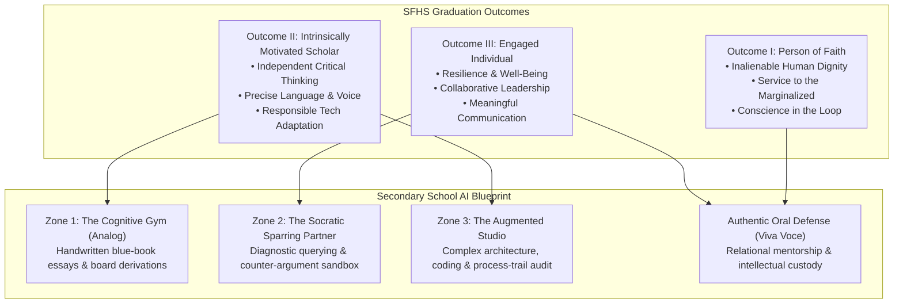

# Saint Francis High School: Mission, Vision & Graduation Outcomes

---

## 1. Governance Authority & Institutional Purpose

Sponsored by the **Brothers of Holy Cross**, Saint Francis High School (Mountain View, California) operates as a premier Catholic college-preparatory institution. 

This document serves as the canonical institutional benchmark for Saint Francis High School. All curricular developments, departmental course policies, technological adoptions, and artificial intelligence guidelines must be demonstrably aligned with the school's **Mission Statement**, **Vision Statement**, and **Three Graduation Outcomes**.

---

## 2. Mission Statement

> *In the tradition of the Catholic Church and the spirit of Holy Cross, Saint Francis High School is committed to providing the finest college-preparatory program in an inclusive family environment, encouraging students to achieve their highest potential through:*
> 
> * **Spiritual development**, which expresses their Christian values in the convictions of their heart and the actions of their hands;
> * **Intellectual development**, which translates their knowledge and skills into independent and creative thinking;
> * **Social development**, which transforms their activities and experiences into leadership in and service to the community.

---

## 3. Vision Statement

> *We shape the future by nurturing exploration of thought to cultivate leaders of impact rooted in faith and service.*

---

## 4. Graduation Outcomes Matrix

The Saint Francis graduate embodies the Holy Cross charism and is formed across three comprehensive, interconnected dimensions:

```
┌──────────────────────────────────────────────────────────────────────────────────────────┐
│                     SAINT FRANCIS HIGH SCHOOL GRADUATION OUTCOMES                        │
├──────────────────────────┬───────────────────────────────────────────────────────────────┤
│ Dimension                │ Specific Behavioral & Intellectual Competencies               │
├──────────────────────────┼───────────────────────────────────────────────────────────────┤
│ I. Person of Faith       │ • Imparts Holy Cross values in the Catholic tradition.        │
│                          │ • Understands the teaching of Christ and Catholic doctrine.   │
│                          │ • Recognizes and respects the dignity of the human person.    │
│                          │ • Responds to the call to love and serve (preferential care). │
│                          │ • Actively participates in and embraces faith community.      │
├──────────────────────────┼───────────────────────────────────────────────────────────────┤
│ II. Intrinsically        │ • Pursues lifelong learning and critical/creative problem-    │
│     Motivated Scholar    │   solving, both independently and in collaborative teams.     │
│                          │ • Listens effectively, reads critically, and uses language    │
│                          │   precisely in speech and writing.                            │
│                          │ • Interprets and evaluates complex multi-media information.   │
│                          │ • Utilizes and adapts technology productively and responsibly.│
├──────────────────────────┼───────────────────────────────────────────────────────────────┤
│ III. Engaged Individual  │ • Demonstrates personal and social responsibility.            │
│                          │ • Understands rights and responsibilities of citizenship.     │
│                          │ • Possesses clear communication and meaningful collaboration. │
│                          │ • Develops self-direction, resilience, and emotional/physical │
│                          │   well-being; embraces the call to lead.                      │
└──────────────────────────┴───────────────────────────────────────────────────────────────┘
```

### Outcome I: A Person of Faith
* **Human Dignity Grounding**: Every student is formed to recognize that the human person possesses inviolable worth (*[Imago Dei](/concepts/human-dignity.md)*) that can never be subordinated to technological or economic utility.
* **Catholic Moral & Social Tradition**: Students learn to respond actively to systemic injustice, ensuring that innovation serves the common good and protects the vulnerable.

### Outcome II: An Intrinsically Motivated Scholar
* **Critical & Creative Independence**: Students develop intellectual stamina and original voice, directly countering [Cognitive Deskilling & Moral Atrophy](/concepts/cognitive-deskilling.md).
* **Precise Use of Language**: In an era of automated text generators, students are trained to articulate their own thoughts with syntactic precision, rhetorical care, and authentic reflection.
* **Responsible Technological Adaptation**: Technology is neither uncritically embraced nor reactively banned; students are trained to adapt digital and AI tools productively while retaining personal agency.

### Outcome III: An Engaged Individual
* **Resilience & Self-Direction**: The ability to navigate frustration, difficulty, and ambiguous problems without immediately seeking synthetic shortcuts (*[Cognitive Friction & Productive Struggle](/concepts/cognitive-friction.md)*).
* **Collaborative Leadership**: Fostering relational fraternity and empathetic communication in embodied peer cohorts, resisting digital atomization.

---

## 5. Strategic Alignment with the Secondary School AI Blueprint

Saint Francis's course policies and the [Secondary School AI Pedagogy Blueprint](/frontier/secondary-school-ai-pedagogy.md) map directly to these three graduation outcomes:



1. **Zone 1 (The Cognitive Gym)** operationalizes **Outcome II**: Safeguarding foundational critical thinking and unassisted language mastery before external digital tools are introduced.
2. **Zone 2 & Zone 3 (Socratic & Studio)** operationalize **Outcome II & III**: Training students to adapt technological tools responsibly, audit algorithmic bias, and maintain moral custody.
3. **The Viva Voce Oral Defense** operationalizes **Outcome I & III**: Transforming assessment into authentic human dialogue between student and teacher, honoring personal voice and accompaniment.

---

## 6. Related Knowledge Base Documents

* [Secondary School AI Pedagogy & Assessment Blueprint](/frontier/secondary-school-ai-pedagogy.md) — St. Francis High School's 3-zone classroom model and viva assessment system.
* [Saint Francis High School Sustainability Framework](/references/st-francis-sustainability.md) — Institutional charter on environmental responsibility and spiritual ecology.
* [Congregation of Holy Cross: Educational Charism](/ecosystem/institutions/holy-cross-tradition.md) — Blessed Basil Moreau's pedagogy of educating hearts and minds.
* [Catholic Companion Framework for Technology and Innovation](/ecosystem/catholic-companion-framework.md) — Five anchor strands bridging Catholic theology with digital literacy.
* [The DELTA Framework: Faith-Informed Virtue Ethics for AI](/ecosystem/delta-framework.md) — University of Notre Dame virtue ethics framework.
