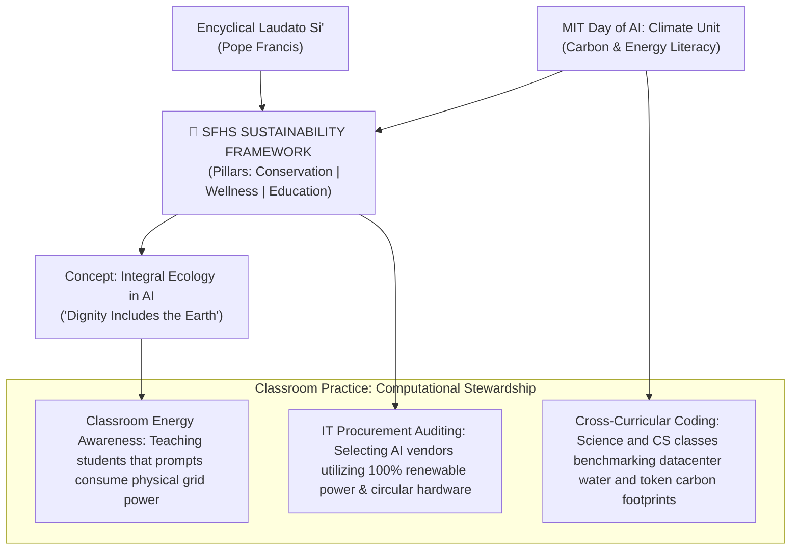

# Saint Francis High School: Framework for Sustainability & Spiritual Ecology

---

## 1. Executive Summary & Institutional Distinction

At Saint Francis High School, sustainability is recognized both as an institutional responsibility and a moral commitment. Grounded in care for the human community, stewardship of God’s creation, and the preparation of adolescents for leadership in a changing world, the school integrates ecological mindfulness into campus operations, student wellness, and academic curricula.

In 2025, Saint Francis High School was recognized as a **California Green Ribbon School (CA-GRS) Green Achiever**—one of only five schools across the entire state of California to receive this highest distinction. This award honors the school's comprehensive approach to reducing environmental impact, promoting health and wellness, and providing effective environmental and sustainability education.

---

## 2. Spiritual Ecology: Saint Francis of Assisi & The Holy Cross Charism

The school’s ecological commitment is animated by a synthesis of two profound traditions:
1. **Patron Saint Francis of Assisi**: The school's patron whose 1224 hymn, the *Canticle of the Creatures* (*Cantico delle Creature*), proclaims:
   > *"Praise be to you, my Lord, through our Sister, Mother Earth, who sustains and governs us, and who produces various fruit with coloured flowers and herbs."*
   This Franciscan vision affirms that the natural world is not a mere collection of resources to be exploited, but a sacred communion of life reflecting divine beauty and goodness.
2. **The Holy Cross Charism**: Blessed Basil Moreau’s conviction that education must prepare young people *"for better times than ours"* through the cultivation of hearts and minds. Holy Cross education calls students to *"the competence to see and the courage to act"* when confronting social and environmental crises.

Through this synthesis, Saint Francis embraces **Spiritual Ecology**—fostering deep relationships among the Creator, human persons, and the natural world, while enacting the principles of Pope Francis’s encyclical *[Laudato Si’](/ecosystem/laudato-si.md)*.

---

## 3. The Three Interconnected Pillars of Sustainability

Saint Francis's framework for sustainability is guided by resiliency planning and structured around three mutually reinforcing pillars:

```
┌──────────────────────────────────────────────────────────────────────────────────────────┐
│                   SAINT FRANCIS HIGH SCHOOL SUSTAINABILITY FRAMEWORK                     │
├──────────────────────────┬───────────────────────────────────────────────────────────────┤
│ Sustainability Pillar    │ Operational & Curricular Manifestations                       │
├──────────────────────────┼───────────────────────────────────────────────────────────────┤
│ Pillar I: Resource       │ • Sustainable Transportation Program reducing vehicle commutes.│
│   Conservation & Climate │ • Efficient consumption, green purchasing, and waste reduction.│
│   Impact                 │ • Circular reuse (e.g. milling diseased campus Deodar Cedar   │
│                          │   trees into panels honoring Brothers of Holy Cross).         │
│                          │ • Drought-resilient bioswales and water conservation systems. │
├──────────────────────────┼───────────────────────────────────────────────────────────────┤
│ Pillar II: Health, Safety│ • Campus-wide student and educator wellness initiatives.      │
│   & Wellness             │ • Clean indoor air quality, non-toxic grounds maintenance.    │
│                          │ • Fostering psychological safety and connection with nature.  │
├──────────────────────────┼───────────────────────────────────────────────────────────────┤
│ Pillar III: Effective    │ • Science Department Sustainability & Social Justice outcomes.│
│   Environmental &        │ • School-wide Earth Week programming and immersion service.   │
│   Sustainability         │ • Cross-curricular integration across Economics & Religion.   │
│   Education              │ • Project-based STEM solutions to real-world climate crises.  │
└──────────────────────────┴───────────────────────────────────────────────────────────────┘
```

### Pillar I: Resource Conservation & Climate Impact
Saint Francis actively implements infrastructure projects that reduce carbon emissions, eliminate waste, and conserve vital resources:
* **Circular Campus Material Reuse**: Rather than discarding a diseased campus Deodar Cedar, the school milled and repurposed the timber into handcrafted wood panels installed in the Welcome Center (fronting the Educator Dining Center) to display historical images of the Brothers of Holy Cross who served at Saint Francis.
* **Water Conservation & Runoff Management**: Installation of bioswales and synthetic turf to capture stormwater runoff, protect local watersheds, and minimize chemical fertilizer use.
* **Sustainable Commute Infrastructure**: Developing community transit options, carpooling networks, and bicycle facilities to mitigate traffic and local carbon emissions.

### Pillar II: Health, Safety & Wellness
Recognizing that human ecology and physical environment are inseparable (*Laudato Si’* §148), the school prioritizes student and faculty wellness through healthy campus dining, outdoor green spaces, clean air filtration, and holistic mental health counseling.

### Pillar III: Effective Environmental & Sustainability Education
Students do not merely observe sustainability; they study and practice it as an academic and moral discipline:
* **Interdisciplinary Learning**: Exploring environmental justice in religious studies, ecological economics in social science, and carbon-accounting algorithms in STEM.
* **Civic Action & Immersion**: Empowering students to propose measurable campus and community ecological improvements.

---

## 4. Technological & Artificial Intelligence Implications: Computational Stewardship

The Saint Francis Sustainability Framework intersects directly with the school's AI Initiative:



1. **Combating the "Immaterial Myth" of AI**: Modern adolescents often view artificial intelligence as weightless "cloud software." The sustainability framework provides the curricular mandate to educate students on the physical reality: gigawatt energy grids, datacenter water cooling, and semiconductor supply chains.
2. **Computational Thrift as Character Formation**: Teaching students that careless, redundant, or frivolous generative queries carry an energetic and environmental cost.
3. **Green IT Procurement**: Mandating that software vendors, cloud platforms, and educational AI tools deployed at Saint Francis High School adhere to strict environmental standards and renewable energy baselines.

---

## 5. Related Knowledge Base Documents

* [Integral Ecology in AI (Dignity Includes the Earth)](/concepts/integral-ecology-ai.md) — The theoretical concept expanding DELTA Dignity to environmental stewardship.
* [Encyclical Letter Laudato Si'](/ecosystem/laudato-si.md) — Pope Francis's canonical social encyclical on integral ecology and care for our common home.
* [Saint Francis High School Mission & Graduation Outcomes](/references/st-francis-mission-outcomes.md) — Canonical institutional outcomes for graduates.
* [Congregation of Holy Cross: Educational Charism](/ecosystem/institutions/holy-cross-tradition.md) — Blessed Basil Moreau's pedagogy of educating hearts and minds.
* [Catholic Companion Framework for Technology and Innovation](/ecosystem/catholic-companion-framework.md) — The Co-Creation & Stewardship strand connecting tech to care for creation.
* [Secondary School AI Pedagogy & Assessment Blueprint](/frontier/secondary-school-ai-pedagogy.md) — St. Francis High School's 3-zone classroom model and viva assessment system.
